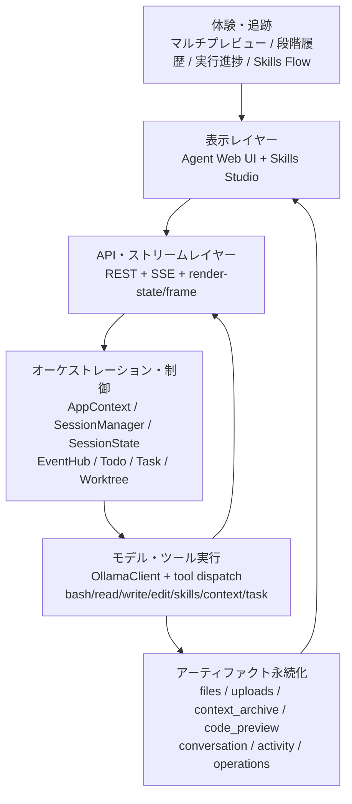
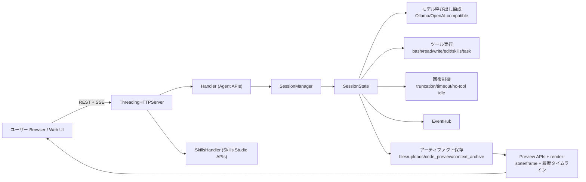
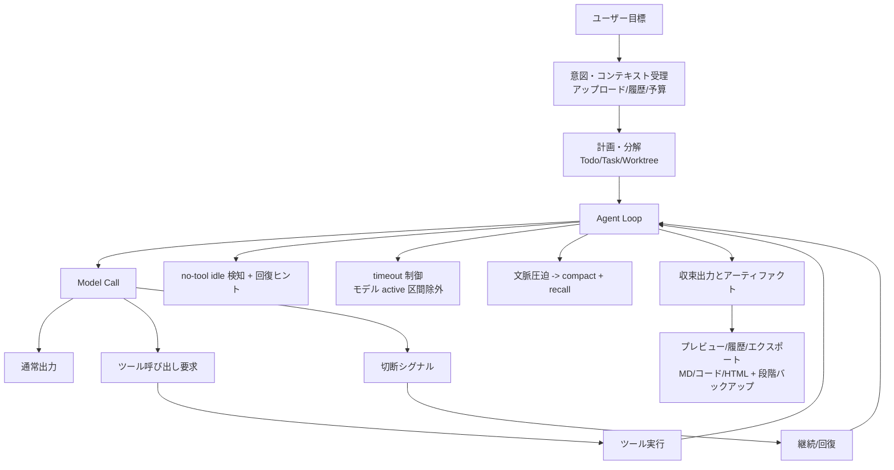
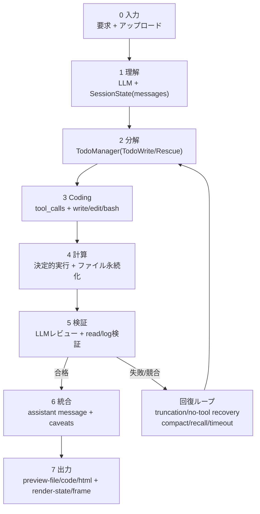

<h1 align="center">Clouds Coder</h1>
<h3 align="center">クラウド CLI コーディングランタイム</h3>
<p align="center">CLI 実行面 × Web ユーザー面の分離協調で、信頼性と可観測性の高い Vibe Coding 体験を提供。</p>
<p align="center">
  <a href="./README.md">English</a> ·
  <a href="./README-zh.md">中文</a> ·
  <a href="./README-ja.md">日本語</a>
</p>
<p align="center">
  <a href="./RELEASE_NOTES.md">Release Notes</a> ·
  <a href="./LICENSE">MIT License</a> ·
  <a href="./LLM.config.json">LLM Config Template</a>
</p>
<p align="center">
  
</p>

Clouds Coder は、CLI 実行面と Web ユーザー面の分離を中核に据えたローカルファーストの汎用タスクエージェント基盤で、コーディング専用に限定せず、Web UI・Skills Studio・堅牢なストリーミング・長タスク回復制御を備えます。

主要な問題設定は、CLI コーディングが学習コスト高く、利用者ごとの環境配布が難しい点です。Clouds Coder はバックエンド/フロントエンド分離（クラウド側 CLI 実行 + Web 側操作）で Vibe Coding の導入コストを下げると同時に、timeout・切断回復・文脈予算・思考ループ抑制を並列の中核能力として扱い、複雑タスクの実行性・収束性・再検証性を担保します。

## 1. プロジェクトの位置づけ

Clouds Coder の中心目標は次の 1 点です。

- CLI 実行面と Web ユーザー面を分離協調させ、低い導入コストで、可観測かつ追跡可能な Vibe Coding ワークフローを提供すること。

本リポジトリは学習用 agent コードから、実配備可能な standalone ランタイムへ発展し、以下を重視しています。

- バックエンド/フロントエンド分離協調（クラウド側実行 + Web 側操作）
- CLI 学習障壁の低減（可視化された実行フローと操作性）
- 配布/導入負荷の低減（統一ランタイム入口）
- 非エキスパートにも届く Vibe Coding 導入コストの最小化
- 信頼性と実行収束制御を中核能力として運用（timeout、切断継続、文脈予算、ドリフト抑制）

## 1.1 アーキテクチャ継承と再利用の明示

Clouds Coder は以下プロジェクトのカーネル思想を明示的に参照・拡張しています。

- shareAI-lab/learn-claude-code: https://github.com/shareAI-lab/learn-claude-code/tree/main

具体的な継承ポイント（本プロジェクトでの対応）：

- 最小 agent ループ（`LLM -> tool_use -> tool_result -> loop`）
- 計画先行（`TodoWrite`）と複雑タスクのドリフト抑制
- `SKILL.md` によるオンデマンド skill ロード契約
- context compact/recall による長会話対応
- task/background/team/worktree 協調モデル

Clouds Coder での拡張点：

- モノリシックなランタイムカーネル（`Clouds_Coder.py`）：agent loop、ツールルータ、セッション管理、API ハンドラ、SSE、Web UI bridge、Skills Studio を単一プロセス状態域で統合。
- 構造化された切断継続エンジン：強い切断シグナル検出、末尾オーバーラップ走査、括弧/記号ペア補修ヒューリスティック、マルチパス継続、pass/token テレメトリ可視化。
- 回復志向の実行コントローラ：no-tool idle 診断、実行時回復ヒント注入、truncation-rescue の todo/task 自動生成、複雑タスクのループ収束誘導。
- 統一 timeout ガバナンス：グローバル timeout スケジューラに最小下限とラウンド会計を持たせ、モデル active 区間を除外して誤タイムアウトを抑制。
- フェーズ別 live-input 仲裁：write/tool/normal フェーズごとに遅延・重みを分離し、遅れて到着したユーザー入力を長時間実行へ安全に合流。
- コンテキストライフサイクル管理：適応的予算 + 手動ロック（`--ctx_limit`）、アーカイブ連動 compact、対象限定の context recall。
- Provider/Profile オーケストレーション層：Ollama + OpenAI-compatible 設定解析、能力推定（マルチモーダル含む）、media endpoint マッピング、実行時選択とフォールバック。
- ストリーミング信頼性と可観測スタック：SSE ハートビート、書き込み例外耐性、モデル呼び出し進捗イベント、event+snapshot ハイブリッド更新。
- アーティファクト優先ワークスペースモデル：セッションごとの `files/uploads/context_archive/code_preview` 永続化、アップロードのワークスペース反映、段階コードプレビューで再現性を確保。

Skills 再利用について：

- `skills/` は同じ `SKILL.md` プロトコル系を継続利用
- `skills/code-review`、`skills/agent-builder`、`skills/mcp-builder`、`skills/pdf` は再利用可能な基盤 skill
- `skills/generated/*` は Clouds Coder 向けに拡張生成された skill 群
- 実行時ツール契約（`load_skill`、`list_skills`、`write_skill` など）との互換性を維持

## 1.2 コーディング CLI を超える汎用タスクカーネル

Clouds Coder は「コードを書くためだけの CLI ラッパー」ではなく、単一セッション内で複合的な知的作業を実行・監査できる汎用エージェントランタイムとして設計されています。

- プログラミング系: 実装、リファクタ、デバッグ、テスト、パッチレビュー
- 分析系: ファイル調査、文書解析、構造化抽出、比較検討
- 総合系: 複数ソース統合推論、意思決定メモ、リスク/仮定の集約
- レポート/可視化系: HTML レポート、Markdown 叙述、段階コード/成果物プレビュー

中核は次の 3 段チェーンを高効率に回すことです。

- `LLM（思考/計画）` -> 目標を制約付き実行ステップへ分解
- `Coding（解析/実行）` -> 決定的なツール実行で成果物を生成
- `LLM（統合/分析）` -> 中間成果物を検証し、追跡可能な結論へ統合

この構成により、「思考だけで終わる」ドリフトを抑え、思考を実行と検証可能な成果物へ強制的に接続します。

## 2. 主な機能

- セッション分離された agent runtime
- 単一セッションでの汎用タスクルーティング（コーディング + 分析 + 総合 + レポート）
- 複雑タスク向け `LLM -> Coding -> LLM` 実行パターンを標準搭載
- 内蔵 Web UI + 外部 Web UI の切替
- Skills Studio（別ポート）で skill のスキャン/編集/生成/アップロード
- Ollama モデル検出とカタログ読み込み
- `LLM.config.json` による OpenAI-compatible プロファイル対応
- 統一 timeout 制御（グローバル超時、モデル active 区間除外）
- 切断回復ループ（継続 pass/token を UI にリアルタイム表示）
- コンテキスト圧縮 + アーカイブ再呼び出し
- no-tool idle 診断と回復ヒント
- Task/Todo/Background/Team/Worktree を一体実装
- SSE ハートビートと書き込み例外処理
- Markdown/HTML/ファイル/コード段階プレビュー
- フロントエンド負荷制御（live/static 凍結、スナップショット制御、仮想リスト）
- 研究ワークロード向け: 成果物中心、段階追跡可能、再現性重視の永続化設計

## 3. アーキテクチャ概要

```text
┌───────────────────────────────────────────────────────────────────────┐
│                            Clouds Coder                              │
├───────────────────────────────────────────────────────────────────────┤
│ 体験・追跡レイヤー                                                    │
│  - マルチプレビュー（Markdown / コード / HTML）                      │
│  - 段階コード履歴バックアップ + 差分/追跡タイムライン                │
│  - 実行進捗カード（thinking/run/truncation/recovery）               │
│  - Skills 可視フロー設計 + SKILL.md 生成/注入                        │
├───────────────────────────────────────────────────────────────────────┤
│ 表示レイヤー                                                          │
│  - Agent Web UI（チャット、ボード、プレビュー、状態）                │
│  - Skills Studio（scan/generate/save/upload skills）                 │
├───────────────────────────────────────────────────────────────────────┤
│ API・ストリームレイヤー                                                │
│  - REST APIs：sessions/config/models/tools/preview/render            │
│  - SSE：/api/sessions/{id}/events（heartbeat + 耐障害）              │
├───────────────────────────────────────────────────────────────────────┤
│ オーケストレーション・制御レイヤー                                     │
│  - AppContext / SessionManager / SessionState                        │
│  - EventHub / TodoManager / TaskManager / WorktreeManager            │
│  - 切断回復 + timeout ガバナンス + 実行回復コントローラ               │
├───────────────────────────────────────────────────────────────────────┤
│ モデル・ツール実行レイヤー                                              │
│  - Ollama/OpenAI-compatible profile オーケストレーション              │
│  - tools: bash/read/write/edit/Todo/skills/context/task/render       │
│  - live-input 仲裁 + 小規模モデル保護                                  │
├───────────────────────────────────────────────────────────────────────┤
│ アーティファクト・永続化レイヤー                                        │
│  - セッションごと files/uploads/context_archive/code_preview          │
│  - conversation/activity/operations/todos/tasks/worktree             │
└───────────────────────────────────────────────────────────────────────┘
```

Mermaid：



### 3.1 プログラム相互作用アーキテクチャ図

```text
ユーザー（Browser/Web UI）
        │
        │ REST（message/config/uploads/preview） + SSE（runtime events）
        ▼
ThreadingHTTPServer
  ├─ Handler（Agent APIs）
  └─ SkillsHandler（Skills Studio APIs）
        │
        ▼
SessionManager ──► SessionState（セッション単位状態機械）
        │                    │
        │                    ├─ モデル呼び出し編成（Ollama/OpenAI-compatible）
        │                    ├─ ツール実行（bash/read/write/edit/skills/task）
        │                    └─ 回復制御（truncation/timeout/no-tool idle）
        │
        ├─ EventHub（一時実行イベント）
        └─ アーティファクト保存（files/uploads/code_preview/context_archive）
                │
                ▼
       Preview APIs + Render bridge + 履歴追跡タイムライン
                │
                ▼
        Web UI リアルタイム更新（chat/runtime/preview/skills）
```

Mermaid：



### 3.2 タスクロジック図

```text
ユーザー目標
   │
   ▼
意図・コンテキスト受理
   │（アップロード/履歴/コンテキスト予算）
   ▼
計画・分解（Todo/Task/Worktree）
   │
   ▼
Agent Loop
  ├─ Model Call
  │    ├─ 通常出力 ───────────────┐
  │    ├─ ツール要求 ─────► ツール実行├─► 結果追記 -> 次ラウンド
  │    └─ 切断シグナル ───► 継続/回復
  │
  ├─ no-tool idle 検知 -> 診断/回復ヒント
  ├─ timeout 制御（モデル active 区間を除外）
  └─ コンテキスト圧迫 -> compact + recall
   │
   ▼
収束出力とアーティファクト
   │
   ▼
プレビュー/履歴/エクスポート（MD/コード/HTML + 段階バックアップ）
```

Mermaid：



## 4. 主要ランタイム構成（実装ベース）

メイン実装：`Clouds_Coder.py`。

- `AppContext`：全体設定・モデルカタログ・サーバ状態
- `SessionManager`：セッション管理
- `SessionState`：セッション単位の実行状態、ツール状態、切断/文脈/進行マーカー
- `EventHub`：SSE/内部イベント配信
- `OllamaClient`：モデル呼び出しアダプタとフォールバック
- `SkillStore`：ローカル/プロバイダ skill 登録・読み込み
- `TodoManager` / `TaskManager` / `BackgroundManager`：計画と非同期処理
- `WorktreeManager`：分離作業ディレクトリ
- `Handler` / `SkillsHandler`：Agent UI/Skills Studio API

## 5. 複雑タスク信頼性設計

### 5.1 切断回復クローズドループ

- live truncation 状態（`text/kind/tool/attempts/tokens`）を追跡
- 切断回復イベントを UI に逐次配信
- 末尾バッファと構造情報から continuation prompt を構築
- 破損末尾を補修してから継続出力をマージ
- 多段継続（`TRUNCATION_CONTINUATION_MAX_PASSES`）
- UI 上は同一 call 内の継続として表示

### 5.2 Timeout スケジューリング

- `--timeout` / `--run_timeout` によるグローバル制御
- 最小 timeout は 600 秒
- モデル active 区間を timeout 計算から除外
- timeout 状態は実行ボードで可視化

### 5.3 ループ/空想抑制

- no-tool idle streak を検知
- 空白/思考のみターンの連続時に診断ヒント注入
- 回復モードへ移行しタスク分解を誘導
- Todo/Task と連携して収束性を向上

### 5.4 コンテキスト予算制御

- `--ctx_limit` による文脈予算上限
- ユーザー明示設定時は手動ロック
- UI に推定 token と残量を表示
- 圧迫時は自動 compact + archive recall

### 5.5 汎用/研究タスク向け `LLM -> Coding -> LLM` 信頼性経路

- フェーズ A（`LLM 計画`）: 曖昧な要求を、検証可能な実行サブタスクへ変換。
- フェーズ B（`Coding 実行`）: ツールベース解析/計算/書き込みを強制し、進捗をファイル・コマンド・成果物に固定。
- フェーズ C（`LLM 統合`）: 中間成果物を統合し、仮定・制約・未解決点を明示した説明可能な結論を出力。
- ドリフト抑制: 切断/空白出力が続く場合は、長い自由生成を繰り返さず、より細粒度な分解実行に自動遷移。
- 研究向け数値厳密性: 単位正規化、値域妥当性、複数ソース照合、差異発生時の再計算を経て最終報告。

## 6. Web UI とパフォーマンス戦略

- SSE + snapshot polling のハイブリッド更新
- モデル実行中の経過時間表示
- 切断回復パネル（pass/token）
- 大規模会話向け仮想リスト経路
- `live/static` 凍結モードで描画負荷を抑制
- render bridge による構造化可視化フレーム更新
- コードプレビューの stage タイムライン + 全文表示

### 6.1 UX イノベーション（プレビュー・追跡・操作性）

- 統合マルチビュー作業面：同一タスクを Markdown 叙述、HTML 表示、コード段階ビューで横断確認できる。
- リアルタイムコード追跡：write/edit 操作が段階スナップショットと操作ストリームに反映され、変更内容・時刻・実行ステップを追跡可能。
- 履歴バックアップ指向のコードレビュー：段階バックアップ、差分行表示、ホットアンカー定位、純コードコピーによりデバッグと監査を両立。
- 人間中心の実行フィードバック：長時間呼び出し中も会話/実行ボード内で経過時間、切断継続進捗、回復ヒントを可視化。
- Skills 制作注入フローの一体化：Skills Studio は scan -> flow 設計 -> 生成 -> 注入 -> 保存の閉ループを提供し、可視 flow builder を搭載。
- 混在コンテンツ作業の連続性：コード/文書/表/メディアのドラッグアップロード後、即座にワークスペースへ反映し、プレビューと実行経路へ接続。

## 7. Skills システム

2 層構造：

- 実行時ロード層：ローカル skill + provider プロトコル
- Skills Studio 制作層：スキャン、生成、保存、アップロード

本リポジトリの skill 構成：

- 再利用基盤：`skills/code-review`、`skills/agent-builder`、`skills/mcp-builder`、`skills/pdf`
- 拡張生成：`skills/generated/*`
- プロトコル/インデックス：`skills/clawhub/`、`skills/skills_Gen/`

対応プロトコル：

- ローカルファイル型
- HTTP JSON provider manifest 型

## 8. API サマリ

主要エンドポイント群：

- グローバル設定/モデル/ツール/skill：`/api/config`、`/api/models`、`/api/tools`、`/api/skills*`
- セッション管理：`/api/sessions`（CRUD）
- セッション実行：`/api/sessions/{id}`、`/api/sessions/{id}/events`（SSE）
- メッセージ/制御：`/message`、`/interrupt`、`/compact`、`/uploads`
- モデル/言語設定：`/api/sessions/{id}/config/model`、`/config/language`
- プレビュー/描画：`/preview-file/*`、`/preview-code/*`、`/preview-code-stages/*`、`/render-state`、`/render-frame`
- Skills Studio：`/api/skillslab/*`

## 9. クイックスタート

### 9.1 必要環境

- Python 3.10+
- Ollama（ローカルモデル運用向け、推奨）
- 依存インストール：

```bash
pip install -r requirements.txt
```

### 9.2 起動

```bash
python Clouds_Coder.py --host 0.0.0.0 --port 8080
```

デフォルト：

- Agent UI：`http://127.0.0.1:8080`
- Skills Studio：`http://127.0.0.1:8081`（無効化可能）

### 9.3 よく使うオプション

- `--model <name>`：起動モデル
- `--ollama-base-url <url>`：Ollama エンドポイント
- `--timeout <seconds>`：グローバル timeout
- `--ctx_limit <tokens>`：コンテキスト上限（明示設定でロック）
- `--max_rounds <n>`：1 run の最大ラウンド
- `--no_Skills_UI`：Skills Studio 無効化
- `--config <path-or-url>`：外部 LLM 設定
- `--use_external_web_ui` / `--no_external_web_ui`：外部 UI 切替
- `--export_web_ui`：内蔵 UI 資産エクスポート

## 10. リポジトリ構成

リリースパッケージ（静的ファイル）：

```text
.
├── Clouds_Coder.py   # コアランタイム（バックエンド + 内蔵フロント資産）
├── requirements.txt                  # Python 依存
├── .env.example                      # 環境変数テンプレート
├── .gitignore                        # リリース時の隠しファイル除外ルール
├── LLM.config.json                   # メイン LLM 設定テンプレート
├── README.md
├── README-zh.md
├── README-ja.md
├── LICENSE
└── packaging/                        # クロスプラットフォーム包装スクリプト
    ├── README.md
    ├── windows/
    ├── linux/
    └── macos/
```

初回起動後に自動生成される構成：

```text
.
├── skills/                           # 起動時に内蔵 bundle から自動展開
│   ├── code-review/
│   ├── agent-builder/
│   ├── mcp-builder/
│   ├── pdf/
│   └── generated/...
├── js_lib/                           # 実行時に自動取得/検証されるフロントライブラリ
├── Codes/                            # セッション作業領域と実行アーティファクト
│   └── user_*/sessions/*/...
└── web_UI/                           # 任意：外部 WebUI 資産エクスポート時に生成
```

補足：

- `skills/` はプログラム側（`ensure_embedded_skills` + `ensure_runtime_skills`）で自動展開されるため、リリース同梱は必須ではありません。
- `js_lib/` は実行時にダウンロード・検証・キャッシュされるため、クリーンなリリース同梱には必須ではありません。
- macOS の隠しファイル（`.DS_Store`、`__MACOSX`、`._*`）は `.gitignore` で除外し、配布物に含めない運用を推奨します。
- 本リリースは意図的に、実行必須ファイルとパッケージングスクリプト中心の最小構成にしています。

## 11. エンジニアリング特性

- 単一ファイル中核で配備と版管理が容易
- API と UI が密結合し、運用可観測性が高い
- 楽観的再試行より決定的回復を重視
- セッション成果物を永続化し、追跡と再現が容易
- 短いデモではなく長時間タスク実行を重視
- 従来のコーディング CLI より、汎用タスク適応性と完遂性を重視

## 11.1 アーキテクチャ上の優位性（詳細）

- All-in-one 単一ファイルカーネル（`Clouds_Coder.py`）：agent loop、ツールルータ、セッション状態機械、HTTP API、SSE、Web UI bridge、Skills Studio を同一プロセスに統合し、サービス間オーケストレーション負荷と分散障害点を削減。
- 軽量かつ展開容易：依存は最小限（`requirements.txt`）、単一コマンドで起動可能。さらに PyInstaller/Nuitka の onedir/onefile 配布経路を標準化。
- ネイティブなマルチモーダル対応：プロバイダ能力推定と media endpoint ルーティングをプロファイル解析に内蔵し、画像/音声/動画ワークフローを追加プロキシなしで扱える。
- ローカル + Web モデル広域対応と小規模モデル最適化：Ollama と OpenAI-compatible を併用しつつ、context 予算制御、切断継続、idle 回復、統一 timeout により小モデル運用時の失敗率を抑制。

## 11.2 ネイティブな多言語プログラミング環境切替

- UI 言語切替を標準実装：`zh-CN`、`zh-TW`、`ja`、`en` をグローバル/セッション API 経由で切替可能。
- モデル環境切替を標準実装：Web UI から provider/model プロファイルを動的に切替可能（再起動不要、カタログ検証とフォールバックあり）。
- プログラミング言語コンテキスト切替：コードプレビューが多数の拡張子を自動判別して言語レンダラへ割当て、混在言語リポジトリでも連続した読解・編集が可能。

## 11.3 Cloud CLI Coder：アーキテクチャ価値と実運用上の優位性

- クラウド側 CLI 実行モデル：サーバが隔離セッションワークスペース上で `bash`/`read_file`/`write_file`/`edit_file` を実行し、Web 側で CLI 級プログラミング能力と可観測性を提供。
- 配備・配布が容易：単一コマンド起動と PyInstaller/Nuitka（onedir/onefile）経路により、端末ごとにフル CLI 環境を配る方式より運用負荷を削減。
- サーバ側分離の実装基盤：セッション単位の空間分離（`files/uploads/context_archive/code_preview`）と task/worktree 分離により、1テナント1VM など物理分離運用へ接続しやすい。
- Web + CLI の融合 UX：Web の可視性（状態・タイムライン・プレビュー）と CLI の実行力（Shell・決定的ファイル変更・再現可能アーティファクト）を両立。
- マルチ端末並列の集中管理：1 サービスで複数セッションを並列運用し、モデルカタログ、skills レジストリ、操作ログ、ランタイム制御を集約。
- ローカル/プライベートクラウドでの情報保全：実行と成果物を自主管理環境（ローカル、社内 LAN、私有クラウド）に留められ、第三者 SaaS 実行経路への依存を下げられる。

### 11.3.1 一般的な代替方式との比較

- 純粋な Web Copilot と比較：Clouds Coder は提案表示だけでなく、サーバ側ツール実行と成果物永続化まで提供。
- 純粋なローカル CLI Agent と比較：端末ごとの初期構築コストを下げ、共有可能な可視化コントロールプレーンを追加。
- 重量級マルチサービス型 Agent 基盤と比較：軽量トポロジーを維持しつつ、セッション分離、ストリーミング可観測、長タスク回復を実現。

## 11.4 従来のコーディング CLI より汎用である理由

- 従来 CLI は「コード変更」に最適化されがちだが、Clouds Coder は証拠収集、解析、実行、統合、レポート提出までを一連で扱う。
- 従来 CLI は状態が端末ログに埋もれやすいが、Clouds Coder は実行状態、切断回復、timeout 制御、成果物系譜を Web UI に明示。
- 従来 CLI はコード生成で終了しやすいが、Clouds Coder は同一ランで分析結果やレポート（Markdown/HTML/構造プレビュー）まで出力可能。
- 従来 CLI は単一端末中心だが、Clouds Coder はクラウド側 CLI 実行とセッション分離により集中運用に向く。

## 11.5 高効率チェーンと研究向け数値厳密性

Clouds Coder は複雑な理工系タスクを「一発回答」ではなく、実行可能な状態機械として処理します。目標チェーンは `入力 -> 理解 -> 思考 -> Coding（人間に近い記述計算）-> 計算 -> 検証 -> 再思考 -> 統合 -> 出力` です。

実装整合メモ：以下の流れは、現行ソースに実在するモジュール/イベント/成果物（`SessionState`、`TodoManager`、tool dispatch、`code_preview`、`context_archive`、`live_truncation`、`runtime_progress`、`render-state/frame`）のみで構成しています。未実装の専用「ハードコード科学検証器」は仮定していません。

### 11.5.1 理工系タスク処理パイプライン（カーネル整合）

```text
┌──────────────────────────────────────────────────────────────────────┐
│ 0) 入力 Input                                                       │
│ ユーザー要求 + アップロード（PDF/CSV/コード/メディア）             │
└─────────────────────────────┬────────────────────────────────────────┘
                              ▼
┌──────────────────────────────────────────────────────────────────────┐
│ 1) 理解 Understanding                                               │
│ モデル関与: LLM による意図解析・制約抽出                             │
│ カーネル: Handler + SessionState                                    │
│ 産物: messages（ユーザー回合 + system prompt）                        │
└─────────────────────────────┬────────────────────────────────────────┘
                              ▼
┌──────────────────────────────────────────────────────────────────────┐
│ 2) 思考と分解 Thinking                                              │
│ モデル関与: LLM による Todo 分解・実行順序設計                       │
│ カーネル: TodoManager + SkillStore                                  │
│ 産物: todos[]（TodoWrite/TodoWriteRescue）                           │
└─────────────────────────────┬────────────────────────────────────────┘
                              ▼
┌──────────────────────────────────────────────────────────────────────┐
│ 3) Coding（人間に近い記述計算）                                      │
│ モデル関与: 実行スクリプト/パーサ/クエリ生成                         │
│ カーネル: tool dispatch + WorktreeManager + Skill runtime           │
│ 産物: tool_calls / file_patch / code_preview stages                 │
└─────────────────────────────┬────────────────────────────────────────┘
                              ▼
┌──────────────────────────────────────────────────────────────────────┐
│ 4) 計算 Compute                                                     │
│ モデル関与: 最小化（決定的実行を優先）                               │
│ カーネル: bash/read/write/edit/background_run + persistence         │
│ 産物: command outputs / changed files / intermediate files          │
└─────────────────────────────┬────────────────────────────────────────┘
                              ▼
┌──────────────────────────────────────────────────────────────────────┐
│ 5) 検証 Verify                                                      │
│ モデル関与: LLM レビュー + ツールスクリプト検証（専用固定検証器なし） │
│ カーネル: SessionState + EventHub + context_archive                 │
│ 検証: 式/単位、範囲外れ値、ソース整合、叙述整合                      │
│ 産物: レビューメッセージ + read/log 根拠 + 信頼度表現                │
└───────────────┬───────────────────────────────────────┬──────────────┘
                │合格                                    │失敗/競合
                ▼                                        ▼
┌──────────────────────────────────────┐     ┌─────────────────────────┐
│ 6) 統合 Synthesis                    │     │ 2)/3) へ戻る再計算ループ│
│ モデル関与: 結果解釈・制約明示       │     │ anti-drift / truncation │
│ カーネル: SessionState + EventHub    │     │ resume / timeout 制御   │
│ 産物: assistant message/caveats      │     │ context compact/recall  │
└───────────────────┬──────────────────┘     └───────────┬─────────────┘
                    ▼                                    ▲
┌──────────────────────────────────────────────────────────────────────┐
│ 7) 出力 Output                                                      │
│ カーネル: preview-file/code/render-state/frame APIs                 │
│ 出力: Markdown / HTML / コード成果物 / 可視化レポート               │
└──────────────────────────────────────────────────────────────────────┘
```

Mermaid：



### 11.5.2 ノード別のモデル関与と品質ゲート

| ノード | モデル関与 | 主要処理 | 品質ゲート | 追跡可能成果物 |
|---|---|---|---|---|
| 入力 | 軽度 LLM 補助 | 取り込みと正規化 | ファイル整合/文字コード確認 | 入力スナップショット |
| 理解 | LLM 主導 | 目的・変数・制約抽出 | 要件カバレッジ確認 | `messages[]` |
| 分解 | LLM 主導 | Todo/マイルストーン分解 | 実行可能性確認 | `todos[]` |
| Coding | LLM + ツール | 解析/計算コードとコマンド生成 | 構文/依存確認 | `tool_calls`、`file_patch` |
| 計算 | ツール主導 | 決定的実行と書き込み | 終了コード/ログ確認 | `operations[]`、中間ファイル |
| 検証 | LLM + ツール検証 | 単位/範囲/整合/競合検知 | 失敗時はループバック | `read_file` 出力 + レビュー文 |
| 統合/出力 | LLM 主導 | 結果説明と不確実性開示 | 根拠-主張整合確認 | markdown/html/code プレビュー |

### 11.5.3 研究向け数値厳密性ポリシー

- 先に計算・後で叙述: 再計算可能なスクリプトと中間成果物を先に確定。
- 単位/次元の前置検証: 数値公開前に単位正規化と次元整合を確認。
- 複数ソース照合: 同一指標を横断比較し、偏差レンジを記録。
- 外れ値再検証: 範囲逸脱時は分解/計算へ自動ループバック。
- 叙述整合ゲート: テキスト結論と表/指標が不一致なら出力停止。
- 不確実性の明示: 根拠不足時は補間ではなく信頼度と欠落項目を開示。

### 11.5.4 既存アーキテクチャ図との対応

- 入出力端は Presentation Layer + API & Stream Layer に対応。
- 理解/思考/統合は Orchestration & Control Layer（`SessionState`、`TodoManager`、`EventHub`）に対応。
- Coding/計算は Model & Tool Execution Layer（tool router、worktree、runtime tools）に対応。
- 検証/再現は Artifact & Persistence Layer（中間成果物、archive、stage preview）に対応。
- 切断回復、timeout 制御、文脈予算、anti-drift が全体安定化ループを形成。

## 12. 参考

### 12.1 主な参照

- anomalyco/opencode: https://github.com/anomalyco/opencode/
- openai/codex: https://github.com/openai/codex
- shareAI-lab/learn-claude-code: https://github.com/shareAI-lab/learn-claude-code/tree/main

### 12.1.1 learn-claude-code からの明示的継承

- `agents/s01`~`s12` の agent loop/tool dispatch 学習系を系譜として保持
- Todo/task/worktree/team を概念・インターフェースレベルで継承し standalone runtime に統合
- `SKILL.md` のオンデマンド読み込み手法を再利用し Skills Studio へ拡張

### 12.2 追加参照

- Ollama: https://github.com/ollama/ollama
- OpenAI API docs: https://platform.openai.com/docs
- MDN EventSource (SSE): https://developer.mozilla.org/docs/Web/API/EventSource
- PyInstaller: https://pyinstaller.org/
- Nuitka: https://nuitka.net/

### 12.3 本リポジトリ実装

- `Clouds_Coder.py`（ランタイム構成、API、フロント連携）
- `packaging/README.md`（配布/パッケージング）
- `requirements.txt`（依存）
- `skills/`（skill プロトコルとロード構造）

## 13. ライセンス

本プロジェクトは MIT License で公開されています。詳細は [LICENSE](./LICENSE)。
