<h1 align="center">Clouds Coder</h1>
<h3 align="center">クラウド CLI コーディングランタイム</h3>
<p align="center">CLI 実行面 × Web ユーザー面の分離協調で、信頼性と可観測性の高い Vibe Coding 体験を提供。</p>
<p align="center">
  <a href="./README.md">English</a> ·
  <a href="./README-zh.md">中文</a> ·
  <a href="./README-ja.md">日本語</a>
</p>
<p align="center">
  <a href="https://pypi.org/project/clouds-coder/"></a>
  <a href="https://pypi.org/project/clouds-coder/"></a>
  <a href="https://pypi.org/project/clouds-coder/"></a>
</p>
<p align="center">
  <a href="./RELEASE_NOTES.md">Release Notes</a> ·
  <a href="./log/CHANGELOG-2026-03-31.md">2026-03-31 Changelog (EN/中文/日本語)</a> ·
  <a href="./log/CHANGELOG-2026-03-25.md">2026-03-25 Changelog (EN/中文/日本語)</a> ·
  <a href="./log/CHANGELOG-2026-03-20.md">2026-03-20 Changelog (EN/中文/日本語)</a> ·
  <a href="./log/CHANGELOG-2026-03-16.md">2026-03-16 Changelog</a> ·
  <a href="./log/CHANGELOG-2026-03-07.md">2026-03-07 Changelog</a> ·
  <a href="./LICENSE">MIT License</a> ·
  <a href="./LLM.config.json">LLM Config Template</a>
</p>
<p align="center">
  
</p>

Clouds Coder は、CLI 実行面と Web ユーザー面の分離を中核に据えたローカルファーストの汎用タスクエージェント基盤で、コーディング専用に限定せず、Web UI・Skills Studio・堅牢なストリーミング・長タスク回復制御を備えます。

主要な問題設定は、CLI コーディングが学習コスト高く、利用者ごとの環境配布が難しい点です。Clouds Coder はバックエンド/フロントエンド分離（クラウド側 CLI 実行 + Web 側操作）で Vibe Coding の導入コストを下げると同時に、timeout・切断回復・文脈予算・思考ループ抑制を並列の中核能力として扱い、複雑タスクの実行性・収束性・再検証性を担保します。

最新アーキテクチャ更新の三言語サマリー: [`CHANGELOG-2026-03-31.md`](./log/CHANGELOG-2026-03-31.md) | 前回: [`CHANGELOG-2026-03-25.md`](./log/CHANGELOG-2026-03-25.md) | [`CHANGELOG-2026-03-20.md`](./log/CHANGELOG-2026-03-20.md) | [`CHANGELOG-2026-03-16.md`](./log/CHANGELOG-2026-03-16.md) | [`CHANGELOG-2026-03-07.md`](./log/CHANGELOG-2026-03-07.md)

## 1. プロジェクトの位置づけ

Clouds Coder の中心目標は次の 1 点です。

- CLI 実行面と Web ユーザー面を分離協調させ、低い導入コストで、可観測かつ追跡可能な Vibe Coding ワークフローを提供すること。

本リポジトリは学習用 agent コードから、実配備可能な standalone ランタイムへ発展し、以下を重視しています。

- バックエンド/フロントエンド分離協調（クラウド側実行 + Web 側操作）
- CLI 学習障壁の低減（可視化された実行フローと操作性）
- 配布/導入負荷の低減（統一ランタイム入口）
- 非エキスパートにも届く Vibe Coding 導入コストの最小化
- 信頼性と実行収束制御を中核能力として運用（timeout、切断継続、文脈予算、ドリフト抑制）

## 1.1 アーキテクチャ継承と再利用の明示

Clouds Coder は以下プロジェクトのカーネル思想を明示的に参照・拡張しています。

- shareAI-lab/learn-claude-code: https://github.com/shareAI-lab/learn-claude-code/tree/main

具体的な継承ポイント（本プロジェクトでの対応）：

- 最小 agent ループ（`LLM -> tool_use -> tool_result -> loop`）
- 計画先行（`TodoWrite`）と複雑タスクのドリフト抑制
- `SKILL.md` によるオンデマンド skill ロード契約
- context compact/recall による長会話対応
- task/background/team/worktree 協調モデル

Clouds Coder での拡張点：

- モノリシックなランタイムカーネル（`Clouds_Coder.py`）：agent loop、ツールルータ、セッション管理、API ハンドラ、SSE、Web UI bridge、Skills Studio を単一プロセス状態域で統合。
- 構造化された切断継続エンジン：強い切断シグナル検出、末尾オーバーラップ走査、括弧/記号ペア補修ヒューリスティック、マルチパス継続、pass/token テレメトリ可視化。
- 回復志向の実行コントローラ：no-tool idle 診断、実行時回復ヒント注入、truncation-rescue の todo/task 自動生成、複雑タスクのループ収束誘導。
- 統一 timeout ガバナンス：グローバル timeout スケジューラに最小下限とラウンド会計を持たせ、モデル active 区間を除外して誤タイムアウトを抑制。
- フェーズ別 live-input 仲裁：write/tool/normal フェーズごとに遅延・重みを分離し、遅れて到着したユーザー入力を長時間実行へ安全に合流。
- コンテキストライフサイクル管理：適応的予算 + 手動ロック（`--ctx_limit`）、アーカイブ連動 compact、対象限定の context recall。
- Provider/Profile オーケストレーション層：Ollama + OpenAI-compatible 設定解析、能力推定（マルチモーダル含む）、media endpoint マッピング、実行時選択とフォールバック。
- ストリーミング信頼性と可観測スタック：SSE ハートビート、書き込み例外耐性、モデル呼び出し進捗イベント、event+snapshot ハイブリッド更新。
- アーティファクト優先ワークスペースモデル：セッションごとの `files/uploads/context_archive/code_preview` 永続化、アップロードのワークスペース反映、段階コードプレビューで再現性を確保。

Skills 再利用について：

- `skills/` は同じ `SKILL.md` プロトコル系を継続利用
- `skills/code-review`、`skills/agent-builder`、`skills/mcp-builder`、`skills/pdf` は再利用可能な基盤 skill
- `skills/generated/*` は Clouds Coder 向けに拡張生成された skill 群
- 実行時ツール契約（`load_skill`、`list_skills`、`write_skill` など）との互換性を維持

MiniMax skills の出典表記:

- 本リポジトリ内の `skills` に含まれるローカル skill パックは、MiniMax AI の公開 skills リポジトリをもとに適用・改変しています: https://github.com/MiniMax-AI/skills
- 上流の原典ソースは MIT License に基づいて利用しています
- 元の skill コンテンツ、構成、エコシステム整備を提供した MiniMax AI と上流コントリビューターに感謝します

## 1.2 コーディング CLI を超える汎用タスクカーネル

Clouds Coder は「コードを書くためだけの CLI ラッパー」ではなく、単一セッション内で複合的な知的作業を実行・監査できる汎用エージェントランタイムとして設計されています。

- プログラミング系: 実装、リファクタ、デバッグ、テスト、パッチレビュー
- 分析系: ファイル調査、文書解析、構造化抽出、比較検討
- 総合系: 複数ソース統合推論、意思決定メモ、リスク/仮定の集約
- レポート/可視化系: HTML レポート、Markdown 叙述、段階コード/成果物プレビュー

中核は次の 3 段チェーンを高効率に回すことです。

- `LLM（思考/計画）` -> 目標を制約付き実行ステップへ分解
- `Coding（解析/実行）` -> 決定的なツール実行で成果物を生成
- `LLM（統合/分析）` -> 中間成果物を検証し、追跡可能な結論へ統合

この構成により、「思考だけで終わる」ドリフトを抑え、思考を実行と検証可能な成果物へ強制的に接続します。

## 2. 主な機能

- セッション分離された agent runtime
- 単一セッションでの汎用タスクルーティング（コーディング + 分析 + 総合 + レポート）
- 複雑タスク向け `LLM -> Coding -> LLM` 実行パターンを標準搭載
- **Plan Mode** — UI トグル（Auto/On/Off）、調査 → 提案 → ユーザー選択 → ステップ実行、Single/Sync 両対応
- **マルチエージェント協調** — 4 ロール（manager/explorer/developer/reviewer）+ blackboard 中心協調
- **Reviewer Debug Mode** — エラー検出時に reviewer が書き込み権限を取得し、独立してバグ修正
- **6 カテゴリ統一エラー検出**（test/lint/compilation/build/deploy/runtime）+ 統一 failure ledger
- **4 段階コンテキスト圧縮**（normal → light → medium → heavy）+ ファイルバッファ、4K〜1M トークン対応
- **タスクフェーズ認識委任** — manager が現在フェーズ（research/design/implement/test/review/deploy）に基づき適切な agent にルーティング
- **ネイティブマルチモーダルサポート** — read_file が画像/音声/動画を自動検出、モデル対応時にネイティブ入力として注入
- **リアルタイムユーザー入力マージ** — 実行中のフィードバックで plan 方向を調整、再起動不要
- **リスタート意図融合** — ユーザー意図 > plan 意図 > コンテキスト意図の優先度で融合
- **Skills エコシステム全面対応** — 5 大エコシステム対応（awesome-claude-skills / MiniMax-skills / skills-main / kimi-agent-internals / academic-pptx）、LLM 自律発見・タスク別判断ロード、マルチ skill 同時起動 + コンフリクト検出
- **デュアル RAG 知識アーキテクチャ** — Code RAG（`CodeIngestionService`）+ Data RAG（`RAGIngestionService`）、TF_G_IDF_RAG 基盤、統一検索インターフェース `query_knowledge_library`、内蔵 skills への RAG 検索ガイド注入
- **多因子優先度コンテキスト圧縮** — 10 因子メッセージ重要性スコアリング（近接性・役割・タスク進捗・エラー・目標関連性・skills・compact-resume）で時系列のみの切り捨てを置換
- 内蔵 Web UI + 外部 Web UI の切替
- Skills Studio（別ポート）で skill のスキャン/編集/生成/アップロード
- Ollama モデル検出とカタログ読み込み
- `LLM.config.json` による OpenAI-compatible プロファイル対応
- 統一 timeout 制御（グローバル超時、モデル active 区間除外）
- 切断回復ループ（継続 pass/token を UI にリアルタイム表示）
- コンテキスト圧縮 + アーカイブ再呼び出し + ロスレス状態引き継ぎ
- no-tool idle 診断と回復ヒント
- Task/Todo/Background/Team/Worktree を一体実装
- SSE ハートビートと書き込み例外処理
- Markdown/HTML/コード/PDF/CSV/Excel/Word/PPT/メディア/コード段階プレビュー
- フロントエンド負荷制御（live/static 凍結、スナップショット制御、��想リスト）
- 研究ワークロード向け: 成果物中心、段階追跡可能、再現性重視の永続化設計

## 3. アーキテクチャ概要

```text
┌───────────────────────────────────────────────────────────────────────┐
│                            Clouds Coder                              │
├───────────────────────────────────────────────────────────────────────┤
│ 体験・追跡レイヤー                                                    │
│  - マルチプレビュー（Markdown / HTML / コード / PDF / Office / Media）│
│  - 段階コード履歴バックアップ + 差分/追跡タイムライン                │
│  - 実行進捗カード（thinking/run/truncation/recovery）               │
│  - Skills 可視フロー設計 + SKILL.md 生成/注入                        │
├───────────────────────────────────────────────────────────────────────┤
│ 表示レイヤー                                                          │
│  - Agent Web UI（チャット、ボード、プレビュー、状態）                │
│  - Plan Mode トグル（Auto/On/Off）+ Planner バブル（オレンジレッド）│
│  - Skills Studio（scan/generate/save/upload skills）                 │
├───────────────────────────────────────────────────────────────────────┤
│ API・ストリームレイヤー                                                │
│  - REST APIs：sessions/config/models/tools/preview/render/plan-mode   │
│  - SSE：/api/sessions/{id}/events（heartbeat + 耐障害）              │
├───────────────────────────────────────────────────────────────────────┤
│ オーケストレーション・制御レイヤー                                     │
│  - AppContext / SessionManager / SessionState                        │
│  - EventHub / TodoManager / TaskManager / WorktreeManager            │
│  - Plan Mode ゲート + フェーズ認識委任                                │
│  - 切断回復 + timeout ガバナンス + 実行回復コントローラ               │
├───────────────────────────────────────────────────────────────────────┤
│ モデル・ツール実行レイヤー                                              │
│  - Ollama/OpenAI-compatible profile オーケストレーション              │
│  - ネイティブマルチモーダル + 6カテゴリエラー検出 + 4段階圧縮        │
│  - Reviewer Debug Mode（書き込み権限付き独立修正）                    │
│  - tools: bash/read/write/edit/Todo/skills/context/task/render       │
│  - live-input 仲裁 + 小規模モデル保護                                  │
├───────────────────────────────────────────────────────────────────────┤
│ アーティファクト・永続化レイヤー                                        │
│  - セッションごと files/uploads/context_archive/code_preview          │
│  - file_buffer（ファイル単位の中間バッファ）                          │
│  - conversation/activity/operations/todos/tasks/worktree             │
└───────────────────────────────────────────────────────────────────────┘
```

Mermaid：

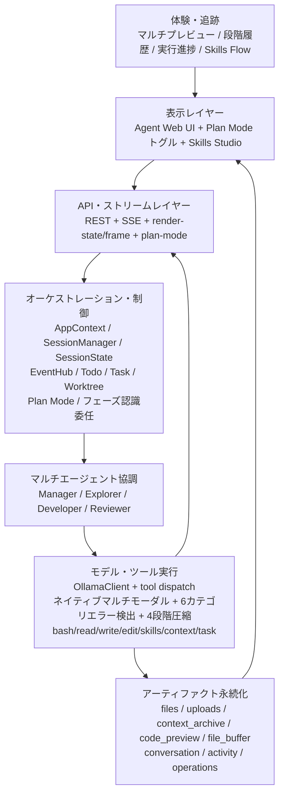

### 3.1 プログラム相互作用アーキテクチャ図

```text
ユーザー（Browser/Web UI）
        │
        │ REST（message/config/uploads/preview） + SSE（runtime events）
        ▼
ThreadingHTTPServer
  ├─ Handler（Agent APIs）
  └─ SkillsHandler（Skills Studio APIs）
        │
        ▼
SessionManager ──► SessionState（セッション単位状態機械）
        │                    │
        │                    ├─ モデル呼び出し編成（Ollama/OpenAI-compatible）
        │                    ├─ ツール実行（bash/read/write/edit/skills/task）
        │                    └─ 回復制御（truncation/timeout/no-tool idle）
        │
        ├─ EventHub（一時実行イベント）
        └─ アーティファクト保存（files/uploads/code_preview/context_archive）
                │
                ▼
       Preview APIs + Render bridge + 履歴追跡タイムライン
                │
                ▼
        Web UI リアルタイム更新（chat/runtime/preview/skills）
```

Mermaid：

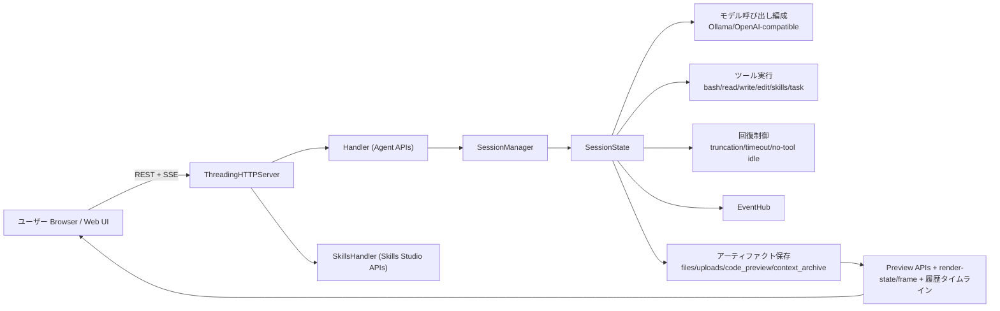

### 3.2 タスクロジック図

```text
ユーザー目標
   │
   ▼
意図・コンテキスト受理
   │（アップロード/履歴/コンテキスト予算）
   ▼
Plan Mode ゲート（Auto/On/Off）
   │
   ▼
計画・分解（Todo/Task/Worktree）
   │
   ▼
フェーズ認識委任（research/design/implement/test/review/deploy）
   │
   ▼
Agent Loop
  ├─ Model Call
  │    ├─ 通常出力 ───────────────┐
  │    ├─ ツール要求 ─────► ツール実行├─► 結果追記 -> 次ラウンド
  │    └─ 切断シグナル ───► 継続/回復
  │
  ├─ no-tool idle 検知 -> 診断/回復ヒント
  ├─ timeout 制御（モデル active 区間を除��）
  ├─ コンテキスト圧迫 -> 4段階圧縮（normal/light/medium/heavy）+ recall
  ├─ Reviewer Debug Mode（書き込み権限でバグ独立修正）
  ├─ リアルタイムユーザー入力マージ（plan 方向調整）
  └─ Plan ステップ自動進行
   │
   ▼
収束出力とアーティファクト
   │
   ▼
プレビュー/履歴/エクスポート（MD/コード/HTML + 段階バックアップ）
```

Mermaid：

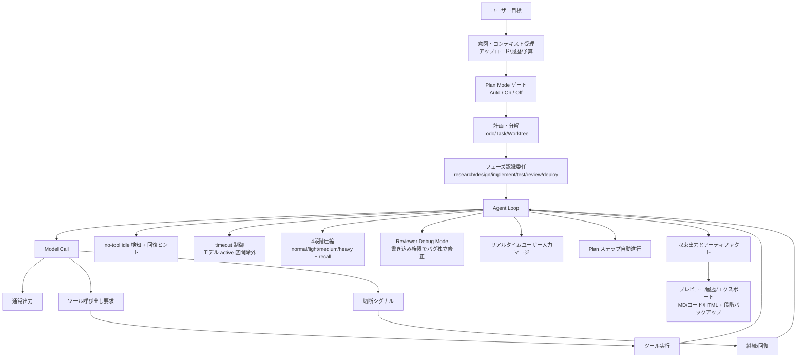

### 3.3 モノリシック同周波数マルチエージェント協調（Blackboard モード）

Clouds Coder は単一プロセスのモノリシック・ランタイム内で、役割特化の協調実行をサポートします。

- `manager`: ルーティング/仲裁専任（実装を直接書かない）+ フェーズ認識委任
- `explorer`: 調査、依存/パス解析、環境探索
- `developer`: 実装、ファイル編集、ツール実行
- `reviewer`: 検証、テスト判定、承認/差し戻し + Debug Mode で書き込み権限を取得しバグを独立修正

これはマイクロサービス分割ではなく、「単一プロセス + 単一ブラックボード」の協調モデルです。主な利点は次の通りです。

- サービス間 RPC 不要で協調レイテンシを低減
- Blackboard スナップショットによる Manager 判断の安定化
- 実行途中エラー時の高速な中断・再ルーティング

Blackboard の主要スライス:

- `original_goal`, `status`, `manager_cycles`, `plan`, `errors`, `phase`
- `research_notes`, `code_artifacts`, `execution_logs`, `review_feedback`
- `owner` 付き `todos`（`manager` / `explorer` / `developer` / `reviewer`）
- manager 判断状態（`task level`, `budget`, `remaining rounds`, `approval gate`）

実行トポロジ:

- `sequential`: Explorer -> Developer -> Reviewer の直列パイプライン
- `sync`: Manager 主導の同周波数協調。動的なクロスロール再委譲を許可

タスクレベル方針（Manager の意味判断、各ユーザー入力ごとに再評価）:

| Level | 典型タスク形態 | モード判断 | 予算方針 |
| --- | --- | --- | --- |
| L1 | 単発の簡易回答 | single-agent へ切替 | 最小 |
| L2 | 短い連続会話対応 | single-agent へ切替 | 拡張だが上限あり |
| L3 | 軽量な複数役割協業 | sync 継続 | 収束重視の制約 |
| L4 | 複雑な実装/調査 | sync 継続 | 拡張 |
| L5 | システム級の長期オーケストレーション | sync 継続 | 実質無制限（確認ゲート付き） |

Mermaid（モノリシック同周波数協調）:

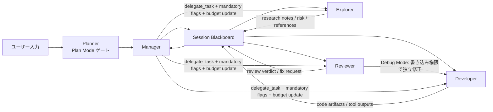

Mermaid（動的ルーティングと中断回帰）:

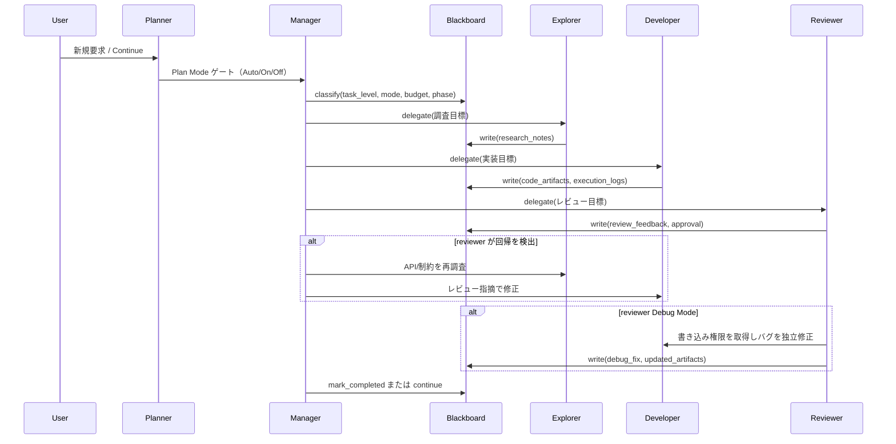

Mermaid（Blackboard 状態機械）:

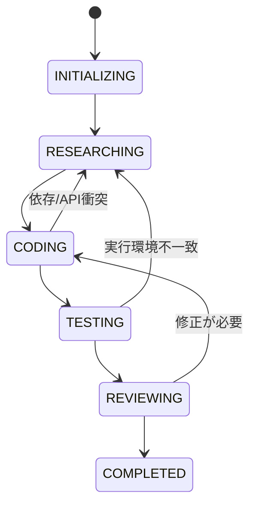

### 3.4 2026-03-07 更新セットとイノベーション対応

優先度順に統合された更新:

| 優先度 | 更新項目 | 実装ハイライト | アーキテクチャ影響 |
| --- | --- | --- | --- |
| 1 | マルチエージェント + Blackboard 融合 | 役割集合（`explorer/developer/reviewer/manager`）、blackboard 状態、sync/sequential、L1-L5 方針 | 単一ループを仲裁付き協調グラフへ拡張 |
| 2 | サーキットブレーカと融合故障制御 | `CircuitBreakerTriggered`、`HARD_BREAK_TOOL_ERROR_THRESHOLD`、`FUSED_FAULT_BREAK_THRESHOLD` | 反復失敗をハード停止し、収束性と Token 予算を保護 |
| 3 | 思考出力リカバリ | 寛容な `<think>` 解析、`EmptyActionError`、`<thinking-empty-recovery>` | 「思考のみで実行しない」ドリフトを抑制 |
| 4 | メモリ有界ホットスポットプレビュー | `_compress_rows_keep_hotspot`、動的 `buffer_cap`、変更点周辺保持圧縮 | 巨大 diff/大規模置換で OOM と UI フリーズを回避 |
| 5 | Todo 所有権 + 仲裁改善 | todo `owner`/`key`、`complete_active`、`complete_all_open`、仲裁計画制約 | 計画から実行までの責務追跡と収束制御を強化 |

2026.03.07 のアーキテクチャ革新:

- モノリシック同周波数マルチエージェント協調: 単一プロセス・単一ブラックボードで低摩擦協業。
- 産業グレード実行サーキットブレーカ: 無制限リトライではなく、ハード閾値で停止。
- OOM 安全なホットスポット描画: 変更領域を優先保持し、非重要コンテキストを圧縮。
- 適応型思考ウェイクアップ: 空アクションドリフトを検知し、実行フェーズへ強制復帰。

### 3.5 2026-03-07 詳細変更インベントリ

1. コアアーキテクチャとマルチエージェント系（最優先）
- 実行モード定数を追加: `EXECUTION_MODE_SINGLE`、`EXECUTION_MODE_SEQUENTIAL`、`EXECUTION_MODE_SYNC`。
- 役割集合を追加: `AGENT_ROLES = ("explorer", "developer", "reviewer")` と `manager` を含む `AGENT_BUBBLE_ROLES`。
- タスクレベル方針 `TASK_LEVEL_POLICIES`（`L1` 〜 `L5`）を追加し、意味判断ベースのモード/予算配分を可能化。
- Blackboard 状態定数 `BLACKBOARD_STATUSES` を追加（`INITIALIZING`、`RESEARCHING`、`CODING`、`TESTING`、`REVIEWING`、`COMPLETED`、`PAUSED`）。

2. サーキットブレーカとアンチドリフト強化
- 不可逆障害をハード停止する例外 `CircuitBreakerTriggered` を追加。
- 厳格閾値を追加: `HARD_BREAK_TOOL_ERROR_THRESHOLD = 3`、`HARD_BREAK_RECOVERY_ROUND_THRESHOLD = 3`、`FUSED_FAULT_BREAK_THRESHOLD = 3`。
- 効果: 楽観的リトライ中心の運用を、境界付き安全収束モデルへ移行。

3. 深い推論モデル向け思考出力リカバリ
- 「思考のみ・実行なし」を捕捉する `EmptyActionError` を追加。
- ウェイクアップ制御を追加: `EMPTY_ACTION_WAKEUP_RETRY_LIMIT = 2` と `<thinking-empty-recovery>`。
- `split_thinking_content` を強化し、未閉じ `<think>` を含む寛容パースに対応。

4. メモリ有界コードプレビューとホットスポット描画
- 変更領域保持圧縮 `_compress_rows_keep_hotspot` を追加。
- `make_numbered_diff` と `build_code_preview_rows` に動的 `buffer_cap` を導入し、メモリ増大を制御。
- 効果: 巨大ファイル差分時の OOM/フロント停滞リスクを低減。

5. Todo 所有権・仲裁・ワークフロー統制
- Todo に所有者/識別子フィールド `owner`、`key` を追加。
- 一括状態操作 API `complete_active()`、`complete_all_open()`、`clear_all()` を追加。
- 仲裁計画制御 `ARBITER_VALID_PLANNING_STREAK_LIMIT = 4` を追加。

6. 依存・雑多な制御プレーン拡張
- オーケストレーションと非ブロッキング制御のため `deque`、`selectors`、`signal`、`shlex` を導入。
- `RUNTIME_CONTROL_HINT_PREFIXES` に `<arbiter-continue>` と `<fault-prefill>` を追加し、回復ヒント表現を拡張。

三言語の完全版更新ログ: [`CHANGELOG-2026-03-07.md`](./log/CHANGELOG-2026-03-07.md)

### 3.6 2026-03-16 重大修正：Single モード Agent リーク & 終了シグナル無視

マルチエージェントオーケストレーション層で相互に関連する 2 つの重大バグを修正：

1. Single モード Agent リーク（`_manager_apply_task_policy`）
- `executor_mode_flag=True` の場合、target が participants に含まれない分岐が追加 Agent を append し、Single モードの `participants = [assigned_expert]` 制約を上書きしていた。
- 修正：全 participant/target 解決後にハードガードを追加。`participants = [assigned_expert]` を強制リセットし、expert 以外の target を assigned_expert にリダイレクト。

2. Manager が Agent の結論的応答の終了シグナルを無視
- Agent（例: developer）が「タスク完了」と応答した後も、Manager が explorer → developer → reviewer を繰り返し委任する無限ループが発生。原因：(a) 結論検出は fallback パスでのみ実行され、ツール解析ルーティングパスでは完全にバイパス；(b) `_manager_apply_task_policy()` に結論検出ロジックが皆無；(c) テキストベースの完了シグナルでは blackboard `approval.approved` が設定されない。
- 修正：4 層防御を追加：
  - 第 1 層 — Fallback 汎用 endpoint 検出：`_detect_endpoint_intent` を `simple_qa` 限定から全タスクタイプに拡張。
  - 第 2 層 — Policy 層インターセプト：`can_finish_from_approval` チェック前に結論的応答検出を追加。
  - 第 3 層 — Sync ループインターセプト：各 Agent ターン完了後に結論的応答を検出し、条件を満たせば即座に break し自動承認。
- セーフガード：エラーログまたは未完了タスクが存在する場合、結論検出は finish をトリガーしない（誤終了防止）。

三言語の完全版詳細: [`CHANGELOG-2026-03-16.md`](./log/CHANGELOG-2026-03-16.md)

### 3.7 2026-03-20 大規模更新：Plan Mode アーキテクチャ & コア全面刷新

プロジェクト開始以来最大のアーキテクチャ変更 — 7 モジュール、60+ 修正ポイント。

**Plan Mode — 統一アーキテクチャ**
- ツールバーに `Plan: Auto/On/Off` ボタンを新設。ユーザーがプランニング実行を制御可能。
- Single/Sync 両モードで同一動作。Single モードは `_single_agent_plan_step_check()` でツール結果に基づき plan step を自動推進。
- 6 層 plan step 保護で早期終了を防止：arbiter による一括完了不可、pending steps がある場合 manager は finish にルーティング不可。
- Planner チャットバブルはオレンジレッドテーマ、完全な agent badge 構造。

**階層型コンテキスト圧縮 + ファイルバッファ**
- 4 段階漸進圧縮（Tier 0–3）、ctx_left パーセンテージと絶対閾値に基づく。
- Agent コンテキスト（`agent_messages`、`manager_context`、ロール別 `contexts`）が compact 時に同期圧縮 — 以前は未処理で、compact 後に即座に再壁衝突。
- ファイルバッファが大きなコンテンツ（>2KB）をディスクにオフロード。ctx_left 範囲を [4K, 1M] に拡張。
- `_build_state_handoff()` で目標/進捗/状態の圧縮後ロスレス引き継ぎを保証。

**統一エラーアーキテクチャ**
- 統一 `errors` リスト + `category` フィールドでコンパイルエラーのみの検出を置換。6 カテゴリ：test、lint、compilation、build_package、deploy_infra、runtime。
- `_process_tool_result_errors()` がマルチエージェント/シングルエージェント両パスのインライン検出を置換。

**Reviewer Debug Mode**
- エラー検出時、reviewer が自動的に `write_file`/`edit_file` 権限を取得し独立してバグ修正。
- エラー解消または 6 ラウンド後に自動解除（developer にフォールバック）。Explorer ストール検出：連続 3 回同一委任 → 強制切替。

**複雑度継承 & リア��タイム入力**
- Plan 選択応答で再分類をスキップ、複雑度レベルを維持。
- リアルタイムユーザー入力が `_merge_user_feedback_with_plan()` をトリガーし、実行中に plan 方向を調整。
- リスタート意図融合：ユーザー意図 > plan 意図 > コンテキスト意図の優先度。

**タスクフェーズ独立性**
- フェーズ認識委任：research→explorer、implement→developer、test→developer、review→reviewer。
- Manager に `PHASE INDEPENDENCE` 指示で前フェーズの実装パターン引き継ぎを防止。

**マルチモーダルネイティブサポート & TodoWrite 分離**
- `_run_read()` が画像/音声/動画ファイルを検出、モデル対応時にネイティブマルチモ���ダル入力として注入。
- Plan mode 下の TodoWrite は owner タグ付きサブタスクを���成、plan_step を上書きしない。

三言語の完全版詳細: [`CHANGELOG-2026-03-20.md`](./log/CHANGELOG-2026-03-20.md)

### 3.8 2026-03-25 重大アップデート：Skills エコシステム互換 & デュアル RAG アーキテクチャ & コア修正

**Skills エコシステム全面対応**
- 5 大 skill エコシステムに対応、per-provider アダプター不要：
  - [awesome-claude-skills](https://github.com/travisvn/awesome-claude-skills) — コミュニティ Claude skills キュレーションコレクション
  - [MiniMax-AI/skills](https://github.com/MiniMax-AI/skills) — MiniMax 公式 skills（フロントエンド/フルスタック/iOS/Android/PDF/PPTX）
  - [anthropics/skills](https://github.com/anthropics/skills) — Anthropic 公式 skills リポジトリ（`skills-main`）
  - [kimi-agent-internals](https://github.com/dnnyngyen/kimi-agent-internals) — Kimi agent スキルシステム解析と抽出 skill アーティファクト
  - [academic-pptx-skill](https://github.com/Gabberflast/academic-pptx-skill) — アカデミック発表 skill（アクションタイトル・引用規格・論理構造）
- 以前の失敗の根本原因を修正：Execution Guide インジェクション（削除済み）が存在しない仮想 skill パスに `read_file` を強制し無限ループ。
- Chain Tracking システム削除（7 メソッド）；`_broadcast_loaded_skill` を 16→6 フィールドに簡素化；`_loaded_skills_prompt_hint` を約 350→120 tokens に削減。
- LLM 自律発見：タスクタイプに基づき適切な skill を自律選択。マルチ skill 同時ロード + コンフリクト検出。
- Sync モード Manager が `TodoWrite` を取得。新規 `_preload_skills_from_plan_steps` で plan steps から skill 名を事前スキャン。
- Plan steps 上限 10→20；1 ステップ文字数 400→600；反幻覚制約を追加。

**デュアル RAG 知識アーキテクチャ**
- `RAGIngestionService`（Data RAG）：ドキュメント・PDF・構造化データ — 汎用知識ベース。
- `CodeIngestionService`（Code RAG）：ソースコードファイル、コード認識トークナイザー — コード知識ベース。
- 両ライブラリとも TF_G_IDF_RAG 基盤；`query_knowledge_library(query, top_k)` が両ライブラリを並列検索しマージ結果を返す。
- `research-orchestrator-pro` と `scientific-reasoning-lab` に完全な RAG 検索ガイドを注入。

デュアル RAG アーキテクチャ：

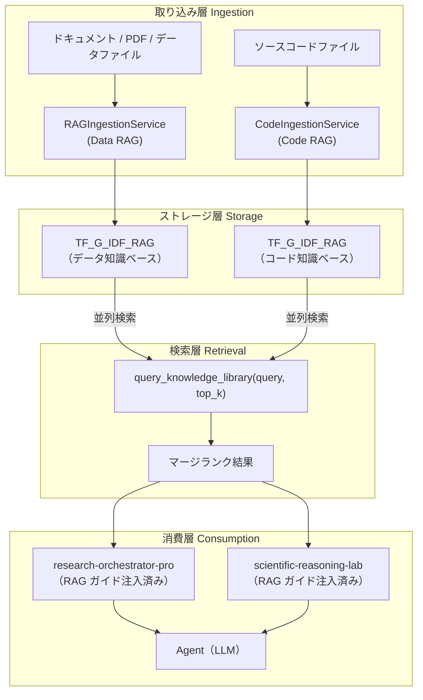

RAG 検索フロー：

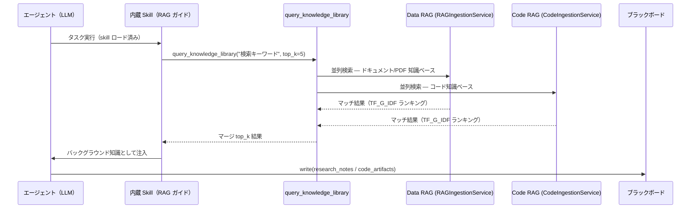

**内蔵 Skills 全面リライト**
- `research-orchestrator-pro`：協調型分析決定ハブ、出力型 skill と協調（干渉しない）、RAG 検索ガイド内蔵、反幻覚スタンス。
- `scientific-reasoning-lab`：5 フェーズ自己反復推論エンジン（分解→導出→検証→評価→統合）、research-orchestrator-pro Phase 2 サブエンジンとして統合、RAG 検索ガイド内蔵。

**多因子優先度コンテキスト圧縮**
- `_classify_message_priority`：10 因子スコアリング（近接性 0–3、役割重み、タスク進捗 +2、エラー +2、目標関連性 +1、skill +1、compact-resume=10）。
- `_priority_compress_messages`：高スコア（≥7）保持、中スコア（4–6）500 文字に圧縮、低スコア（0–3）1 行サマリー。
- `_build_state_handoff` 強化：PLAN_PROGRESS、CURRENT_STEP、ACTIVE_SKILLS、RECENT_TOOLS フィールド追加。
- `_auto_compact` に優先度圧縮を統合、`pop(0)` セーフティフォールバック維持。

**Anti-stall メカニズム最適化**
- 閾値 2→3 回連続同一ターゲット委任で発動に引き上げ。
- "CHANGE YOUR APPROACH" を協調的ガイダンス（ask_colleague / 別ツール試行 / finish_current_task 呼び出し）に軟化。

**重大バグ修正**
- `CodeIngestionService._flush_lock`：`threading.Lock()` 追加 — コードライブラリへのアップロード時の `AttributeError` を修正。
- フロントエンド `setTaskLevel()`：レベル更新後に `scheduleSnapshot()` 追加 — 次の SSE 更新でタスクレベルセレクターが "Auto" に戻る問題を修正。
- `_sync_todos_from_blackboard`：worker items（`owner ∈ {developer, explorer, reviewer}`) をブラックボード同期をまたいで保護 — 毎回のサイクルで TodoWrite アイテムが消失する問題を修正。

三言語の完全版詳細: [`CHANGELOG-2026-03-25.md`](./log/CHANGELOG-2026-03-25.md)

## 4. 主要ランタイム構成

- `AppContext`：全体設定・モデルカタログ・サーバ状態
- `SessionManager`：セッション管理
- `SessionState`：セッション単位の実行状態、ツール状態、切断/文脈/進行マーカー
- `EventHub`：SSE/内部イベント配信
- `OllamaClient`：モデル呼び出しアダプタとフォールバック
- `SkillStore`：ローカル/プロバイダ skill 登録・読み込み
- `TodoManager` / `TaskManager` / `BackgroundManager`：計画と非同期処理
- `WorktreeManager`：分離作業ディレクトリ
- `Handler` / `SkillsHandler`：Agent UI/Skills Studio API

## 4.1 RAG 知識アーキテクチャ：TF-Graph_IDF エンジン

Clouds Coder には **TF-Graph_IDF** と呼ぶ検索エンジンが内蔵されています。語彙スコアリング・知識グラフ位相・自動コミュニティ検出・マルチルートクエリオーケストレーションを組み合わせ、標準的な TF-IDF や BM25 に比べて召回品質が大きく向上しています。

### デュアルライブラリ設計

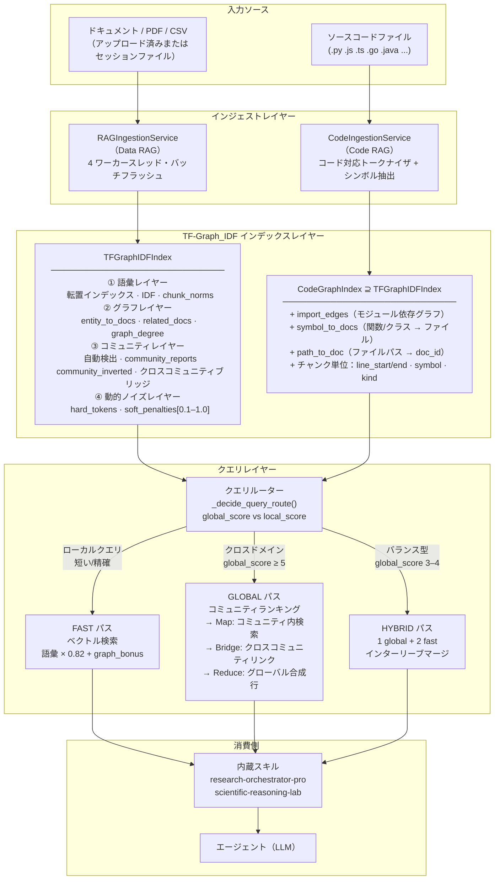

### TF-Graph_IDF スコアリング式

検索された各チャンクは **語彙コンポーネント** と **グラフボーナス** で構成されるスコアを受け取ります：

```
final_score = 語彙 × 0.82 + graph_bonus         （Data RAG）
final_score = 語彙 × 0.78 + graph_bonus         （Code RAG — グラフ重み増加）

語彙        = Σ(q_weight_i × c_weight_i) / (query_norm × chunk_norm)

graph_bonus = 0.18 × entity_overlap                 （共有固有表現）
            + 0.10 × doc_entity_overlap              （ドキュメントレベル固有表現一致）
            + min(0.16, log(doc_graph_degree+1)/12)  （ハブドキュメントブースト）
            + 0.08  （クエリカテゴリ == ドキュメントカテゴリの場合）
            + min(0.08, log(community_doc_count+1)/16)

Code RAG 追加ボーナス：
            + 0.16 × symbol_overlap                  （関数/クラス名一致）
            + 0.28  （ファイルパスがクエリに含まれる場合）
            + 0.20  （ファイル名がクエリに含まれる場合）
            + 0.14  （モジュール名がクエリに含まれる場合）
            + min(0.12, log(import_degree+1)/9)      （インポートグラフ中心性）
```

動的ノイズによるトークン重み：

```
idf[token]    = log((1 + N_chunks) / (1 + df[token])) + 1.0
tf_weight     = (1 + log(freq)) × idf[token] × dynamic_noise_penalty[token]
chunk_norm    = √Σ(tf_weight²)

dynamic_noise_penalty ∈ [0.10, 1.0]  — 静的ストップワードリストではなくコーパス単位で計算
```

### 動的ノイズ抑制 — コーパス適応型トークン重み付け

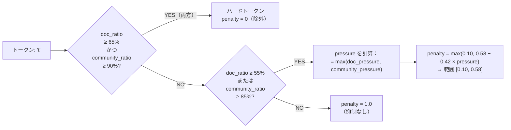

これは標準 TF-IDF で使用されるハードコードされたストップワードリストを置き換えます。"the" や "and" のようなトークンは、事前に作成されたリストではなく、**この特定の知識ベースにおいて情報を持たない**とコーパス証拠が確認した場合にペナルティが課されます。ドメイン固有の一般的な用語は、実際のドキュメント分布から導出された適切なペナルティレベルを受け取ります。

### 3ルートクエリオーケストレーション

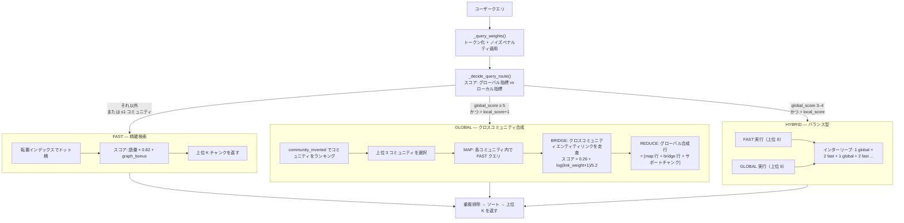

**ルート決定シグナル：**
- グローバル指標（+スコア）：クエリ長 ≥ 18 トークン、固有表現 ≥ 2、"compare"/"overall"/"trend"/"survey" などのキーワード
- ローカル指標（+スコア）："what is"/"which file"/クエリ内ファイル拡張子、短いクエリ ≤ 10 トークン

### 自動コミュニティ検出

ドキュメントは `(category, language, top_entities)` に基づいて自動的にコミュニティにグループ化されます — 手動分類は不要です。

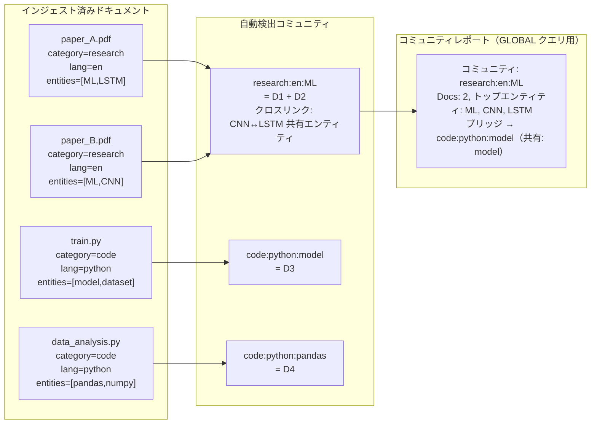

各コミュニティは **コミュニティレポート** を生成します — メンバードキュメント、トップエンティティ、クロスコミュニティリンクの構造化テキスト要約。GLOBAL クエリはまずコミュニティレベルで検索し、その後チャンクにドリルインします。

### Code RAG：モジュール依存グラフ

`CodeGraphIndex` は `TFGraphIDFIndex` をコードネイティブ知識グラフで拡張します：

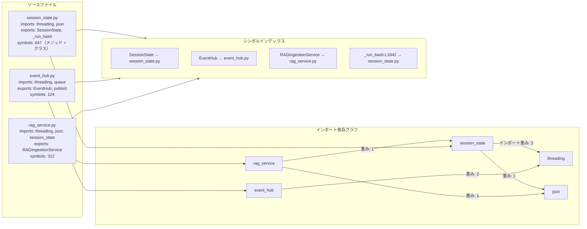

クエリが `"RAGIngestionService"` に言及すると、シンボルインデックスが直接 `rag_service.py` を特定し、インポートグラフ中心性のボーナススコアを付与します（高インポートファイルは上位にランク）。

### 標準 RAG アプローチとの比較優位性

| 機能 | 標準 TF-IDF | BM25 | 埋め込み / ベクター RAG | **TF-Graph_IDF（Clouds Coder）** |
|---|---|---|---|---|
| ストップワード処理 | 静的リスト | 静的リスト | 暗黙的（埋め込み空間） | **コーパス適応型動的ペナルティ** |
| IDF スムージング | `log(N/df)` | 飽和 BM25 | N/A | `log((1+N)/(1+df)) + 1.0` |
| TF 飽和 | なし | BM25 k₁ パラメータ | N/A | `log(freq)` + ノイズペナルティ |
| 知識グラフ | ✗ | ✗ | ✗ | **エンティティ重複 + ドキュメントグラフ次数 + コミュニティ位相** |
| 多階層検索 | フラット | フラット | フラット | **チャンク → ドキュメント → コミュニティ** |
| コミュニティ合成 | ✗ | ✗ | ✗ | **自動コミュニティ検出 + コミュニティ横断 Map-Reduce** |
| クロスドメインブリッジ | ✗ | ✗ | ✗ | **エンティティ連結コミュニティブリッジ** |
| コードネイティブグラフ | ✗ | ✗ | ✗ | **インポートエッジ + シンボルテーブル + 行範囲** |
| クエリルーティング | 固定 | 固定 | 固定 | **自動: fast / global / hybrid** |
| 未知語処理 | 失敗 | 失敗 | 埋め込みで対応 | エンティティ抽出で対応 |
| 説明可能性 | スコア分解 | スコア分解 | ブラックボックス | **完全スコア内訳: 語彙 + エンティティ + グラフ + コミュニティ** |
| GPU/埋め込みモデル要件 | ✗ | ✗ | ✓（必須） | **✗ — 完全インプロセス、外部モデル不要** |

**主要な設計選択とその根拠：**

1. **埋め込みモデル不要** — TF-Graph_IDF は完全インプロセス（Python + JSON スナップショット）。GPU・API 呼び出し・ベクター DB なし。一般的な知識ベースでの検索レイテンシはサブミリ秒。

2. **動的ノイズ > 静的ストップワード** — "model" というトークンはコード RAG コンテキストでは必須ですが、すべてのドキュメントが "models" を論じるドメインでは無関係なノイズ。コーパス由来のペナルティが普遍的なリストではなく実際の知識ベースに適応します。

3. **グラフボーナスがハブドキュメントを発見可能に** — 他の多くのファイルからインポートされる中心ファイル（高 `graph_degree`）は、ルーズにマッチするクエリでも自然に上位に表示。純粋な語彙検索に共通する「重要ファイルが結果に埋もれる」問題を解決。

4. **合成クエリのためのコミュニティ Map-Reduce** — ユーザーが「ML フレームワークをプロジェクト横断で比較して」と質問すると、FAST 検索は散在するチャンクを返します。GLOBAL 検索はコミュニティ別にグループ化し、コミュニティごとのサマリーを生成し、統一されたビューを合成 — 人間のアナリストが行うことに近い。

5. **Code RAG パスマッチボーナス（+0.28）** — クエリが明示的にファイルパスを名指しすると、検索はそのファイルをほぼ確実に上位1位に重み付けし、ファイル間のトークン内容の重複による無関係な結果を排除。

## 5. 複雑タスク信頼性設計

### 5.1 切断回復クローズドループ

- live truncation 状態（`text/kind/tool/attempts/tokens`）を追跡
- 切断回復イベントを UI に逐次配信
- 末尾バッファと構造情報から continuation prompt を構築
- 破損末尾を補修してから継続出力をマージ
- 多段継続（`TRUNCATION_CONTINUATION_MAX_PASSES`）
- UI 上は同一 call 内の継続として表示

### 5.2 Timeout スケジューリング

- `--timeout` / `--run_timeout` によるグローバル制御
- 最小 timeout は 600 秒
- モデル active 区間を timeout 計算から除外
- timeout 状態は実行ボードで可視化

### 5.3 ループ/空想抑制

- no-tool idle streak を検知
- 空白/思考のみターンの連続時に診断ヒント注入
- 回復モードへ移行しタスク分解を誘導
- Todo/Task と連携して収束性を向上

### 5.4 コンテキスト予算制御

- `--ctx_limit` による文脈予算上限
- ユーザー明示設定時は手動ロック
- UI に推定 token と残量を表示
- 圧迫時は自動 compact + archive recall

### 5.5 汎用/研究タスク向け `LLM -> Coding -> LLM` 信頼性経路

- フェーズ A（`LLM 計画`）: 曖昧な要求を、検証可能な実行サブタスクへ変換。
- フェーズ B（`Coding 実行`）: ツールベース解析/計算/書き込みを強制し、進捗をファイル・コマンド・成果物に固定。
- フェーズ C（`LLM 統合`）: 中間成果物を統合し、仮定・制約・未解決点を明示した説明可能な結論を出力。
- ドリフト抑制: 切断/空白出力が続く場合は、長い自由生成を繰り返さず、より細粒度な分解実行に自動遷移。
- 研究向け数値厳密性: 単位正規化、値域妥当性、複数ソース照合、差異発生時の再計算を経て最終報告。

## 6. Web UI とパフォーマンス戦略

- SSE + snapshot polling のハイブリッド更新
- モデル実行中の経過時間表示
- 切断回復パネル（pass/token）
- 大規模会話向け仮想リスト経路
- `live/static` 凍結モードで描画負荷を抑制
- render bridge による構造化可視化フレーム更新
- コードプレビューの stage タイムライン + 全文表示

### 6.1 UX イノベーション（プレビュー・追跡・操作性）

- 統合マルチビュー作業面：同一タスクを Markdown 叙述、HTML 表示、コード段階ビューで横断確認できる。
- リアルタイムコード追跡：write/edit 操作が段階スナップショットと操作ストリームに反映され、変更内容・時刻・実行ステップを追跡可能。
- 履歴バックアップ指向のコードレビュー：段階バックアップ、差分行表示、ホットアンカー定位、純コードコピーによりデバッグと監査を両立。
- 人間中心の実行フィードバック：長時間呼び出し中も会話/実行ボード内で経過時間、切断継続進捗、回復ヒントを可視化。
- Skills 制作注入フローの一体化：Skills Studio は scan -> flow 設計 -> 生成 -> 注入 -> 保存の閉ループを提供し、可視 flow builder を搭載。
- 混在コンテンツ作業の連続性：コード/文書/表/メディアのドラッグアップロード後、即座にワークスペースへ反映し、プレビューと実行経路へ接続。

## 7. Skills システム

2 層構造：

- **実行時ロード層**：ローカル skill ファイル + HTTP JSON provider manifest プロトコル
- **Skills Studio 制作層**：スキャン、生成、保存、アップロード

**エコシステム互換性** — 以下 5 大エコシステムの skills をアダプターなしでロード・実行：
- [awesome-claude-skills](https://github.com/travisvn/awesome-claude-skills) — コミュニティ Claude skills キュレーションコレクション
- [MiniMax-AI/skills](https://github.com/MiniMax-AI/skills) — MiniMax 公式 skills（フロントエンド/フルスタック/iOS/Android/PDF/PPTX）
- [anthropics/skills](https://github.com/anthropics/skills) — Anthropic 公式 skills リポジトリ
- [kimi-agent-internals](https://github.com/dnnyngyen/kimi-agent-internals) — Kimi agent スキルシステム解析と抽出 skill アーティファクト
- [academic-pptx-skill](https://github.com/Gabberflast/academic-pptx-skill) — アカデミック発表 skill（アクションタイトル・引用規格・論理構造）

**ロードメカニズム**：
- LLM 自律発見：モデルがタスクタイプに基づき適切な skill を判断、キーワード強制トリガーなし
- マルチ skill：複数の skills を同時起動可能；直接競合する skill ペアはブロック
- Plan steps 先行ロード：`_preload_skills_from_plan_steps` が plan steps テキストをスキャンし実行前に先行プリロード

**内蔵 skills**（本リリースでリライト）：
- `research-orchestrator-pro`：協調型分析決定ハブ、RAG 検索ガイド内蔵
- `scientific-reasoning-lab`：5 フェーズ自己反復推論エンジン、RAG 検索ガイド内蔵

本リポジトリの skill 構成：

- 再利用基盤：`skills/code-review`、`skills/agent-builder`、`skills/mcp-builder`、`skills/pdf`
- 拡張生成：`skills/generated/*`
- プロトコル/インデックス：`skills/clawhub/`、`skills/skills_Gen/`

## 8. API サマリ

主要エンドポイント群：

- グローバル設定/モデル/ツール/skill：`/api/config`、`/api/models`、`/api/tools`、`/api/skills*`
- セッション管理：`/api/sessions`（CRUD）
- セッション実行：`/api/sessions/{id}`、`/api/sessions/{id}/events`（SSE）
- メッセージ/制御：`/message`、`/interrupt`、`/compact`、`/uploads`
- モデル/言語設定：`/api/sessions/{id}/config/model`、`/config/language`
- プレビュー/描画：`/preview-file/*`、`/preview-code/*`、`/preview-code-stages/*`、`/render-state`、`/render-frame`
- Skills Studio：`/api/skillslab/*`

## 9. クイックスタート

### 9.0 PyPI インストール（推奨）

```bash
pip install clouds-coder
```

インストール後、直接起動：

```bash
clouds-coder --host 0.0.0.0 --port 8080
```

- Agent UI：`http://127.0.0.1:8080`
- Skills Studio：`http://127.0.0.1:8081`（無効化可能）

> PyPI ページ：https://pypi.org/project/clouds-coder/

### 9.1 必要環境（ソースインストール）

- Python 3.10+
- Ollama（ローカルモデル運用向け、推奨）
- 依存インストール（フルのソース導入プレビュー / 解析対応を有効化）：

```bash
pip install -r requirements.txt
```

このソース導入依存で、ランタイムが使うリッチプレビュー解析スタックを有効化します。

- PDF: `pdfminer.six`, `PyMuPDF`
- CSV / 分析テーブル: `pandas`
- Excel: `openpyxl`, `xlrd`
- Word: `python-docx`
- PowerPoint: `python-pptx`
- 画像アセット処理: `Pillow`

`pdftotext`、`xls2csv`、`antiword`、`catdoc`、`catppt`、`textutil` などの OS 補助ツールは旧形式 fallback の品質を上げますが、基本のソース導入必須条件ではありません。

### 9.2 起動（ソースインストール）

```bash
python Clouds_Coder.py --host 0.0.0.0 --port 8080
```

デフォルト：

- Agent UI：`http://127.0.0.1:8080`
- Skills Studio：`http://127.0.0.1:8081`（無効化可能）

### 9.3 よく使うオプション

- `--model <name>`：起動モデル
- `--ollama-base-url <url>`：Ollama エンドポイント
- `--timeout <seconds>`：グローバル timeout
- `--ctx_limit <tokens>`：コンテキスト上限（明示設定でロック）
- `--max_rounds <n>`：1 run の最大ラウンド
- `--no_Skills_UI`：Skills Studio 無効化
- `--config <path-or-url>`：外部 LLM 設定
- `--use_external_web_ui` / `--no_external_web_ui`：外部 UI 切替
- `--export_web_ui`：内蔵 UI 資産エクスポート

## 10. リポジトリ構成

リリースパッケージ（静的ファイル）：

```text
.
├── Clouds_Coder.py   # コアランタイム（バックエンド + 内蔵フロント資産）
├── requirements.txt                  # Python 依存
├── .env.example                      # 環境変数テンプレート
├── .gitignore                        # リリース時の隠しファイル除外ルール
├── LLM.config.json                   # メイン LLM 設定テンプレート
├── README.md
├── README-zh.md
├── README-ja.md
├── LICENSE
└── packaging/                        # クロスプラットフォーム包装スクリプト
    ├── README.md
    ├── windows/
    ├── linux/
    └── macos/
```

初回起動後に自動生成される構成：

```text
.
├── skills/                           # 起動時に内蔵 bundle から自動展開
│   ├── code-review/
│   ├── agent-builder/
│   ├── mcp-builder/
│   ├── pdf/
│   └── generated/...
├── js_lib/                           # 実行時に自動取得/検証されるフロントライブラリ
├── Codes/                            # セッション作業領域と実行アーティファクト
│   └── user_*/sessions/*/...
└── web_UI/                           # 任意：外部 WebUI 資産エクスポート時に生成
```

補足：

- `skills/` はプログラム側（`ensure_embedded_skills` + `ensure_runtime_skills`）で自動展開されるため、リリース同梱は必須ではありません。
- `js_lib/` は実行時にダウンロード・検証・キャッシュされるため、クリーンなリリース同梱には必須ではありません。
- macOS の隠しファイル（`.DS_Store`、`__MACOSX`、`._*`）は `.gitignore` で除外し、配布物に含めない運用を推奨します。
- 本リリースは意図的に、実行必須ファイルとパッケージングスクリプト中心の最小構成にしています。

## 11. エンジニアリング特性

- 単一ファイル中核で配備と版管理が容易
- API と UI が密結合し、運用可観測性が高い
- 楽観的再試行より決定的回復を重視
- セッション成果物を永続化し、追跡と再現が容易
- 短いデモではなく長時間タスク実行を重視
- 従来のコーディング CLI より、汎用タスク適応性と完遂性を重視

## 11.1 アーキテクチャ上の優位性

- All-in-one 単一ファイルカーネル（`Clouds_Coder.py`）：agent loop、ツールルータ、セッション状態機械、HTTP API、SSE、Web UI bridge、Skills Studio を同一プロセスに統合し、サービス間オーケストレーション負荷と分散障害点を削減。
- 柔軟な導入プロファイル：PyPI 導入は軽量なベースランタイムを維持し、ソース導入では `requirements.txt` により PDF / Office / 表計算 / 画像プレビュー依存を有効化できます。さらに PyInstaller/Nuitka の onedir/onefile 配布経路も維持しています。
- ネイティブなマルチモーダル対応：プロバイダ能力推定と media endpoint ルーティングをプロファイル解析に内蔵し、画像/音声/動画ワークフローを追加プロキシなしで扱える。
- ローカル + Web モデル広域対応と小規模モデル最適化：Ollama と OpenAI-compatible を併用しつつ、context 予算制御、切断継続、idle 回復、統一 timeout により小モデル運用時の失敗率を抑制。

## 11.2 ネイティブな多言語プログラミング環境切替

- UI 言語切替を標準実装：`zh-CN`、`zh-TW`、`ja`、`en` をグローバル/セッション API 経由で切替可能。
- モデル環境切替を標準実装：Web UI から provider/model プロファイルを動的に切替可能（再起動不要、カタログ検証とフォールバックあり）。
- プログラミング言語コンテキスト切替：コードプレビューが多数の拡張子を自動判別して言語レンダラへ割当て、混在言語リポジトリでも連続した読解・編集が可能。

## 11.3 Cloud CLI Coder：アーキテクチャ価値と実運用上の優位性

- クラウド側 CLI 実行モデル：サーバが隔離セッションワークスペース上で `bash`/`read_file`/`write_file`/`edit_file` を実行し、Web 側で CLI 級プログラミング能力と可観測性を提供。
- 配備・配布が容易：単一コマンド起動と PyInstaller/Nuitka（onedir/onefile）経路により、端末ごとにフル CLI 環境を配る方式より運用負荷を削減。
- サーバ側分離の実装基盤：セッション単位の空間分離（`files/uploads/context_archive/code_preview`）と task/worktree 分離により、1テナント1VM など物理分離運用へ接続しやすい。
- Web + CLI の融合 UX：Web の可視性（状態・タイムライン・プレビュー）と CLI の実行力（Shell・決定的ファイル変更・再現可能アーティファクト）を両立。
- マルチ端末並列の集中管理：1 サービスで複数セッションを並列運用し、モデルカタログ、skills レジストリ、操作ログ、ランタイム制御を集約。
- ローカル/プライベートクラウドでの情報保全：実行と成果物を自主管理環境（ローカル、社内 LAN、私有クラウド）に留められ、第三者 SaaS 実行経路への依存を下げられる。

### 11.3.1 一般的な代替方式との比較

- 純粋な Web Copilot と比較：Clouds Coder は提案表示だけでなく、サーバ側ツール実行と成果物永続化まで提供。
- 純粋なローカル CLI Agent と比較：端末ごとの初期構築コストを下げ、共有可能な可視化コントロールプレーンを追加。
- 重量級マルチサービス型 Agent 基盤と比較：軽量トポロジーを維持しつつ、セッション分離、ストリーミング可観測、長タスク回復を実現。

## 11.4 従来のコーディング CLI より汎用である理由

- 従来 CLI は「コード変更」に最適化されがちだが、Clouds Coder は証拠収集、解析、実行、統合、レポート提出までを一連で扱う。
- 従来 CLI は状態が端末ログに埋もれやすいが、Clouds Coder は実行状態、切断回復、timeout 制御、成果物系譜を Web UI に明示。
- 従来 CLI はコード生成で終了しやすいが、Clouds Coder は同一ランで分析結果やレポート（Markdown/HTML/構造プレビュー）まで出力可能。
- 従来 CLI は単一端末中心だが、Clouds Coder はクラウド側 CLI 実行とセッション分離により集中運用に向く。

## 11.5 高効率チェーンと研究向け数値厳密性

Clouds Coder は複雑な理工系タスクを「一発回答」ではなく、実行可能な状態機械として処理します。目標チェーンは `入力 -> 理解 -> 思考 -> Coding（人間に近い記述計算）-> 計算 -> 検証 -> 再思考 -> 統合 -> 出力` です。

実装整合メモ：以下の流れは、現行ソースに実在するモジュール/イベント/成果物（`SessionState`、`TodoManager`、tool dispatch、`code_preview`、`context_archive`、`live_truncation`、`runtime_progress`、`render-state/frame`）のみで構成しています。未実装の専用「ハードコード科学検証器」は仮定していません。

### 11.5.1 理工系タスク処理パイプライン（カーネル整合）

```text
┌──────────────────────────────────────────────────────────────────────┐
│ 0) 入力 Input                                                       │
│ ユーザー要求 + アップロード（PDF/CSV/コード/メディア）             │
└─────────────────────────────┬────────────────────────────────────────┘
                              ▼
┌──────────────────────────────────────────────────────────────────────┐
│ 1) 理解 Understanding                                               │
│ モデル関与: LLM による意図解析・制約抽出                             │
│ カーネル: Handler + SessionState                                    │
│ 産物: messages（ユーザー回合 + system prompt）                        │
└─────────────────────────────┬────────────────────────────────────────┘
                              ▼
┌──────────────────────────────────────────────────────────────────────┐
│ 2) 思考と分解 Thinking                                              │
│ モデル関与: LLM による Todo 分解・実行順序設計                       │
│ カーネル: TodoManager + SkillStore                                  │
│ 産物: todos[]（TodoWrite/TodoWriteRescue）                           │
└─────────────────────────────┬────────────────────────────────────────┘
                              ▼
┌──────────────────────────────────────────────────────────────────────┐
│ 3) Coding（人間に近い記述計算）                                      │
│ モデル関与: 実行スクリプト/パーサ/クエリ生成                         │
│ カーネル: tool dispatch + WorktreeManager + Skill runtime           │
│ 産物: tool_calls / file_patch / code_preview stages                 │
└─────────────────────────────┬────────────────────────────────────────┘
                              ▼
┌──────────────────────────────────────────────────────────────────────┐
│ 4) 計算 Compute                                                     │
│ モデル関与: 最小化（決定的実行を優先）                               │
│ カーネル: bash/read/write/edit/background_run + persistence         │
│ 産物: command outputs / changed files / intermediate files          │
└─────────────────────────────┬────────────────────────────────────────┘
                              ▼
┌──────────────────────────────────────────────────────────────────────┐
│ 5) 検証 Verify                                                      │
│ モデル関与: LLM レビュー + ツールスクリプト検証（専用固定検証器なし） │
│ カーネル: SessionState + EventHub + context_archive                 │
│ 検証: 式/単位、範囲外れ値、ソース整合、叙述整合                      │
│ 産物: レビューメッセージ + read/log 根拠 + 信頼度表現                │
└───────────────┬───────────────────────────────────────┬──────────────┘
                │合格                                    │失敗/競合
                ▼                                        ▼
┌──────────────────────────────────────┐     ┌─────────────────────────┐
│ 6) 統合 Synthesis                    │     │ 2)/3) へ戻る再計算ループ│
│ モデル関与: 結果解釈・制約明示       │     │ anti-drift / truncation │
│ カーネル: SessionState + EventHub    │     │ resume / timeout 制御   │
│ 産物: assistant message/caveats      │     │ context compact/recall  │
└───────────────────┬──────────────────┘     └───────────┬─────────────┘
                    ▼                                    ▲
┌──────────────────────────────────────────────────────────────────────┐
│ 7) 出力 Output                                                      │
│ カーネル: preview-file/code/render-state/frame APIs                 │
│ 出力: Markdown / HTML / コード成果物 / 可視化レポート               │
└──────────────────────────────────────────────────────────────────────┘
```

Mermaid：

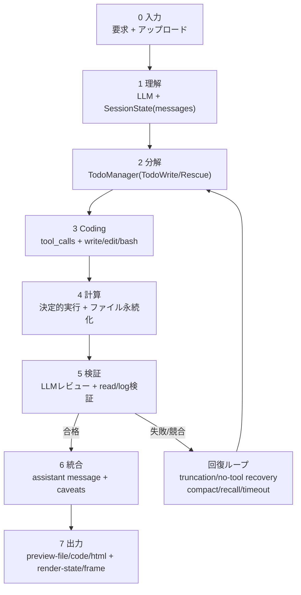

### 11.5.2 ノード別のモデル関与と品質ゲート

| ノード | モデル関与 | 主要処理 | 品質ゲート | 追跡可能成果物 |
|---|---|---|---|---|
| 入力 | 軽度 LLM 補助 | 取り込みと正規化 | ファイル整合/文字コード確認 | 入力スナップショット |
| 理解 | LLM 主導 | 目的・変数・制約抽出 | 要件カバレッジ確認 | `messages[]` |
| 分解 | LLM 主導 | Todo/マイルストーン分解 | 実行可能性確認 | `todos[]` |
| Coding | LLM + ツール | 解析/計算コードとコマンド生成 | 構文/依存確認 | `tool_calls`、`file_patch` |
| 計算 | ツール主導 | 決定的実行と書き込み | 終了コード/ログ確認 | `operations[]`、中間ファイル |
| 検証 | LLM + ツール検証 | 単位/範囲/整合/競合検知 | 失敗時はループバック | `read_file` 出力 + レビュー文 |
| 統合/出力 | LLM 主導 | 結果説明と不確実性開示 | 根拠-主張整合確認 | markdown/html/code プレビュー |

### 11.5.3 研究向け数値厳密性ポリシー

- 先に計算・後で叙述: 再計算可能なスクリプトと中間成果物を先に確定。
- 単位/次元の前置検証: 数値公開前に単位正規化と次元整合を確認。
- 複数ソース照合: 同一指標を横断比較し、偏差レンジを記録。
- 外れ値再検証: 範囲逸脱時は分解/計算へ自動ループバック。
- 叙述整合ゲート: テキスト結論と表/指標が不一致なら出力停止。
- 不確実性の明示: 根拠不足時は補間ではなく信頼度と欠落項目を開示。

### 11.5.4 既存アーキテクチャ図との対応

- 入出力端は Presentation Layer + API & Stream Layer に対応。
- 理解/思考/統合は Orchestration & Control Layer（`SessionState`、`TodoManager`、`EventHub`）に対応。
- Coding/計算は Model & Tool Execution Layer（tool router、worktree、runtime tools）に対応。
- 検証/再現は Artifact & Persistence Layer（中間成果物、archive、stage preview）に対応。
- 切断回復、timeout 制御、文脈予算、anti-drift が全体安定化ループを形成。

## 12. 参考

### 12.1 主な参照

- anomalyco/opencode: https://github.com/anomalyco/opencode/
- openai/codex: https://github.com/openai/codex
- shareAI-lab/learn-claude-code: https://github.com/shareAI-lab/learn-claude-code/tree/main

### 12.1.1 learn-claude-code からの明示的継承

- `agents/s01`~`s12` の agent loop/tool dispatch 学習系を系譜として保持
- Todo/task/worktree/team を概念・インターフェースレベルで継承し standalone runtime に統合
- `SKILL.md` のオンデマンド読み込み手法を再利用し Skills Studio へ拡張

### 12.2 追加参照

- Ollama: https://github.com/ollama/ollama
- OpenAI API docs: https://platform.openai.com/docs
- MDN EventSource (SSE): https://developer.mozilla.org/docs/Web/API/EventSource
- PyInstaller: https://pyinstaller.org/
- Nuitka: https://nuitka.net/

### 12.3 本リポジトリ実装時の参照

- `Clouds_Coder.py`（ランタイム構成、API、フロント連携）
- `packaging/README.md`（配布/パッケージング）
- `requirements.txt`（依存）
- `skills/`（skill プロトコルとロード構造）

## 13. ライセンス

本プロジェクトは MIT License で公開されています。詳細は [LICENSE](./LICENSE)。
