<h1 align="center">Clouds Coder</h1>
<h3 align="center">云端 CLI 编码智能体运行时</h3>
<p align="center">CLI 执行面 × Web 用户面分离协同，构建可靠可观测的 Vibe Coding 体验。</p>
<p align="center">
  <a href="./README.md">English</a> ·
  <a href="./README-zh.md">中文</a> ·
  <a href="./README-ja.md">日本語</a>
</p>
<p align="center">
  <a href="https://pypi.org/project/clouds-coder/"></a>
  <a href="https://pypi.org/project/clouds-coder/"></a>
  <a href="https://pypi.org/project/clouds-coder/"></a>
</p>
<p align="center">
  <a href="./RELEASE_NOTES.md">Release Notes</a> ·
  <a href="./log/CHANGELOG-2026-03-31.md">2026-03-31 更新日志（EN/中文/日本語）</a> ·
  <a href="./log/CHANGELOG-2026-03-25.md">2026-03-25 更新日志（EN/中文/日本語）</a> ·
  <a href="./log/CHANGELOG-2026-03-20.md">2026-03-20 更新日志（EN/中文/日本語）</a> ·
  <a href="./log/CHANGELOG-2026-03-16.md">2026-03-16 更新日志</a> ·
  <a href="./log/CHANGELOG-2026-03-07.md">2026-03-07 更新日志</a> ·
  <a href="./LICENSE">MIT License</a> ·
  <a href="./LLM.config.json">LLM Config Template</a>
</p>
<p align="center">
  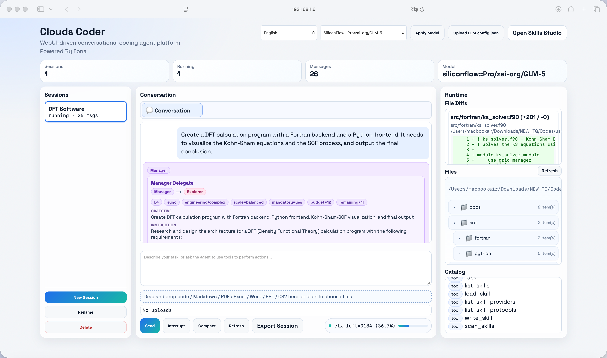
</p>

Clouds Coder 是一个以“CLI 执行层与 Web 用户层分离”为核心的本地优先（local-first）通用任务智能体平台，不局限于编程场景，集成 Web UI、Skills Studio、鲁棒流式回传与复杂任务恢复能力。

它的首要问题定义是：CLI 编程门槛高、环境分发困难、学习曲线陡。Clouds Coder 通过前后端分离（云端 CLI 执行 + Web 端交互控制）来降低 Vibe Coding 上手成本，同时把超时、截断、上下文预算、空想循环治理作为并列核心能力，保障复杂任务可执行、可收敛、可复盘。

本次架构更新三语总览见：[`CHANGELOG-2026-03-31.md`](./log/CHANGELOG-2026-03-31.md) | 上期：[`CHANGELOG-2026-03-25.md`](./log/CHANGELOG-2026-03-25.md) | [`CHANGELOG-2026-03-20.md`](./log/CHANGELOG-2026-03-20.md) | [`CHANGELOG-2026-03-16.md`](./log/CHANGELOG-2026-03-16.md) | [`CHANGELOG-2026-03-07.md`](./log/CHANGELOG-2026-03-07.md)

## 1. 项目定位

Clouds Coder 的核心目标：

- 构建 CLI 执行面与 Web 用户面的分离协同环境，让用户以更低门槛获得高质量、可观测、可追溯的 Vibe Coding 体验。

本仓库从学习型 agent 代码演进为可部署的 standalone 运行时，聚焦：

- 前后端分离协同：云端执行、Web 端交互，降低本地环境耦合
- 降低 CLI 学习门槛：把复杂执行过程转为可视化、可追踪、可操作流程
- 降低分发与部署成本：统一运行时入口，减少“每端独立配置”负担
- 降低 Vibe Coding 采纳成本：让非 CLI 重度用户也能快速进入高质量工作流
- 稳定性与执行收敛能力作为核心能力：timeout 调度、截断续写、上下文预算、执行收敛控制

## 1.1 架构传承与复用说明

Clouds Coder 明确借鉴并扩展了以下项目的内核思想：

- shareAI-lab/learn-claude-code: https://github.com/shareAI-lab/learn-claude-code/tree/main

具体借鉴点（并在本项目中的映射）：

- 最小 agent 循环（`LLM -> tool_use -> tool_result -> loop`）
- 规划优先（`TodoWrite`）与复杂任务防漂移机制
- `SKILL.md` 按需加载协议
- 上下文压缩与召回（compact/recall）
- task/background/team/worktree 多步骤协同思想

Clouds Coder 在此基础上的扩展：

- 单体内核运行时（`Clouds_Coder.py`）：agent loop、工具路由、会话管理、API Handler、SSE 流、Web UI bridge、Skills Studio 处于同一进程状态域内协作。
- 结构化截断续写引擎：强截断信号检测、尾部重叠扫描、括号/符号配对修复启发式、多 pass 续写与 pass/token 实时遥测。
- 面向恢复的执行控制器：no-tool idle 诊断、运行时恢复提示注入、truncation-rescue 的 todo/task 自动创建，以及复杂任务死循环收敛诱导。
- 统一 timeout 治理：全局 timeout 调度 + 最小下限 + 回合级计账，并排除模型 active 时段，降低“仍在生成却被误超时”的概率。
- 分阶段 live-input 仲裁：针对 write/tool/normal 阶段使用不同延迟与权重策略，把晚到用户指令安全并入长任务执行。
- 上下文生命周期管理：自适应预算与手动锁定（`--ctx_limit`）、归档驱动 compact、按需 context recall，支撑长会话稳定运行。
- Provider/Profile 编排层：Ollama + OpenAI-compatible 配置解析、能力推断（含多模态标记）、media endpoint 映射、运行时选择与回退。
- 流式可靠性与可观测栈：SSE 心跳、写异常容错、模型调用周期进度事件、event+snapshot 混合刷新保障 UI 一致性。
- 工件优先工作区模型：每会话 `files/uploads/context_archive/code_preview` 持久化、上传文件镜像到工作区、阶段化代码预览保障可复现。

Skills 复用说明：

- `skills/` 继续采用同一 `SKILL.md` 协议与 runtime loading 模型
- `skills/code-review`、`skills/agent-builder`、`skills/mcp-builder`、`skills/pdf` 为基础可复用 skills
- `skills/generated/*` 为本项目扩展的场景化 skills（报告、退化恢复、HTML 管线、上传解析等）
- 运行时工具接口与 skill 链路保持兼容（如 `load_skill`、`list_skills`、`write_skill`）

MiniMax skills 来源说明：

- 本仓库内 `Minimax/` 与 `Minimax_2/` 下打包的本地 skill 套件，基于 MiniMax AI 的开源 skills 仓库改编而来：https://github.com/MiniMax-AI/skills
- 上游原始源码依据 MIT License 使用
- 感谢 MiniMax AI 及其上游贡献者提供原始 skill 内容、结构设计与生态建设

## 1.2 超越编程 CLI：面向通用任务的内核定位

Clouds Coder 并不是“只做写代码”的 CLI 包装器，而是一个可在单会话中执行并审计复合知识工作流的通用智能体运行时：

- 编程类任务：实现、重构、调试、测试、补丁审阅
- 分析类任务：文件挖掘、文档解析、结构化提取、对比研究
- 综合类任务：跨源推理、决策备忘录、风险与假设汇总
- 报告与可视化任务：HTML 报告、Markdown 叙事、阶段化代码与工件预览

核心执行链路强调三阶段高效闭环：

- `LLM（思考/规划）` -> 把目标拆解为约束明确的步骤与验收条件
- `Coding（解析/执行）` -> 通过确定性工具执行与产物落地推进任务
- `LLM（汇总/分析）` -> 校验中间结果并输出可追溯的最终结论

这种设计通过“思考必须转化为可执行动作与可验证工件”的机制，显著降低只思考不执行的漂移风险。

## 2. 核心特性

- 会话隔离的 agent runtime
- 单会话内通用任务路由（编程 + 分析 + 综合 + 报告）
- 内置 `LLM -> Coding -> LLM` 三阶段执行模式，适配复杂多步骤工作
- **Plan Mode** — UI 开关（Auto/On/Off），研究 → 方案 → 用户选择 → 逐步执行，Single 和 Sync 模式均支持
- **多智能体协作** — 4 角色（manager/explorer/developer/reviewer）+ blackboard 中心化协调
- **Reviewer Debug Mode** — 检测到错误时 reviewer 获得写权限，独立诊断修复 bug
- **6 类通用错误检测**（test/lint/compilation/build/deploy/runtime）+ 统一 failure ledger
- **4 级分层上下文压缩**（normal → light → medium → heavy）+ 文件缓冲卸载，支持 4K 到 1M token
- **任务阶段感知委派** — manager 根据当前阶段（research/design/implement/test/review/deploy）路由到合适的 agent
- **原生多模态支持** — read_file 自动检测图片/音频/视频，模型支持时作为原生输入注入
- **实时用户输入合并** — 执行中途的反馈可调整 plan 方向，无需重启
- **Restart 意图融合** — 恢复时按 用户意图 > plan 意图 > 上下文意图 优先级融合
- **Skills 生态全面兼容** — 兼容 5 大生态系统（awesome-claude-skills / Minimax-skills / skills-main / kimi-agent-internals / academic-pptx），LLM 自主判断按任务类型加载，支持多 skills 并发 + 冲突检测
- **双库 RAG 知识架构** — Code RAG（`CodeIngestionService`）+ Data RAG（`RAGIngestionService`），均基于 TF_G_IDF_RAG，统一检索接口 `query_knowledge_library`，RAG 检索指南注入到内置 skills
- **多因素优先级上下文压缩** — 10 因素消息重要性评分（时间近因、角色权重、任务进度、错误、目标相关性、skills、compact-resume），替代纯时序裁剪
- 内置 Web UI + 可选外部 Web UI
- Skills Studio（独立端口）用于扫描/编辑/生成/上传 skills
- Ollama 探测与模型目录加载
- 通过 `LLM.config.json` 支持 OpenAI-compatible 多配置
- 统一 timeout 调度（全局超时，模型 active 时段排除）
- 截断恢复循环（续写 pass/token 计数 + UI 实时展示）
- 上下文压缩 + 历史归档召回 + 无损状态衔接
- 无工具空转诊断与恢复提示
- Task/Todo/Background/Team/Worktree 一体化机制
- SSE 心跳与写入异常处理
- 预览链路：Markdown/HTML/代码/PDF/CSV/Excel/Word/PPT/媒体/代码阶段预览
- 前端资源控制：live/static 冻结、快照调度、对话虚拟化
- 科研��务友好：工件优先、阶段可追溯、可复现持久化链路

## 3. 架构总览

```text
┌───────────────────────────────────────────────────────────────────────┐
│                            Clouds Coder                              │
├───────────────────────────────────────────────────────────────────────┤
│ 体验与溯源层                                                         │
│  - 多预览中心（Markdown / HTML / 代码 / PDF / Office / 媒体）        │
│  - 阶段化代码历史备份 + 差异/溯源时间线                              │
│  - 运行进度卡片（thinking/run/truncation/recovery）                 │
│  - Skills 可视化流程构建 + SKILL.md 生成注入                         │
├───────────────────────────────────────────────────────────────────────┤
│ 展示层                                                               │
│  - Agent Web UI（对话、看板、预览、运行状态）                        │
│  - Plan Mode 开关（Auto/On/Off）+ Planner 气泡（橙红色）     │
│  - Skills Studio（扫描/生成/保存/上传 skills）                       │
├───────────────────────────────────────────────────────────────────────┤
│ API 与流式层                                                         │
│  - REST APIs：sessions/config/models/tools/preview/render/plan-mode │
│  - SSE：/api/sessions/{id}/events（心跳 + 容错）                     │
├───────────────────────────────────────────────────────────────────────┤
│ 编排与控制层                                                         │
│  - AppContext / SessionManager / SessionState                        │
│  - EventHub / TodoManager / TaskManager / WorktreeManager            │
│  - Plan Mode（Auto/On/Off）+ 阶段感知委派                           │
│  - 截断恢复 + timeout 治理 + 执行恢复控制器                          │
├───────────────────────────────────────────────────────────────────────┤
│ 模型与工具执行层                                                     │
│  - Ollama/OpenAI-compatible profile 编排                             │
│  - tools: bash/read/write/edit/Todo/skills/context/task/render       │
│  - 原生多模态 + 6 类错误检测 + 4 级压缩 + Reviewer Debug Mode       │
��  - live-input 仲裁 + 小模型保护策略                                  │
├───────────────────────────────────────────────────────────────────────┤
│ 工件与持久化层                                                       │
│  - 每会话 files/uploads/context_archive/code_preview                 │
│  - conversation/activity/operations/todos/tasks/worktree             │
│  - file_buffer（大内容卸载到磁盘）                                   │
└───────────────────────────────────────────────────────────────────────┘
```

Mermaid：

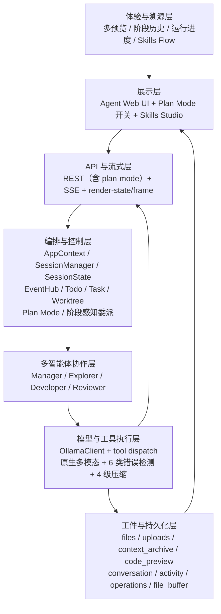

### 3.1 程序交互架构图

```text
用户（Browser/Web UI）
        │
        │ REST（message/config/uploads/preview） + SSE（runtime events）
        ▼
ThreadingHTTPServer
  ├─ Handler（Agent APIs）
  └─ SkillsHandler（Skills Studio APIs）
        │
        ▼
SessionManager ──► SessionState（会话级运行时状态机）
        │                    │
        │                    ├─ 模型调用编排（Ollama/OpenAI-compatible）
        │                    ├─ 工具执行（bash/read/write/edit/skills/task）
        │                    └─ 恢复控制（truncation/timeout/no-tool idle）
        │
        ├─ EventHub（瞬时运行时事件）
        └─ 工件存储（files/uploads/code_preview/context_archive）
                │
                ▼
       Preview APIs + Render bridge + 历史溯源时间线
                │
                ▼
        Web UI 实时更新（chat/runtime/preview/skills）
```

Mermaid：

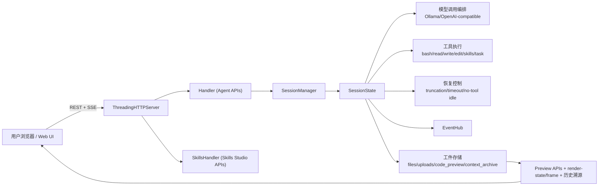

### 3.2 任务逻辑图

```text
用户目标
   │
   ▼
意图与上下文摄入
   │（上传/历史/上下文预算）
   ▼
Plan Mode 门控（Auto/On/Off）
   │
   ▼
规划与分解（Todo/Task/Worktree）
   │
   ▼
阶段感知委派（research→explorer / implement→developer / review→reviewer）
   │
   ▼
Agent Loop
  ├─ Model Call
  │    ├─ 正常输出 ───────────────┐
  │    ├─ 工具调用请求 ─► 执行工具├─► 回填结果 -> 下一轮
  │    └─ 截断信号 ──────► 续写/恢复
  │
  ├─ no-tool idle 检测 -> 诊断与恢复提示
  ├─ timeout 治理（模型 active 时段不计时）
  ├─ 上下文压力 -> 4 级分层压缩 + compact + recall
  ├─ Reviewer Debug Mode（检测到错误 → 获写权限独立修复）
  ├─ 实时用户输入合并（中途调整 plan 方向）
  └─ Plan Step 自动推进
   │
   ▼
收敛结果与工件
   │
   ▼
预览/历史/导出（MD/代码/HTML + 阶段备份）
```

Mermaid：

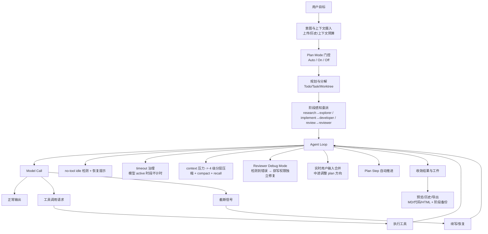

### 3.3 单体化同频多智能体协作（Blackboard 模式）

Clouds Coder 已支持在单体内核中进行角色专职协作：

- `manager`：仅负责路由与仲裁（不直接写实现）+ 阶段感知委派
- `explorer`：调研、依赖分析、路径与环境探测
- `developer`：代码实现、文件修改、工具执行
- `reviewer`：校验、测试判定、通过/阻断裁决；Debug Mode 可获得写权限独立修复 bug

这不是微服务拆分模型，而是“单进程 + 单黑板”的协作范式。核心收益：

- 无跨服务 RPC 开销，协同延迟更低
- 黑板状态可快照、可重放，Manager 决策更稳定
- 任一环节报错时可快速中断并重路由

黑板核心切片（Single Source of Truth）：

- `original_goal`、`status`、`manager_cycles`
- `plan`（plan steps + plan_mode 状态）、`phase`（当前阶段）、`errors`（6 类错误列表）
- `research_notes`、`code_artifacts`、`execution_logs`、`review_feedback`
- 带 owner 的 `todos`（`manager/explorer/developer/reviewer`）
- manager 判定字段（任务等级、预算、剩余轮次、确认门禁）

执行拓扑：

- `sequential`：Explorer -> Developer -> Reviewer 串行流水线
- `sync`：Manager 主导的同频协作，支持动态跨角色回调与接管

任务等级策略（由 Manager 语义判定，每次用户输入都会重评）：

| 等级 | 典型任务形态 | 模式决策 | 预算策略 |
| --- | --- | --- | --- |
| L1 | 一次性简单问答 | 切回 single-agent | 最小预算 |
| L2 | 简短连续对话任务 | 切回 single-agent | 放宽但有上限 |
| L3 | 轻量多角色工程任务 | 保持 sync | 收敛型预算 |
| L4 | 复杂工程/调研任务 | 保持 sync | 扩展预算 |
| L5 | 系统级长链路任务 | 保持 sync | 近似无限预算（含确认门禁） |

Mermaid（单体内核下的同频协作）：

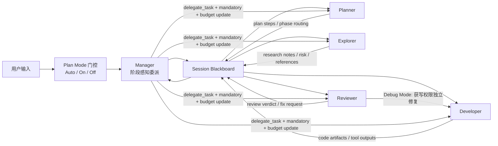

Mermaid（动态路由与中途打断）：

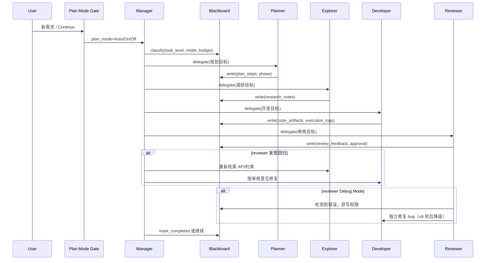

Mermaid（黑板状态机）：

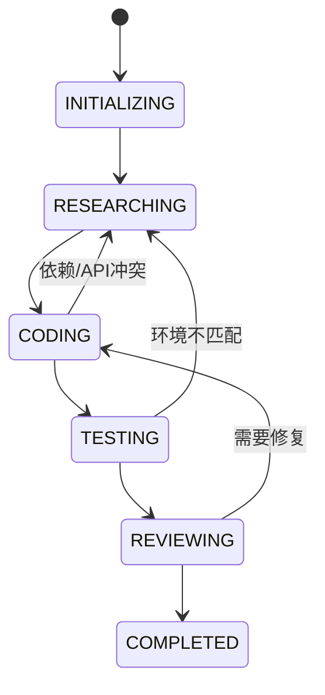

### 3.4 2026-03-07 更新集合与创新映射

按优先级合并的更新如下：

| 优先级 | 更新项 | 关键实现 | 架构影响 |
| --- | --- | --- | --- |
| 1 | 多智能体 + 黑板融合 | `explorer/developer/reviewer/manager` 角色组、blackboard 状态、sync/sequential、L1-L5 策略 | 将单智能体流水线升级为可仲裁协作图 |
| 2 | 熔断器与融合故障阻断 | `CircuitBreakerTriggered`、`HARD_BREAK_TOOL_ERROR_THRESHOLD`、`FUSED_FAULT_BREAK_THRESHOLD` | 多次失败触发硬阻断，保护收敛与 Token 预算 |
| 3 | 长思考输出恢复 | 宽容 `<think>` 解析、`EmptyActionError`、`<thinking-empty-recovery>` 提示 | 减少“只思考不执行”的漂移 |
| 4 | 内存有界热点预览 | `_compress_rows_keep_hotspot`、动态 `buffer_cap`、热点保留压缩 | 超大 diff/大文件替换场景避免 OOM 与前端卡死 |
| 5 | Todo 所有权与仲裁增强 | todo `owner/key`、`complete_active`、`complete_all_open`、仲裁规划阈值 | 计划到执行的责任链更清晰，收敛约束更强 |

2026.03.07 架构创新点：

- 单体化同频多智能体协作：单进程共享黑板，低成本高一致性协同。
- 工业级执行熔断：重试受硬阈值约束，不再无限摸鱼循环。
- OOM 免疫热点渲染：优先保留修改区，压缩非关键上下文。
- 自适应思考唤醒：识别空动作漂移并强制回到执行态。

### 3.5 2026-03-07 详细变更清单

1. 核心架构与多智能体系统（最高优先级）
- 新增执行模式常量：`EXECUTION_MODE_SINGLE`、`EXECUTION_MODE_SEQUENTIAL`、`EXECUTION_MODE_SYNC`。
- 新增角色集合：`AGENT_ROLES = ("explorer", "developer", "reviewer")` 与包含 `manager` 的 `AGENT_BUBBLE_ROLES`。
- 新增任务分级策略矩阵：`TASK_LEVEL_POLICIES`（`L1` 到 `L5`），用于语义级模式/预算决策。
- 新增黑板状态机常量：`BLACKBOARD_STATUSES`，覆盖 `INITIALIZING`、`RESEARCHING`、`CODING`、`TESTING`、`REVIEWING`、`COMPLETED`、`PAUSED`。

2. 断路器与防漂移硬化
- 新增 `CircuitBreakerTriggered`，用于不可逆故障模式下的硬性切断。
- 新增硬阈值：`HARD_BREAK_TOOL_ERROR_THRESHOLD = 3`、`HARD_BREAK_RECOVERY_ROUND_THRESHOLD = 3`、`FUSED_FAULT_BREAK_THRESHOLD = 3`。
- 架构效果：把“乐观重试”升级为“有边界的安全收敛”。

3. 深度推理模型的思考输出恢复
- 新增 `EmptyActionError`，捕捉“只有思考、没有可执行动作”的空转回合。
- 新增唤醒控制：`EMPTY_ACTION_WAKEUP_RETRY_LIMIT = 2` 与运行时提示 `<thinking-empty-recovery>`。
- 强化 `split_thinking_content`：宽容 `<think>` 扫描并支持未闭合标签兜底。

4. 内存有界代码预览与热点渲染
- 新增 `_compress_rows_keep_hotspot`：保留修改热点并压缩非关键上下文。
- 在 `make_numbered_diff` 和 `build_code_preview_rows` 引入动态 `buffer_cap`，限制内存增长。
- 架构效果：超大文件替换与高行数 diff 预览场景下仍可避免 OOM。

5. Todo 归属、仲裁与工作流治理
- 新增 todo 归属与身份字段：`owner`、`key`。
- 新增批量状态 API：`complete_active()`、`complete_all_open()`、`clear_all()`。
- 新增仲裁规划约束：`ARBITER_VALID_PLANNING_STREAK_LIMIT = 4`。

6. 运行时依赖与控制平面杂项增强
- 新增系统级依赖导入：`deque`、`selectors`、`signal`、`shlex`，用于调度与非阻塞控制路径。
- 扩展 `RUNTIME_CONTROL_HINT_PREFIXES`：新增 `<arbiter-continue>` 与 `<fault-prefill>`，增强恢复闭环表达力。

完整三语更新日志见：[`CHANGELOG-2026-03-07.md`](./log/CHANGELOG-2026-03-07.md)。

### 3.6 2026-03-16 严重修复：Single 模式 Agent 泄漏 & 终止信号失效

多智能体编排层修复了两个互相关联的严重 bug：

1. Single 模式 Agent 泄漏（`_manager_apply_task_policy`）
- 当 `executor_mode_flag=True` 时，target 不在 participants 的分支会 append 额外 Agent，覆盖了 Single 模式 `participants = [assigned_expert]` 的约束。
- 修复：在所有 participant/target 解析完成后新增硬约束后置守卫，强制重置 `participants = [assigned_expert]`，并将非 expert 的 target 重定向回 assigned_expert。

2. Manager 忽略 Agent 的结论性回复终止信号
- 当 Agent（如 developer）回复"任务完成"后，Manager 仍反复委派 explorer → developer → reviewer 形成死循环。原因：(a) 结论检测仅在 fallback 路径触发，LLM 工具路由路径完全绕过；(b) `_manager_apply_task_policy()` 无结论检测逻辑；(c) 文本形式的完成信号不会设置 blackboard `approval.approved`。
- 修复：新增四层防御：
  - 第 1 层 — Fallback 通用 endpoint 检测：`_detect_endpoint_intent` 从仅限 `simple_qa` 扩展到所有任务类型。
  - 第 2 层 — Policy 层拦截：在 `can_finish_from_approval` 检查前新增结论性回复检测。
  - 第 3 层 — Sync 循环拦截：每个 Agent turn 完成后检测结论性回复，满足条件立即 break 并自动 approve。
- 安全守卫：存在错误日志或待办事项时，结论检测不会触发 finish（避免误杀）。

完整三语详情见：[`CHANGELOG-2026-03-16.md`](./log/CHANGELOG-2026-03-16.md)

### 3.7 2026-03-20 重大更新：Plan Mode 架构 & 内核全面升级

项目启动以来最大规模架构改动 — 7 大模块、60+ 修改点。

**Plan Mode — 统一架构**
- 工具栏新增 `Plan: Auto/On/Off` 按钮，用户可控制是否启用规划流程。
- Single 和 Sync 模式行为一致。Single 模式通过 `_single_agent_plan_step_check()` 自动推进 plan steps。
- 6 层 plan step 保护防止提前结束：arbiter 不能批量完成 plan steps，manager 有 pending steps 时不能路由到 finish。
- Planner 气泡采用橙红色主题，完整 agent badge 结构。

**分层上下文压缩 + 文件缓冲**
- 4 级渐进压缩（Tier 0–3），基于 ctx_left 百分比和绝对阈值。
- Agent 上下文（`agent_messages`、`manager_context`、per-role `contexts`）现在在 compact 时同步压缩 — 之前完全不碰，导致 compact 后立即再次撞墙。
- 文件缓冲将大内容（>2KB）卸载到磁盘。ctx_left 范围扩展到 [4K, 1M]。
- `_build_state_handoff()` 确保目标/进度/状态在压缩后无损传递。

**通用错误架构**
- 统一 `errors` 列表 + `category` 字段，替代仅编译错误检测。6 类：test、lint、compilation、build_package、deploy_infra、runtime。
- `_process_tool_result_errors()` 替代 multi-agent 和 single-agent 两条路径的内联检测。

**Reviewer Debug Mode**
- 检测到错误时，reviewer 自动获得 `write_file`/`edit_file` 权限独立修复 bug。
- 错误解决或 6 轮后自动退出（降级到 developer）。Explorer 死循环检测：连续 3 次相同委派 → 强制切换。

**复杂度继承 & 实时输入**
- Plan 方案回复跳过重分类，复杂度级别保持不变。
- 实时用户输入触发 `_merge_user_feedback_with_plan()` 中途调整 plan 方向。
- Restart 意图融合：用户意图 > plan 意图 > 上下文意图。

**任务阶段独立性**
- 阶段感知委派：research→explorer、implement→developer、test→developer、review→reviewer。
- Manager 收到 `PHASE INDEPENDENCE` 指令，防止跨阶段继承实现模式。

**多模态原生支持 & TodoWrite 隔离**
- `_run_read()` 检测图片/音频/视频文件，模型支持时作为原生多模态输入注入。
- Plan mode 下 TodoWrite 创建带 owner 标记的子任务，不覆盖 plan_step。

完整三语详情见：[`CHANGELOG-2026-03-20.md`](./log/CHANGELOG-2026-03-20.md)

### 3.8 2026-03-25 重大更新：Skills 生态系统兼容 & 双库 RAG 架构 & 内核修复

**Skills 生态系统全面兼容**
- 现支持 5 大 skill 生态系统，无需 per-provider 适配器：
  - [awesome-claude-skills](https://github.com/travisvn/awesome-claude-skills) — 社区 Claude skills 精选集合
  - [MiniMax-AI/skills](https://github.com/MiniMax-AI/skills) — MiniMax 官方 skills（前端/全栈/iOS/Android/PDF/PPTX）
  - [anthropics/skills](https://github.com/anthropics/skills) — Anthropic 官方 skills 仓库（`skills-main`）
  - [kimi-agent-internals](https://github.com/dnnyngyen/kimi-agent-internals) — Kimi agent skill 系统分析与提取的 skill 产物
  - [academic-pptx-skill](https://github.com/Gabberflast/academic-pptx-skill) — 学术演示 skill（行动标题、引用规范、论证结构）
- 此前失败根因修复：Execution Guide 注入（已删除）强制对虚拟 skill 路径发起 `read_file` 导致模型循环。
- Chain Tracking 系统删除（7 个方法）；`_broadcast_loaded_skill` 黑板字段 16→6；`_loaded_skills_prompt_hint` 约 350→120 tokens。
- LLM 自主发现：模型根据任务类型判断调用哪个 skill，而非关键词强触发。支持多 skill 并发加载 + 冲突对检测。
- Sync 模式 Manager 获得 `TodoWrite` 能力。新增 `_preload_skills_from_plan_steps`，扫描 plan steps 中的 skill 名称并提前预加载。
- Plan steps 上限 10→20；单步字符 400→600；Plan 合成新增反幻觉约束。

**双库 RAG 知识架构**
- `RAGIngestionService`（Data RAG）：文档/PDF/结构化数据 — 通用知识库。
- `CodeIngestionService`（Code RAG）：代码文件，代码感知分词 — 代码知识库。
- 两库均基于 TF_G_IDF_RAG；`query_knowledge_library(query, top_k)` 并行检索两库，返回合并排序结果。
- RAG 检索指南注入 `research-orchestrator-pro` 和 `scientific-reasoning-lab`。

双库 RAG 架构：

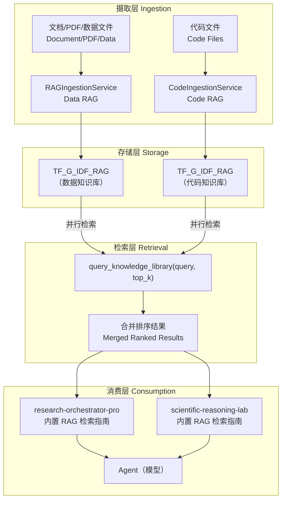

RAG 调取流程：

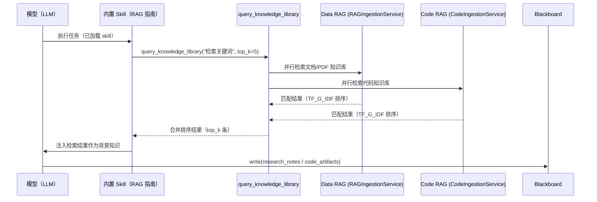

**内置 Skills 重写**
- `research-orchestrator-pro`：协作型决策中枢，与输出型 skills 协作而非冲突，内置 RAG 检索指南，反幻觉姿态。
- `scientific-reasoning-lab`：5 阶段自迭代推理引擎（分解→推导→验证→评估→整合），嵌入为 research-orchestrator-pro Phase 2 子引擎，内置 RAG 检索指南。

**多因素优先级上下文压缩**
- `_classify_message_priority`：10 因素评分（时间近因 0–3、角色权重、任务进度标记 +2、错误 +2、目标相关性 +1、skill 相关 +1、compact-resume=10）。
- `_priority_compress_messages`：高分（≥7）完整保留，中分（4–6）压缩至 500 字符，低分（0–3）折叠为单行。
- `_build_state_handoff` 增强：PLAN_PROGRESS、CURRENT_STEP、ACTIVE_SKILLS、RECENT_TOOLS 字段。
- `_auto_compact` 整合：优先级压缩优先，保底 `pop(0)` fallback。

**Anti-stall 机制优化**
- 阈值 2→3 次连续相同 target 才触发。
- 指令从 "CHANGE YOUR APPROACH" 改为协作性引导（建议 ask_colleague / 换工具 / finish_current_task）。

**关键 Bug 修复**
- `CodeIngestionService._flush_lock`：添加缺失的 `threading.Lock()` — 修复向代码库上传文件时的 `AttributeError`。
- 前端 `setTaskLevel()`：在级别更新后添加 `scheduleSnapshot()` — 修复任务级别选择器在下次 SSE 刷新时回弹至 "Auto"。
- `_sync_todos_from_blackboard`：worker items（`owner ∈ {developer, explorer, reviewer}`)现在单独收集并优先保留 — 修复每次黑板同步都丢失 TodoWrite 条目的问题。

完整三语详情见：[`CHANGELOG-2026-03-25.md`](./log/CHANGELOG-2026-03-25.md)

## 4. 关键运行时组件

- `AppContext`：全局运行时容器（配置、模型目录、服务状态）
- `SessionManager`：会话生命周期管理
- `SessionState`：单会话 agent 状态、工具执行状态、上下文/截断/运行时标记
- `EventHub`：SSE 与内部事件的发布订阅总线
- `OllamaClient`：模型调用适配与回退逻辑
- `SkillStore`：本地/Provider skills 注册与扫描加载
- `TodoManager` / `TaskManager` / `BackgroundManager`：规划与异步执行
- `WorktreeManager`：隔离工作目录管理
- `Handler` / `SkillsHandler`：Agent UI 与 Skills Studio 的 API 入口
- `RAGIngestionService`（Data RAG）+ `CodeIngestionService`（Code RAG）：基于 `TFGraphIDFIndex` / `CodeGraphIndex` 的双库知识摄取与检索引擎

## 4.1 RAG 知识架构：TF-Graph_IDF 引擎

Clouds Coder 内置了名为 **TF-Graph_IDF** 的检索引擎，融合了词法评分、知识图谱拓扑、自动社区检测和多路由查询编排，在召回质量上显著优于标准 TF-IDF 或 BM25。

### 双库设计架构

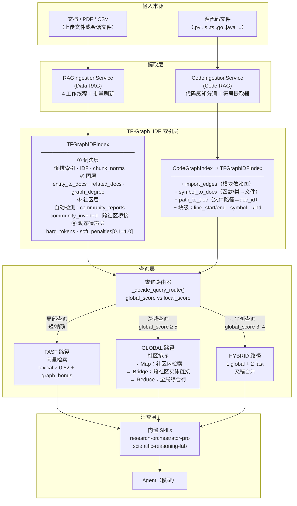

### TF-Graph_IDF 评分公式

每个检索到的 chunk 的分数由**词法分量**和**图奖励**组成：

```
final_score = lexical × 0.82 + graph_bonus         （Data RAG）
final_score = lexical × 0.78 + graph_bonus         （Code RAG — 图奖励权重更高）

lexical     = Σ(q_weight_i × c_weight_i) / (query_norm × chunk_norm)

graph_bonus = 0.18 × entity_overlap                 （共享命名实体）
            + 0.10 × doc_entity_overlap              （文档级实体匹配）
            + min(0.16, log(doc_graph_degree+1)/12) （中心文档提升）
            + 0.08  （查询类别 == 文档类别时）
            + min(0.08, log(community_doc_count+1)/16)

Code RAG 额外奖励：
            + 0.16 × symbol_overlap                  （函数/类名匹配）
            + 0.28  （查询中出现文件完整路径）
            + 0.20  （查询中出现文件名）
            + 0.14  （查询中出现模块名）
            + min(0.12, log(import_degree+1)/9)      （导入图中心性）
```

带动态噪声的 token 权重：

```
idf[token]    = log((1 + N_chunks) / (1 + df[token])) + 1.0
tf_weight     = (1 + log(freq)) × idf[token] × dynamic_noise_penalty[token]
chunk_norm    = √Σ(tf_weight²)

dynamic_noise_penalty ∈ [0.10, 1.0]  — 基于语料库计算，非静态停用词表
```

### 动态噪声抑制 — 语料库自适应 Token 权重

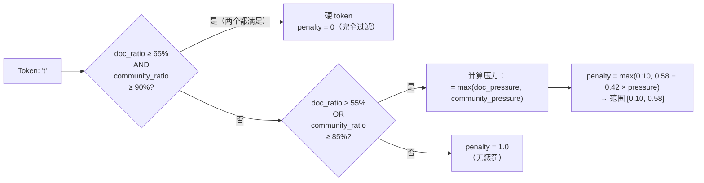

这替代了标准 TF-IDF 中的硬编码停用词表：token 的惩罚来自**该知识库的实际语料分布**而非通用列表。"model"在代码 RAG 中是关键词，在某些论文语料中则可能是高频噪声——两种情况的惩罚因子自动不同。

### 三路由查询编排

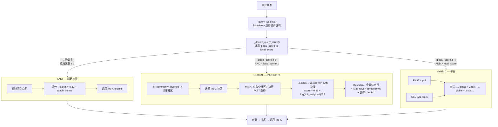

**路由决策信号：**
- 全局倾向（+分）：查询长度 ≥ 18 tokens、≥ 2 个命名实体、出现 "compare"/"overall"/"trend"/"综述" 等关键词
- 局部倾向（+分）：出现 "what is"/"哪篇"/"文件扩展名"，查询长度 ≤ 10 tokens

### 自动社区检测

文档按 `(category, language, top_entities)` 自动分组为社区，无需手动分类：

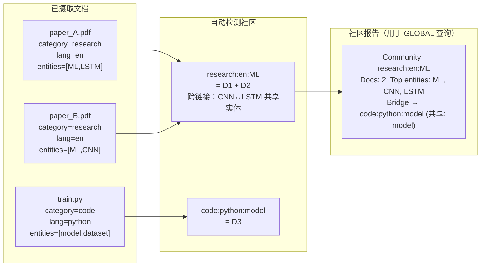

每个社区生成一份**社区报告**——包含成员文档摘要、顶部实体和跨社区链接的结构化文本。GLOBAL 查询先在社区级检索，再下钻到 chunks。

### Code RAG：模块依赖图

`CodeGraphIndex` 在 `TFGraphIDFIndex` 基础上增加了代码原生知识图谱：

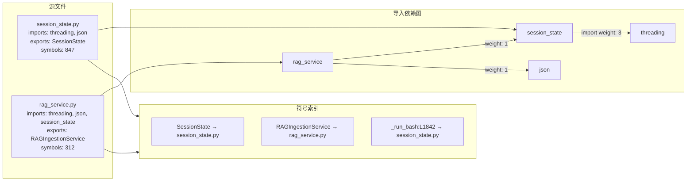

当查询提到 `"RAGIngestionService"` 时，符号索引直接定位 `rag_service.py`，导入图中心性高的文件（被大量其他文件 import）即使词法匹配不强也能排到靠前。

### 与主流 RAG 方案的优势对比

| 能力维度 | 标准 TF-IDF | BM25 | Embedding/向量 RAG | **TF-Graph_IDF（Clouds Coder）** |
|---|---|---|---|---|
| 停用词处理 | 静态列表 | 静态列表 | 嵌入空间隐式 | **语料库自适应动态惩罚** |
| IDF 平滑 | `log(N/df)` | BM25 饱和曲线 | 无 | `log((1+N)/(1+df)) + 1.0` |
| 知识图谱 | ✗ | ✗ | ✗ | **实体重叠 + 文档图度 + 社区拓扑** |
| 多层检索 | 平铺 | 平铺 | 平铺 | **chunk → document → community** |
| 跨域综合 | ✗ | ✗ | ✗ | **自动社区检测 + Map-Reduce** |
| 跨社区桥接 | ✗ | ✗ | ✗ | **实体链接社区 Bridge** |
| 代码原生图 | ✗ | ✗ | ✗ | **导入边 + 符号表 + 行号范围** |
| 查询路由 | 固定 | 固定 | 固定 | **自动：fast / global / hybrid** |
| 无 GPU/嵌入模型 | ✓ | ✓ | ✗（必需） | **✓ — 纯进程内，无外部模型** |
| 可解释性 | 分数可分解 | 分数可分解 | 黑盒 | **完整分解：lexical + entity + graph + community** |

**核心设计抉择与理由：**

1. **无嵌入模型** — TF-Graph_IDF 完全在进程内运行（Python + JSON 快照），无 GPU、无 API 调用、无向量数据库。典型知识库的检索延迟低于毫秒级。

2. **动态噪声 > 静态停用词** — 同一个 token 在代码 RAG 和文档 RAG 中的信息量完全不同。基于语料库的自适应惩罚比通用停用词列表更准确，领域特定高频词也能获得恰当的惩罚系数。

3. **图奖励让中心文档可被发现** — 被大量其他文件导入（`graph_degree` 高）的核心模块，即使词法匹配不强也能排到靠前，解决了纯词法检索中"重要文件被淹没"的问题。

4. **社区 Map-Reduce 应对综合查询** — 当用户询问"比较各项目中的 ML 框架"时，FAST 检索返回零散 chunks；GLOBAL 检索按社区分组，生成 per-community 摘要，再综合为统一视图——更接近人类分析师的做法。

5. **Code RAG 路径匹配奖励（+0.28）** — 当查询明确提到文件路径时，检索几乎必然将该文件排到第一，消除同名 token 导致的无关结果干扰。

## 5. 复杂任务可靠性设计

### 5.1 截断恢复闭环

- 跟踪 live truncation 状态（`text/kind/tool/attempts/tokens`）
- 增量发布截断恢复事件到 UI
- 基于尾部缓冲与结构状态构建 continuation prompt
- 对损坏尾段做修复后再合并续写结果
- 支持多次续写（`TRUNCATION_CONTINUATION_MAX_PASSES`）
- UI 侧按“同一 call 的连续恢复”展示

### 5.2 Timeout 调度

- 每轮 run 采用全局 timeout 调度（`--timeout` / `--run_timeout`）
- 最小 timeout 600 秒
- 模型 active 时段不计入超时预算
- timeout 状态在运行看板可见

### 5.3 防空想/防循环

- 检测 no-tool idle streak
- 连续空白/只思考回合会注入诊断提示
- 进入恢复模式并诱导分解任务执行
- 与 Todo/Task 联动，提升收敛性

### 5.4 上下文预算控制

- `--ctx_limit` 控制上下文预算
- 用户显式设置后触发手动锁定模式
- UI 展示估算 tokens 与剩余预算
- 压力上升时自动 compact + archive recall

### 5.5 面向通用与科研任务的 `LLM -> Coding -> LLM` 可靠链路

- 阶段 A（`LLM 规划`）：将模糊目标转成可执行、可验收的子任务。
- 阶段 B（`Coding 执行`）：强制通过工具化解析/计算/写入，把进度落地为文件、命令与工件。
- 阶段 C（`LLM 汇总`）：基于中间工件给出可解释结论，明确假设、边界和未解问题。
- 结构性抑制空想：若连续截断/空白输出，控制器自动切换为更细粒度分解，而不是重复长调用。
- 科研数值严谨性保障：鼓励单位归一、数值范围合理性检查、多源交叉验证，以及异常差值时的再计算后再出报告。

## 6. Web UI 与性能策略

- SSE + snapshot 混合刷新
- 模型调用进行中的实时计时与状态条
- 截断恢复实时面板（pass/token）
- 大会话对话虚拟列表路径
- `live/static` 冻结模式降低渲染压力
- render bridge 支持结构化可视化帧推送
- 代码预览支持 stage 时间线 + 全文渲染

### 6.1 UX 创新（预览、溯源、人性化操作）

- 统一多视图预览工作区：同一任务可在 Markdown 叙事、HTML 渲染、代码阶段视图之间无缝切换，无需离开当前会话。
- 实时代码溯源：每次 write/edit 会驱动阶段快照与操作流水更新，用户可追踪“改了什么、何时改、由哪个步骤触发”。
- 面向历史备份的代码审阅体验：阶段化 backup、差异行渲染、热点定位与可复制纯代码导出，兼顾调试与审计。
- 更人性化的运行反馈：长调用期间在会话/运行看板实时展示计时、截断续写进度与恢复提示，而非隐藏在日志里。
- Skills 制作注入流作为一等体验：Skills Studio 提供 scan -> flow 设计 -> 生成 -> 注入 -> 保存闭环，并包含可视化 flow builder。
- 混合内容任务连续性：拖拽上传代码/文档/表格/媒体后，文件会镜像进入工作区并立即接入预览链路与执行链路。

## 7. Skills 系统

两层能力：

- **运行时加载层**：本地 skill 文件 + HTTP JSON provider manifest 协议
- **Skills Studio 创作层**：扫描、生成、保存、上传

**生态兼容性** — 以下 5 大生态系统的 skills 均可原生加载执行：
- [awesome-claude-skills](https://github.com/travisvn/awesome-claude-skills) — 社区 Claude skills 精选集合
- [MiniMax-AI/skills](https://github.com/MiniMax-AI/skills) — MiniMax 官方 skills（前端/全栈/iOS/Android/PDF/PPTX）
- [anthropics/skills](https://github.com/anthropics/skills) — Anthropic 官方 skills 仓库
- [kimi-agent-internals](https://github.com/dnnyngyen/kimi-agent-internals) — Kimi agent skill 系统分析与提取的 skill 产物
- [academic-pptx-skill](https://github.com/Gabberflast/academic-pptx-skill) — 学术演示 skill（行动标题、引用规范、论证结构）

**加载机制**：
- LLM 自主发现：模型根据任务类型判断调用哪个 skill，非关键词强触发
- 多 skill 并发：多个 skills 可同时激活；直接冲突的 skill 对被自动阻止
- Plan steps 预加载：`_preload_skills_from_plan_steps` 扫描 plan steps 文本，执行前提前预加载引用的 skills

**内置 skills**（本次发布重写）：
- `research-orchestrator-pro`：协作型分析决策中枢，内置 RAG 检索指南
- `scientific-reasoning-lab`：5 阶段自迭代推理引擎，内置 RAG 检索指南

仓库内 skills 组成：

- 基础可复用：`skills/code-review`、`skills/agent-builder`、`skills/mcp-builder`、`skills/pdf`
- 扩展生成：`skills/generated/*`
- 协议与索引资产：`skills/clawhub/`、`skills/skills_Gen/`

## 8. API 概览

主要端点组：

- 全局配置/模型/工具/技能：`/api/config`、`/api/models`、`/api/tools`、`/api/skills*`
- 会话生命周期：`/api/sessions`（CRUD）
- 会话运行时：`/api/sessions/{id}`、`/api/sessions/{id}/events`（SSE）
- 控制与消息：`/message`、`/interrupt`、`/compact`、`/uploads`
- 模型与语言配置：`/api/sessions/{id}/config/model`、`/config/language`
- 预览与渲染：`/preview-file/*`、`/preview-code/*`、`/preview-code-stages/*`、`/render-state`、`/render-frame`
- Skills Studio：`/api/skillslab/*`

## 9. 快速开始

### 9.0 PyPI 安装（推荐）

```bash
pip install clouds-coder
```

安装后直接启动：

```bash
clouds-coder --host 0.0.0.0 --port 8080
```

- Agent UI：`http://127.0.0.1:8080`
- Skills Studio：`http://127.0.0.1:8081`（可关闭）

> PyPI 页面：https://pypi.org/project/clouds-coder/

### 9.1 环境要求（源码安装）

- Python 3.10+
- Ollama（推荐，用于本地模型）
- 安装依赖（启用完整源码模式文件预览/解析能力）：

```bash
pip install -r requirements.txt
```

这套源码安装依赖会启用运行时使用的富预览解析栈：

- PDF：`pdfminer.six`、`PyMuPDF`
- CSV / 分析表格：`pandas`
- Excel：`openpyxl`、`xlrd`
- Word：`python-docx`
- PowerPoint：`python-pptx`
- 图片资源处理：`Pillow`

可选的系统级辅助工具如 `pdftotext`、`xls2csv`、`antiword`、`catdoc`、`catppt`、`textutil` 仍可增强老格式 fallback 解析，但不是源码安装必需项。

### 9.2 启动（源码安装）

```bash
python Clouds_Coder.py --host 0.0.0.0 --port 8080
```

默认：

- Agent UI：`http://127.0.0.1:8080`
- Skills Studio：`http://127.0.0.1:8081`（可关闭）

### 9.3 常用参数

- `--model <name>`：启动模型
- `--ollama-base-url <url>`：Ollama 地址
- `--timeout <seconds>`：全局 timeout 调度
- `--ctx_limit <tokens>`：上下文预算（显式设置后锁定）
- `--max_rounds <n>`：单轮最大 agent 回合
- `--no_Skills_UI`：关闭 Skills Studio
- `--config <path-or-url>`：加载外部 LLM 配置
- `--use_external_web_ui` / `--no_external_web_ui`：切换外部 UI
- `--export_web_ui`：导出内置 UI 资源

## 10. 仓库结构

发布包静态结构：

```text
.
├── Clouds_Coder.py   # 核心运行时（后端 + 内嵌前端资源）
├── requirements.txt                  # Python 依赖
├── .env.example                      # 环境变量模板
├── .gitignore                        # 发布时隐藏文件过滤规则
├── LLM.config.json                   # 主 LLM 配置模板
├── README.md
├── README-zh.md
├── README-ja.md
├── LICENSE
└── packaging/                        # 跨平台打包脚本
    ├── README.md
    ├── windows/
    ├── linux/
    └── macos/
```

首次启动后自动生成结构：

```text
.
├── skills/                           # 启动时从内嵌 bundle 自动释放
│   ├── code-review/
│   ├── agent-builder/
│   ├── mcp-builder/
│   ├── pdf/
│   └── generated/...
├── js_lib/                           # 运行时自动下载/校验的前端库缓存
├── Codes/                            # 会话工作区与运行工件
│   └── user_*/sessions/*/...
└── web_UI/                           # 可选；导出外部 WebUI 资源时生成
```

说明：

- `skills/` 由程序自动释放（`ensure_embedded_skills` + `ensure_runtime_skills`），不需要在发布目录手工随包携带。
- `js_lib/` 由运行时自动下载、校验和缓存，干净发布包里可以不存在。
- macOS 隐藏文件（`.DS_Store`、`__MACOSX`、`._*`）通过 `.gitignore` 过滤，发布产物中不应保留。
- 当前发布包有意仅保留运行关键文件与打包脚本。

## 11. 工程特征

- 单文件核心运行时，部署与版本管理简单
- API 与 UI 强耦合可观测，便于在线诊断
- 偏向确定性恢复，而非盲目重试
- 会话级产物可持久化，利于追踪与复现
- 面向长任务稳定执行，不是仅面向短提示
- 相比传统编程 CLI，更强调通用任务适配与任务闭环完成

## 11.1 架构优势

- All-in-one 单文件内核（`Clouds_Coder.py`）：agent loop、工具路由、会话状态机、HTTP API、SSE 流、Web UI bridge、Skills Studio 在同一进程协作，减少跨服务编排与分布式故障点。
- 部署形态灵活：PyPI 安装保持基础运行时轻量；源码安装通过 `requirements.txt` 启用更完整的 PDF / Office / 表格 / 图片预览依赖栈；同时继续支持 PyInstaller/Nuitka 的 onedir/onefile 打包路径。
- 原生多模态支持：provider 能力推断与 media endpoint 路由在 profile 解析阶段内建，无需额外多模态网关即可对接图像/音频/视频工作流。
- 本地+Web 模型广覆盖并针对小模型优化：同时支持 Ollama 与 OpenAI-compatible 后端；针对小模型增加 context 预算控制、截断续写、空转恢复、统一 timeout 调度等保护机制。

## 11.2 原生多语言编程环境切换

- UI 语言原生切换：支持 `zh-CN`、`zh-TW`、`ja`、`en`，并提供全局与会话级 API 配置入口。
- 模型环境原生切换：可在 Web UI 中按 profile 动态切换 provider/model，无需重启进程，并带模型目录校验与回退。
- 编程语言上下文切换：代码预览可自动识别多种文件后缀并映射渲染语言，适配多语言代码仓库在同一会话中的连续阅读与修改。

## 11.3 Cloud CLI Coder：架构价值与实践优势

- 云端 CLI 执行模型：服务端在隔离会话工作区内执行 `bash`/`read_file`/`write_file`/`edit_file`，用户在 Web 侧获得 CLI 级编程能力与全过程可观测性。
- 易部署与易分发：单命令启动 + PyInstaller/Nuitka（onedir/onefile）打包路径，相比“每台终端都部署完整本地 CLI 栈”更易推广与维护。
- 服务端隔离能力路径：会话级目录隔离（`files/uploads/context_archive/code_preview`）与 task/worktree 隔离，为“一租户一 VM / 主机级物理隔离”提供工程基础。
- Web + CLI 融合体验：既保留 Web 的状态看板/时间线/可视化预览，又保留 CLI 的 Shell 执行、确定性文件修改与工件可复现。
- 多端并行集中管理：单服务可并行管理多会话，统一模型目录、skills 注册表、操作流水与运行时控制面。
- 本地云部署信息安全：代码执行与产物可留在自管环境（本机、内网、私有云），降低对第三方 SaaS 执行路径的依赖。

### 11.3.1 与常见方案对比

- 对比纯 Web Copilot：Clouds Coder 不只是建议层交互，还提供服务端真实工具执行与工件持久化链路。
- 对比纯本地 CLI Agent：Clouds Coder 降低逐端环境配置成本，并增加共享可视化控制平面。
- 对比重型多服务 Agent 平台：Clouds Coder 在保持轻量拓扑的同时，仍提供会话隔离、流式可观测与长任务恢复能力。

## 11.4 为什么它比传统编程 CLI 更通用

- 传统编程 CLI 通常聚焦“改代码”；Clouds Coder 聚焦“任务闭环”，覆盖取证、解析、执行、汇总、报告交付全链路。
- 传统编程 CLI 常把运行状态埋在终端日志；Clouds Coder 在 Web UI 显式展示执行态、截断恢复、timeout 治理与工件溯源。
- 传统编程 CLI 往往止步于代码产出；Clouds Coder 支持同一任务内继续产出分析结论与报告结果（Markdown/HTML/结构化预览）。
- 传统编程 CLI 以单用户终端为中心；Clouds Coder 支持云端会话隔离执行与多会话集中调度管理。

## 11.5 高效链路与科研数值严谨性

Clouds Coder 在复杂理科任务中采用“可执行状态机”而不是“一次性长文本生成”。核心目标是把 `输入 -> 理解 -> 思考 -> Coding（类人书写计算）-> 计算 -> 验证 -> 再思考 -> 结果整理 -> 输出` 变成可观测、可回滚、可复核的闭环。

实现一致性说明：以下链路只使用当前源码中已实现的模块/事件/工件（`SessionState`、`TodoManager`、`tool dispatch`、`code_preview`、`context_archive`、`live_truncation`、`runtime_progress`、`render-state/frame`）。未引入“硬编码科研验证器”这类源码中不存在的组件。

### 11.5.1 复杂理科任务处理链路（与内核模块对齐）

```text
┌──────────────────────────────────────────────────────────────────────┐
│ 0) 输入 Input                                                        │
│ 用户请求 + 文件/数据上传（PDF/CSV/代码/图片）                       │
└─────────────────────────────┬────────────────────────────────────────┘
                              ▼
┌──────────────────────────────────────────────────────────────────────┐
│ 1) 理解 Understanding                                                │
│ 模型参与: LLM（意图解析/约束识别）                                    │
│ 内核模块: Handler + SessionState                                    │
│ 阶段产物: messages（用户回合 + 系统提示）                             │
└─────────────────────────────┬────────────────────────────────────────┘
                              ▼
┌──────────────────────────────────────────────────────────────────────┐
│ 2) 思考与分解 Thinking                                               │
│ 模型参与: LLM（Todo 分解、执行顺序规划）                               │
│ 内核模块: TodoManager + SkillStore                                  │
│ 阶段产物: todos[]（TodoWrite/TodoWriteRescue）                        │
└─────────────────────────────┬────────────────────────────────────────┘
                              ▼
┌──────────────────────────────────────────────────────────────────────┐
│ 3) Coding（类人书写计算）                                            │
│ 模型参与: LLM 生成可执行脚本/解析器/查询语句                         │
│ 内核模块: tool dispatch + WorktreeManager + Skill runtime           │
│ 阶段产物: tool_calls / file_patch / code_preview stages             │
└─────────────────────────────┬────────────────────────────────────────┘
                              ▼
┌──────────────────────────────────────────────────────────────────────┐
│ 4) 计算 Compute                                                      │
│ 模型参与: 最小化（以确定性执行为主）                                 │
│ 内核模块: bash/read/write/edit/background_run + 持久化                │
│ 阶段产物: command outputs / changed files /中间结果文件               │
└─────────────────────────────┬────────────────────────────────────────┘
                              ▼
┌──────────────────────────────────────────────────────────────────────┐
│ 5) 验证 Verify                                                       │
│ 模型参与: LLM 复核 + 工具脚本校验（非硬编码单独验证器）               │
│ 内核模块: SessionState + EventHub + context_archive                 │
│ 校验动作: 公式/单位、范围异常、来源一致性、叙事一致性                  │
│ 阶段产物: 复核消息 + read/log 证据 + 置信度表述                       │
└───────────────┬───────────────────────────────────────┬──────────────┘
                │通过                                    │失败/冲突
                ▼                                        ▼
┌──────────────────────────────────────┐     ┌─────────────────────────┐
│ 6) 汇总 Synthesis                    │     │ 2)/3) 重分解重算回路    │
│ 模型参与: LLM(结果解释/边界说明)     │     │ 触发: no-tool idle,      │
│ 内核模块: SessionState + EventHub    │     │ truncation resume,       │
│ 产物: assistant message/caveats      │     │ context compact/recall   │
└───────────────────┬──────────────────┘     └───────────┬─────────────┘
                    ▼                                    ▲
┌──────────────────────────────────────────────────────────────────────┐
│ 7) 整理与输出 Output                                                 │
│ 内核模块: preview-file/code/render-state/frame APIs                  │
│ 输出形态: Markdown / HTML / 代码产物 / 可视化报告                    │
└──────────────────────────────────────────────────────────────────────┘
```

Mermaid：

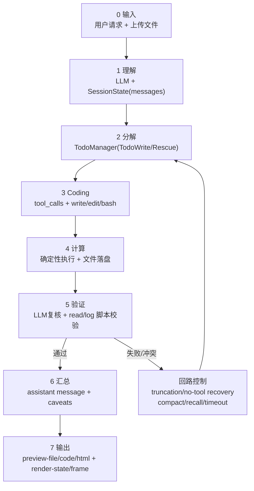

### 11.5.2 节点级模型参与与质量门禁

| 节点 | 模型参与模块 | 核心动作 | 质量门禁 | 可追溯产物 |
|---|---|---|---|---|
| 输入 | LLM 轻参与（格式识别） | 上传解析、任务归档 | 文件完整性/编码检查 | 原始输入快照 |
| 理解 | LLM 主参与 | 目标、变量、约束抽取 | 要求覆盖率检查 | `messages[]` |
| 思考分解 | LLM 主参与 | Todo 分解、里程碑规划 | 步骤可执行性检查 | `todos[]` |
| Coding | LLM + 工具协作 | 生成解析/计算代码与命令 | 语法与依赖检查 | `tool_calls`、`file_patch` |
| 计算 | 工具主导 | 确定性执行与落盘 | 执行返回码/日志检查 | `operations[]`、中间文件 |
| 验证 | LLM + 工具脚本 | 单位/范围/一致性/冲突检测 | 失败即回路重算 | `read_file` 输出、复核消息 |
| 汇总输出 | LLM 主参与 | 解释、结论、不确定性披露 | 证据-结论对齐检查 | Markdown/HTML/代码预览 |

### 11.5.3 科研数值严谨性增强策略

- 先算后说：先落地可复算的脚本与中间结果，再由模型做解释，避免“仅叙事无证据”。
- 单位与量纲前置：发布数值前执行单位归一与量纲一致性检查，避免跨单位误差。
- 多源交叉验证：当同一指标来自不同来源时，默认进行差异比对并记录偏差区间。
- 异常点双重检查：触发范围越界或离群时，自动回到分解/计算阶段复算。
- 叙事一致性检查：若最终文字结论与数值表冲突，禁止直接输出，必须二次推理。
- 不确定性显式化：证据不足时输出“置信度 + 缺口项”，而非隐式补全或强行定论。

### 11.5.4 与现有框架图的映射关系

- 输入/输出两端对应第 3 章中的 Presentation Layer + API & Stream Layer。
- 理解/思考/汇总对应 Orchestration & Control Layer（`SessionState`、`TodoManager`、`EventHub`）。
- Coding/计算对应 Model & Tool Execution Layer（tool router + worktree + runtime tools）。
- 验证与复盘对应 Artifact & Persistence Layer（中间产物、上下文归档、阶段预览）。
- 截断恢复、timeout 调度、上下文预算、反空想收敛共同构成该链路的稳定闭环控制面。

## 12. 参考

### 12.1 主要参考

- anomalyco/opencode: https://github.com/anomalyco/opencode/
- openai/codex: https://github.com/openai/codex
- shareAI-lab/learn-claude-code: https://github.com/shareAI-lab/learn-claude-code/tree/main

### 12.1.1 与 learn-claude-code 的明确借鉴关系

- 保留 `agents/s01`~`s12` 的 agent loop/tool dispatch 教学链路作为架构来源
- Todo/task/worktree/team 机制在概念与接口层继承，并整合到 standalone web agent
- `SKILL.md` 按需加载方法被复用并扩展到 Skills Studio

### 12.2 补充参考

- Ollama: https://github.com/ollama/ollama
- OpenAI API docs: https://platform.openai.com/docs
- MDN EventSource (SSE): https://developer.mozilla.org/docs/Web/API/EventSource
- PyInstaller: https://pyinstaller.org/
- Nuitka: https://nuitka.net/

### 12.3 本仓库实现过程参考

- `Clouds_Coder.py`（运行时架构、API、前端桥接）
- `packaging/README.md`（打包与分发说明）
- `requirements.txt`（依赖面）
- `skills/`（skills 协议与加载结构）

## 13. 许可证

本项目采用 MIT License，见 [LICENSE](./LICENSE)。
