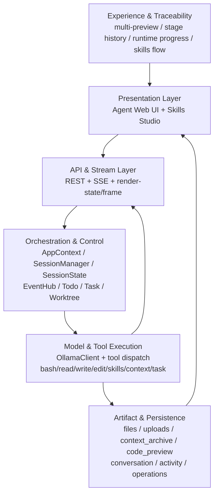
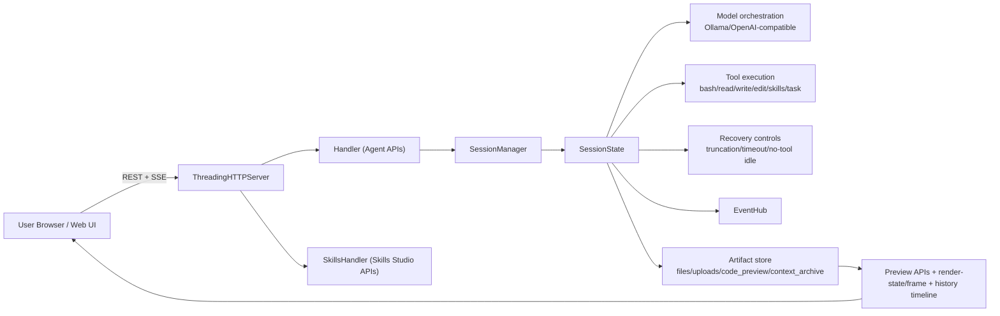
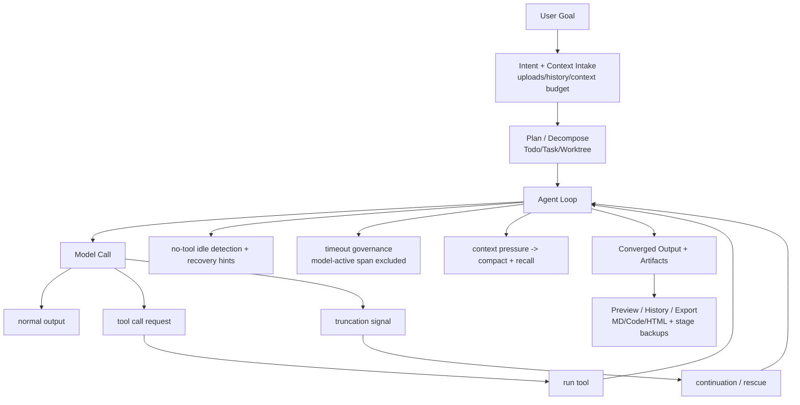
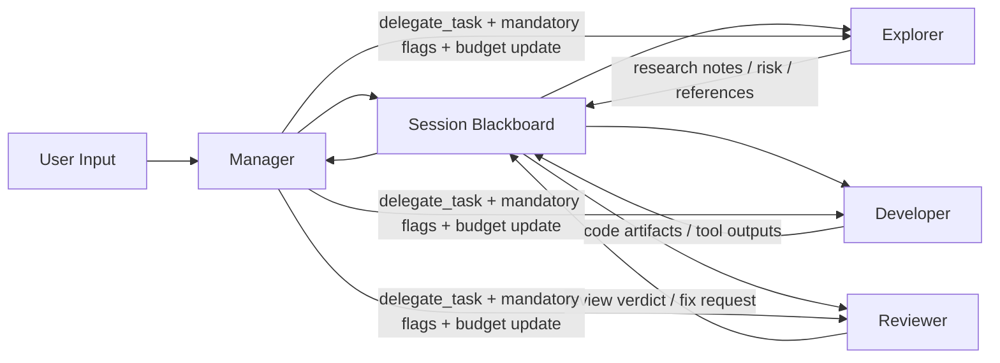
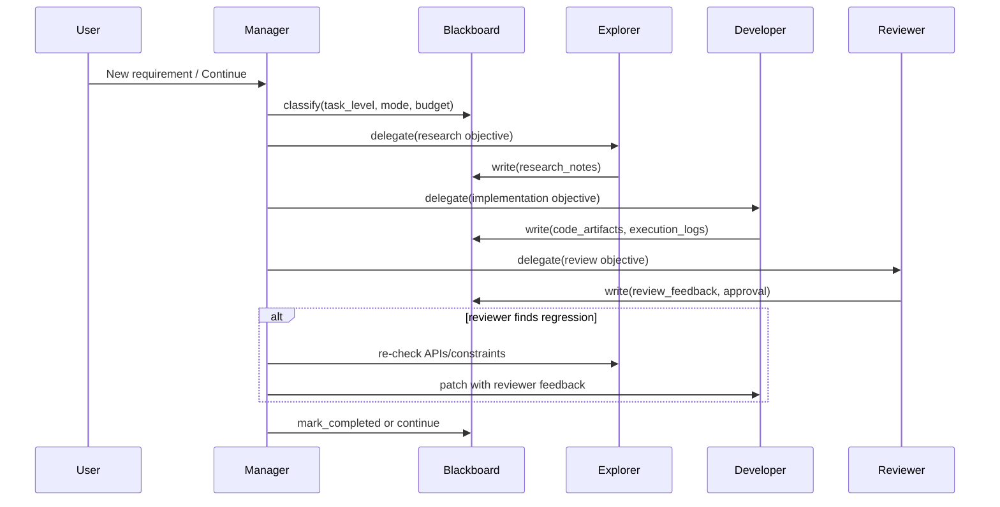
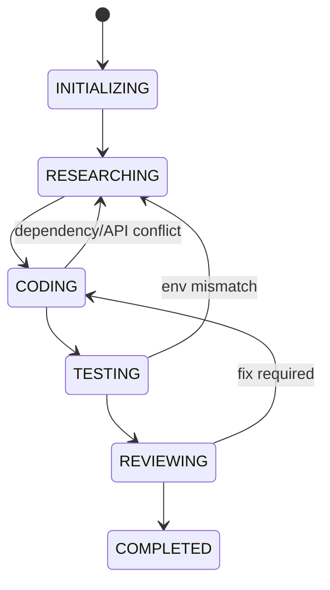
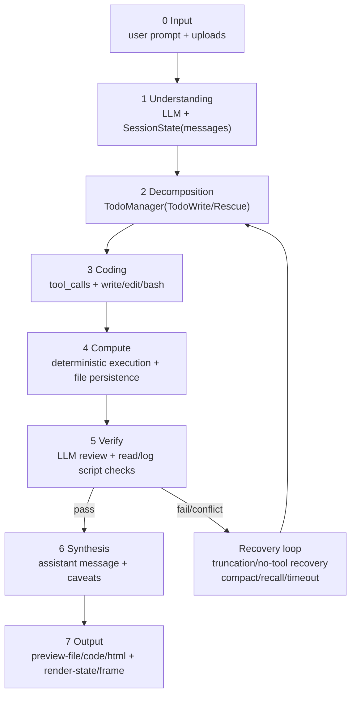

<h1 align="center">Clouds Coder</h1>
<h3 align="center">Cloud CLI Coder Runtime</h3>
<p align="center">CLI execution plane × Web user plane for reliable, observable Vibe Coding.</p>
<p align="center">
  <a href="./README.md">English</a> ·
  <a href="./README-zh.md">中文</a> ·
  <a href="./README-ja.md">日本語</a>
</p>
<p align="center">
  <a href="./RELEASE_NOTES.md">Release Notes</a> ·
  <a href="./CHANGELOG-2026-03-07.md">2026-03-07 Changelog (EN/中文/日本語)</a> ·
  <a href="./LICENSE">MIT License</a> ·
  <a href="./LLM.config.json">LLM Config Template</a>
</p>
<p align="center">
  
</p>

Clouds Coder is a local-first, general-purpose task agent platform centered on separating the CLI execution plane from the Web user plane, with Web UI, Skills Studio, resilient streaming, and long-task recovery controls.

Its primary problem framing is that CLI coding remains hard to learn and difficult to distribute consistently across users. Clouds Coder addresses this through backend/frontend separation (cloud-side CLI execution + Web-side interaction) to lower Vibe Coding onboarding cost, while timeout/truncation/context/anti-drift controls are treated as co-equal core capabilities that keep complex tasks executable, convergent, and trustworthy.

Latest architecture update summary (trilingual): [`CHANGELOG-2026-03-07.md`](./CHANGELOG-2026-03-07.md)

## 1. Project Positioning

Clouds Coder focuses on one practical goal:

- Build a separated CLI-execution/Web-user collaborative environment so users can get low-friction, observable, and traceable Vibe Coding workflows.

This repository evolves from a learning-oriented agent codebase into a production-oriented standalone runtime centered on:

- Backend/frontend separation for cloud-side execution and web-side control
- Lowering CLI learning barrier with visible, guided execution flows
- Lowering distribution/deployment friction with a unified runtime entrypoint
- Reducing Vibe Coding adoption cost for non-expert users
- Reliability and execution-convergence controls as core capabilities: timeout governance, truncation continuation, context budgeting, and anti-drift execution controls

## 1.1 Architecture Lineage and Reuse Statement

Clouds Coder explicitly borrows and extends core kernel ideas from:

- shareAI-lab/learn-claude-code: https://github.com/shareAI-lab/learn-claude-code/tree/main

Concrete borrowed architecture points (and where they map here):

- Minimal tool-agent loop (`LLM -> tool_use -> tool_result -> loop`) from the progressive agent sessions
- Planning-first execution style (`TodoWrite`) and anti-drift behavior for complex tasks
- On-demand skill loading contract (`SKILL.md` + runtime injection)
- Context compaction/recall strategy for long conversations
- Task/background/team/worktree orchestration concepts for multi-step execution

What Clouds Coder adds on top of that kernel lineage:

- Monolithic runtime kernel (`Clouds_Coder.py`): agent loop, tool router, session manager, API handlers, SSE stream, Web UI bridge, and Skills Studio run in one in-process state domain.
- Structured truncation continuation engine: strong truncation signal detection, tail overlap scanning, symbol/pair repair heuristics, multi-pass continuation, and live pass/token telemetry.
- Recovery-oriented execution controller: no-tool idle diagnosis, runtime recovery hint injection, truncation-rescue todo/task creation, and convergence nudges for complex-task dead loops.
- Unified timeout governance: global timeout scheduler with minimum floor, round-aware accounting, and model-active-span exclusion to avoid false timeout during active generation.
- Phase-aware live-input arbitration: different delay/weight policies for write/tool/normal phases to safely merge late user instructions into long-running turns.
- Context lifecycle manager: adaptive context budget + manual lock (`--ctx_limit`), archive-backed compaction, and targeted context recall for long sessions.
- Provider/profile orchestration layer: Ollama + OpenAI-compatible profile parsing, capability inference (including multimodal flags), media endpoint mapping, and runtime selection/fallback.
- Streaming reliability and observability stack: SSE heartbeat, write-exception tolerance, periodic model-call progress events, and event+snapshot hybrid refresh for UI consistency.
- Artifact-first workspace model: per-session `files/uploads/context_archive/code_preview` persistence, upload-to-workspace mirroring, and stage-based code preview for reproducible runs.

Skills reuse statement:

- `skills/` continues to use the same `SKILL.md` protocol family and runtime loading model
- `skills/code-review`, `skills/agent-builder`, `skills/mcp-builder`, `skills/pdf` are baseline reusable skills in this repo
- `skills/generated/*` are extended/generated skills built for Clouds Coder scenarios (reporting, degradation recovery, HTML pipelines, upload parsers, etc.)
- Runtime tool names/protocols remain compatible with the skill-loading workflow (for example `load_skill`, `list_skills`, `write_skill`)

## 1.2 Beyond a Coding CLI: General-Purpose Task Kernel

Clouds Coder is not designed as a coding-only CLI wrapper. It is positioned as a general-purpose agent runtime that can execute and audit mixed knowledge-work flows in one session:

- Programming tasks: implementation, refactor, debugging, tests, patch review
- Analysis tasks: file mining, document parsing, structured extraction, comparison studies
- Synthesis tasks: cross-source reasoning, decision memo drafting, risk/assumption rollups
- Reporting/visualization tasks: HTML reports, markdown narratives, staged code + artifact previews

The core execution target is a high-efficiency three-phase chain:

- `LLM (thinking/planning)` -> decomposes goals, assumptions, and step constraints
- `Coding (parsing/execution)` -> performs deterministic tool execution and artifact generation
- `LLM (synthesis/analysis)` -> validates outputs, aggregates findings, and communicates traceable conclusions

This design reduces "thinking-only" drift by forcing thought to be converted into executable actions and verifiable artifacts.

## 2. Core Features

- Agent runtime with session isolation
- General-purpose task routing (coding + analysis + synthesis + reporting) in one session graph
- Built-in `LLM -> Coding -> LLM` execution pattern for complex multi-step work
- Built-in Web UI + optional external Web UI loading
- Skills Studio (separate UI/port) for skill scanning, editing, and generation
- Ollama integration with model probing and catalog loading
- OpenAI-compatible profile support via `LLM.config.json`
- Unified timeout scheduler (global run timeout, model-active spans excluded)
- Truncation recovery loop with continuation passes, token/pass counters, and live UI status
- Context compaction + recall archive mechanism
- No-tool idle diagnosis/recovery hints for stalled complex tasks
- Task/Todo/Background/Team/Worktree mechanisms in one runtime
- SSE event stream with heartbeat and write-exception handling
- Rich preview pipeline: markdown/html/file preview + code stage preview
- Frontend rendering controls for resource stability (live/static freeze, snapshot strategy, virtualized chat rows)
- Scientific-work friendly output path: artifact-first steps, traceable stage outputs, and reproducibility-oriented persistence

## 3. Architecture Overview

```text
┌───────────────────────────────────────────────────────────────────────┐
│                            Clouds Coder                              │
├───────────────────────────────────────────────────────────────────────┤
│ Experience & Traceability Layer                                       │
│  - Multi-preview hub (Markdown / Code / HTML)                        │
│  - Stage-based code history backup + diff/provenance timeline        │
│  - Runtime progress cards (thinking/run/truncation/recovery)         │
│  - Skills visual flow builder + SKILL.md generation/injection        │
├───────────────────────────────────────────────────────────────────────┤
│ Presentation Layer                                                     │
│  - Agent Web UI (chat, boards, preview, runtime status)              │
│  - Skills Studio UI (scan/generate/save/upload skills)               │
├───────────────────────────────────────────────────────────────────────┤
│ API & Stream Layer                                                     │
│  - REST APIs: sessions/config/models/tools/preview/render            │
│  - SSE channel: /api/sessions/{id}/events (heartbeat + resilience)   │
├───────────────────────────────────────────────────────────────────────┤
│ Orchestration & Control Layer                                          │
│  - AppContext / SessionManager / SessionState                         │
│  - EventHub / TodoManager / TaskManager / WorktreeManager             │
│  - Truncation rescue + timeout governance + recovery controller        │
├───────────────────────────────────────────────────────────────────────┤
│ Model & Tool Execution Layer                                           │
│  - Ollama/OpenAI-compatible profile orchestration                      │
│  - tools: bash/read/write/edit/Todo/skills/context/task/render        │
│  - live-input arbitration + constrained-model safeguards               │
├───────────────────────────────────────────────────────────────────────┤
│ Artifact & Persistence Layer                                           │
│  - per-session files/uploads/context_archive/code_preview              │
│  - conversation/activity/operations/todos/tasks/worktree              │
└───────────────────────────────────────────────────────────────────────┘
```

Mermaid:



### 3.1 Interaction Architecture Diagram

```text
User (Browser/Web UI)
        │
        │ REST (message/config/uploads/preview) + SSE (runtime events)
        ▼
ThreadingHTTPServer
  ├─ Handler (Agent APIs)
  └─ SkillsHandler (Skills Studio APIs)
        │
        ▼
SessionManager ──► SessionState (per-session runtime state machine)
        │                    │
        │                    ├─ Model call orchestration (Ollama/OpenAI-compatible)
        │                    ├─ Tool execution (bash/read/write/edit/skills/task)
        │                    └─ Recovery controls (truncation/timeout/no-tool idle)
        │
        ├─ EventHub (transient runtime events)
        └─ Artifact store (files/uploads/code_preview/context_archive)
                │
                ▼
       Preview APIs + Render bridge + History/provenance timeline
                │
                ▼
        Web UI live updates (chat/runtime/preview/skills)
```

Mermaid:



### 3.2 Task Logic Diagram

```text
User Goal
   │
   ▼
Intent + Context Intake
   │ (uploads/history/context budget)
   ▼
Plan/Decompose (Todo/Task/Worktree)
   │
   ▼
Agent Loop
  ├─ Model Call
  │    ├─ normal output ───────────────┐
  │    ├─ tool call request ──► run tool├─► append result -> next round
  │    └─ truncation signal ─► continuation/rescue
  │
  ├─ no-tool idle detected -> diagnosis + recovery hints
  ├─ timeout governance (model-active span excluded)
  └─ context pressure -> compact + recall
   │
   ▼
Converged Output + Artifacts
   │
   ▼
Preview/History/Export (MD/Code/HTML + stage backups)
```

Mermaid:



### 3.3 Monolithic Multi-Agent Collaboration (Blackboard Mode)

Clouds Coder now supports role-specialized collaboration inside one monolithic runtime process:

- `manager`: routing/arbitration only (does not implement code directly)
- `explorer`: research, dependency/path analysis, environment probing
- `developer`: implementation, file edits, tool execution
- `reviewer`: validation, test judgment, approval/block decisions

This is not a microservice cluster. All agents run in one process and synchronize through one shared blackboard (single source of truth), which gives:

- lower coordination overhead (no cross-service RPC/event drift)
- deterministic state snapshots for Manager decisions
- faster corrective routing when errors appear mid-execution

Blackboard-centered data slices:

- `original_goal`, `status`, `manager_cycles`
- `research_notes`, `code_artifacts`, `execution_logs`, `review_feedback`
- `todos` with owner attribution (`manager`/`explorer`/`developer`/`reviewer`)
- manager judgement state (`task level`, `budget`, `remaining rounds`, `approval gate`)

Execution topologies:

- `sequential`: Explorer -> Developer -> Reviewer pipeline
- `sync`: Manager-led same-frequency collaboration, with dynamic cross-role re-routing

Task-level policy (Manager semantic classification, reset per user turn):

| Level | Typical task profile | Mode decision | Budget strategy |
| --- | --- | --- | --- |
| L1 | one-shot simple answer | switch to single-agent | minimal |
| L2 | short conversational follow-up | switch to single-agent | increased but bounded |
| L3 | light multi-role engineering | keep sync | constrained |
| L4 | complex engineering/research | keep sync | expanded |
| L5 | system-scale, long-horizon orchestration | keep sync | effectively unbounded, with confirmation gates |

Mermaid (same-frequency collaboration under monolithic kernel):



Mermaid (routing loop and dynamic interception):



Mermaid (blackboard state machine):



### 3.4 2026-03-07 Update Set and Innovation Mapping

Priority-ordered updates merged into this architecture:

| Priority | Update | Implementation highlights | Architecture impact |
| --- | --- | --- | --- |
| 1 | Multi-agent + blackboard fusion | role set (`explorer/developer/reviewer/manager`), blackboard statuses, sync/sequential mode, task-level policy L1-L5 | upgrades single-agent loop to managed collaborative graph |
| 2 | Circuit breaker & fused fault control | `CircuitBreakerTriggered`, `HARD_BREAK_TOOL_ERROR_THRESHOLD`, `FUSED_FAULT_BREAK_THRESHOLD` | hard stop on repeated failures to protect convergence and token budget |
| 3 | Thinking-output recovery | tolerant `<think>` parsing, `EmptyActionError`, `<thinking-empty-recovery>` hints | reduces "thinking-only" drift in long-chain reasoning models |
| 4 | Memory-bounded hotspot code preview | `_compress_rows_keep_hotspot`, dynamic `buffer_cap`, hotspot-preserving row compression | avoids OOM / UI stall on huge diff or full-file replacement |
| 5 | Todo ownership + arbiter refinement | todo `owner`/`key`, `complete_active`, `complete_all_open`, arbiter planning streak constraints | tighter planning-to-execution governance and clearer responsibility routing |

2026.03.07 architecture innovations:

- Monolithic same-frequency multi-agent collaboration: one process, one blackboard, low coordination friction.
- Industrial-grade execution circuit breaker: retries are bounded by hard fusion guards, not unlimited loops.
- OOM-safe hotspot rendering: preserve modified regions while compressing non-critical context.
- Adaptive thinking wakeup: catches empty-action drift and forces execution re-entry.

### 3.5 Detailed 2026-03-07 Change Inventory

1. Core architecture and multi-agent system (highest priority)
- Added execution mode constants: `EXECUTION_MODE_SINGLE`, `EXECUTION_MODE_SEQUENTIAL`, `EXECUTION_MODE_SYNC`.
- Added role sets: `AGENT_ROLES = ("explorer", "developer", "reviewer")` and `AGENT_BUBBLE_ROLES` (including `manager`).
- Added task-level policy matrix: `TASK_LEVEL_POLICIES` (`L1` to `L5`) for semantic mode/budget decisions.
- Added blackboard state machine constants: `BLACKBOARD_STATUSES` covering `INITIALIZING`, `RESEARCHING`, `CODING`, `TESTING`, `REVIEWING`, `COMPLETED`, `PAUSED`.

2. Circuit breaker and anti-drift hardening
- Added `CircuitBreakerTriggered` for hard execution cut-off on irreversible failure patterns.
- Added strict thresholds: `HARD_BREAK_TOOL_ERROR_THRESHOLD = 3`, `HARD_BREAK_RECOVERY_ROUND_THRESHOLD = 3`, `FUSED_FAULT_BREAK_THRESHOLD = 3`.
- Architecture effect: turns retry from optimistic repetition into bounded, safety-first convergence.

3. Thinking-output recovery for deep reasoning models
- Added `EmptyActionError` to catch "thinking-only, no executable action" turns.
- Added wake-up controls: `EMPTY_ACTION_WAKEUP_RETRY_LIMIT = 2` with runtime hint `<thinking-empty-recovery>`.
- Enhanced `split_thinking_content` with lenient `<think>` scanning, including unclosed-tag fallback handling.

4. Memory-bounded code preview and hotspot rendering
- Added `_compress_rows_keep_hotspot` to preserve changed regions and compress non-critical context.
- Added dynamic `buffer_cap` limits in `make_numbered_diff` and `build_code_preview_rows` to constrain memory growth.
- Architecture effect: keeps giant file replacements and high-line diff previews OOM-safe.

5. Todo ownership, arbiter, and workflow governance
- Added todo ownership and identity fields: `owner`, `key`.
- Added batch state APIs: `complete_active()`, `complete_all_open()`, `clear_all()`.
- Added arbiter planning control: `ARBITER_VALID_PLANNING_STREAK_LIMIT = 4`.

6. Runtime dependency and miscellaneous control-plane additions
- Added system-level imports for orchestration and non-blocking control paths: `deque`, `selectors`, `signal`, `shlex`.
- Expanded `RUNTIME_CONTROL_HINT_PREFIXES` with `<arbiter-continue>` and `<fault-prefill>` for richer recovery loops.

The full trilingual release narrative is in [`CHANGELOG-2026-03-07.md`](./CHANGELOG-2026-03-07.md).

## 4. Key Runtime Components (from source)

Main runtime file: `Clouds_Coder.py`.

- `AppContext`: global runtime container (config, model catalog, server runtime state)
- `SessionManager`: session lifecycle and lookup
- `SessionState`: per-session agent loop state, tool execution state, context/truncation/runtime markers
- `EventHub`: in-memory publish/subscribe event bus used by SSE and internal runtime events
- `OllamaClient`: model request adapter with chat API handling/fallback logic
- `SkillStore`: local and provider-based skill registry/scan/load
- `TodoManager` / `TaskManager` / `BackgroundManager`: planning and async execution
- `WorktreeManager`: isolated work directory coordination for task execution
- `Handler` / `SkillsHandler`: HTTP API endpoints for Agent UI and Skills Studio

## 5. Complex-Task Reliability Design

### 5.1 Truncation Recovery Closed Loop

Clouds Coder detects truncated model output and continues generation in controlled passes.

- Tracks live truncation state (`text/kind/tool/attempts/tokens`)
- Publishes incremental truncation events to UI
- Builds continuation prompts from tail buffer and structural state
- Repairs broken tail segments before merging continuation output
- Supports multiple continuation passes (`TRUNCATION_CONTINUATION_MAX_PASSES`)
- Keeps truncation continuation under a single tool-call execution context from UI perspective

### 5.2 Timeout Scheduling

- Global timeout scheduler for each run (`--timeout` / `--run_timeout`)
- Minimum enforced timeout is 600 seconds
- Runtime explicitly marks model-active spans and excludes them from timeout budgeting
- Timeout scheduling state is visible in runtime boards

### 5.3 Anti-Drift / Anti-Loop Behavior

- Detects no-tool idle streaks
- Injects diagnosis hints when repeated blank/thinking-only turns are observed
- Enters recovery mode and encourages decomposed execution steps
- Couples with Todo/Task mechanisms for stepwise convergence

### 5.4 Context Budget Control

- Configurable context limit (`--ctx_limit`)
- Manual lock behavior when user explicitly sets `--ctx_limit`
- Context token estimation and remaining budget shown in UI
- Auto compaction + archive recall when budget pressure rises

### 5.5 `LLM -> Coding -> LLM` Reliability Path for General and Research Tasks

- Stage A (`LLM planning`): converts ambiguous goals into constrained, executable subtasks with measurable outputs.
- Stage B (`Coding execution`): enforces tool-based parsing/computation/write steps so progress is grounded in files, commands, and artifacts.
- Stage C (`LLM synthesis`): merges intermediate artifacts into explainable conclusions, with explicit assumptions and unresolved gaps.
- Drift suppression by construction: if output is repeatedly truncated/blank, controller shifts to finer-grained decomposition instead of repeating long free-form calls.
- Scientific numeric rigor checks: encourage unit normalization, value-range sanity checks, multi-source cross-validation, and re-computation on suspicious deltas before final reporting.

## 6. Web UI and Performance Strategy

Clouds Coder Web UI is designed for long sessions and frequent state updates.

- SSE + snapshot polling hybrid refresh path
- Live running indicator and elapsed timer for model call spans
- Truncation-recovery live panel with pass/token progress
- Conversation virtualization path for large feeds
- Static freeze mode (`live/static`) to reduce continuous render pressure
- Render bridge channel for structured visualization/report updates
- Code preview supports stage timeline and full-text rendering

### 6.1 UX Innovations (Preview, Provenance, Humanized Operations)

- Unified multi-view preview workspace: the same task can be inspected through Markdown narrative, HTML rendering, and code-level stage views without leaving the current session context.
- Real-time code provenance: every write/edit operation feeds preview stage snapshots and operation streams, so users can trace what changed, when, and through which agent/tool step.
- History-backup oriented code review UX: stage-based code backups, diff-aware rows, hot-anchor focus, and copy-safe plain code export support both debugging and audit scenarios.
- Humanized runtime feedback: long-running model calls show elapsed state, truncation continuation progress, and recovery hints in the same conversation/runtime board rather than hidden logs.
- Skill authoring as a first-class UX flow: Skills Studio provides scan -> flow design -> generation -> injection -> save workflow, including a visual flow builder for SKILL.md creation.
- Operational continuity for mixed content tasks: drag-and-drop uploads (code/docs/tables/media) are mirrored into workspace context and immediately connected to preview and execution paths.

## 7. Skills System

Two layers:

- Runtime skill loading (agent execution): local skill files + provider protocols
- Skills Studio (authoring): scan, inspect, generate, save, upload skills

Current skill composition in this repository:

- Reusable baseline skills: `skills/code-review`, `skills/agent-builder`, `skills/mcp-builder`, `skills/pdf`
- Generated/extended skills: `skills/generated/*`
- Protocol and indexing assets: `skills/clawhub/`, `skills/skills_Gen/`

Supported protocol directions in code include:

- Local file-based skill protocol
- HTTP JSON provider manifest protocol

## 8. API Surface (Summary)

Major endpoint groups:

- Global config/model/tools/skills: `/api/config`, `/api/models`, `/api/tools`, `/api/skills*`
- Session lifecycle: `/api/sessions` (CRUD)
- Session runtime: `/api/sessions/{id}`, `/api/sessions/{id}/events` (SSE)
- Message/control: `/message`, `/interrupt`, `/compact`, `/uploads`
- Model config: `/api/sessions/{id}/config/model`, `/config/language`
- Preview/render: `/preview-file/*`, `/preview-code/*`, `/preview-code-stages/*`, `/render-state`, `/render-frame`
- Skills Studio: `/api/skillslab/*`

## 9. Quick Start

### 9.1 Requirements

- Python 3.10+
- Ollama (for local model serving, optional but recommended)
- Install dependencies:

```bash
pip install -r requirements.txt
```

### 9.2 Run

```bash
python Clouds_Coder.py --host 0.0.0.0 --port 8080
```

Default behavior:

- Agent UI: `http://127.0.0.1:8080`
- Skills Studio: `http://127.0.0.1:8081` (unless disabled)

### 9.3 Useful CLI Options

- `--model <name>`: startup model
- `--ollama-base-url <url>`: Ollama endpoint
- `--timeout <seconds>`: global run timeout scheduler
- `--ctx_limit <tokens>`: session context limit (manual lock if explicitly set)
- `--max_rounds <n>`: max agent rounds per run
- `--no_Skills_UI`: disable Skills Studio server
- `--config <path-or-url>`: load external LLM profile config
- `--use_external_web_ui` / `--no_external_web_ui`: external UI mode switch
- `--export_web_ui`: export built-in UI assets to configured web UI dir

## 10. Repository Structure

Release package (static files):

```text
.
├── Clouds_Coder.py   # Core runtime (backend + embedded frontend assets)
├── requirements.txt                  # Python dependencies
├── .env.example                      # Environment variable template
├── .gitignore                        # Release-time hidden-file filter rules
├── LLM.config.json                   # Main LLM profile template
├── README.md
├── README-zh.md
├── README-ja.md
├── LICENSE
└── packaging/                        # Cross-platform packaging scripts
    ├── README.md
    ├── windows/
    ├── linux/
    └── macos/
```

Runtime-generated directories (created automatically after first start):

```text
.
├── skills/                           # Auto-extracted from embedded bundle at startup
│   ├── code-review/
│   ├── agent-builder/
│   ├── mcp-builder/
│   ├── pdf/
│   └── generated/...
├── js_lib/                           # Auto-downloaded/validated frontend libraries at runtime
├── Codes/                            # Session workspaces and runtime artifacts
│   └── user_*/sessions/*/...
└── web_UI/                           # Optional, when exporting external Web UI assets
```

Notes:

- `skills/` is released by the program itself (`ensure_embedded_skills` + `ensure_runtime_skills`), so it does not need to be manually bundled in this release directory.
- `js_lib/` is managed at runtime (download/validation/cache), so it can be absent in a clean release package.
- macOS hidden files (`.DS_Store`, `__MACOSX`, `._*`) are filtered by `.gitignore` and should not be committed into release artifacts.
- The static release package intentionally keeps only runtime-critical files and packaging scripts.

## 11. Engineering Characteristics

- Single-file core runtime for easy deployment and versioning
- API + UI tightly integrated for operational visibility
- Strong bias toward deterministic recovery over optimistic retries
- Maintains session-level artifacts for reproducibility and debugging
- Practical support for long-run tasks rather than short toy prompts
- Prioritizes general-task adaptability over coding-only interaction loops

## 11.1 Architecture Advantages

- All-in-one runtime kernel (`Clouds_Coder.py`): agent loop, tool router, session state manager, HTTP APIs, SSE stream, Web UI bridge, and Skills Studio are integrated in one process. This reduces cross-service coordination cost and cuts distributed failure points for local-first usage.
- Lightweight and deployment-friendly: dependency surface is intentionally small (`requirements.txt` is minimal), startup is a single command, and packaging scripts support PyInstaller/Nuitka in both onedir and onefile modes.
- Native multimodal model support: provider capability inference and per-provider media endpoint mapping are built into profile parsing, so image/audio/video workflows can be routed without adding a separate multimodal proxy layer.
- Broad local + web model support with small-model optimization: supports Ollama and OpenAI-compatible backends, while adding constrained-model safeguards such as context limit control, truncation continuation passes, no-tool idle recovery, and unified timeout scheduling.

## 11.2 Native Multilingual Programming Environment Switching

- UI language switching is first-class: `zh-CN`, `zh-TW`, `ja`, `en` are supported through runtime normalization and API-level config switching (global and per-session).
- Model environment switching is native: model/provider profile can be switched at runtime from Web UI without restarting the process, with catalog-based validation and fallback behavior.
- Programming language context switching is built-in for code workspaces: code preview auto-detects many source file extensions and maps them to language renderers, enabling mixed-language repositories to be inspected in one continuous workflow.

## 11.3 Cloud CLI Coder: Architecture Value and Practical Advantages

- Cloud-side CLI execution model: the server executes `bash`/`read_file`/`write_file`/`edit_file` against isolated session workspaces, so users get CLI-grade programming capability with Web-side observability.
- Easy deployment and distribution: one-command startup plus packaging paths (PyInstaller/Nuitka, onedir/onefile) make rollout simpler than distributing and maintaining full local CLI stacks on every endpoint.
- Server-side isolation path: session-level filespace separation (`files/uploads/context_archive/code_preview`) and task/worktree isolation provide a strong base for one-tenant-per-VM or host-level physical isolation strategies.
- Hybrid UX (Web + CLI): combines Web strengths (live status, timeline, preview, visual operations trace) with CLI strengths (shell execution, deterministic file mutation, reproducible artifacts).
- Multi-end parallel centralized management: one service can manage multiple sessions with centralized model catalog, skills registry, operations feed, and runtime controls.
- Security for local-cloud deployment: code execution and artifacts can stay in self-managed environments (local host, private LAN, private cloud), reducing exposure to third-party runtime paths.

### 11.3.1 Compared With Common Alternatives

- Versus pure Web copilots: Clouds Coder provides direct server-side tool execution and artifact persistence, not only suggestion-level interaction.
- Versus pure local CLI agents: Clouds Coder lowers onboarding cost by avoiding per-device environment bootstrapping and adds a shared visual control plane.
- Versus heavy multi-service agent platforms: Clouds Coder keeps a compact runtime topology while still offering session isolation, streaming observability, and long-task recovery controls.

## 11.4 Why It Is More General Than a Traditional Coding CLI

- Traditional coding CLIs optimize for source-code mutation only; Clouds Coder optimizes for full-task closure: evidence collection, parsing, execution, synthesis, and report delivery.
- Traditional coding CLIs often hide runtime state in terminal logs; Clouds Coder makes execution state, truncation recovery, timeout governance, and artifact lineage visible in Web UI.
- Traditional coding CLIs usually stop at "code produced"; Clouds Coder supports downstream analysis/report outputs (for example markdown + HTML + structured previews) in the same run.
- Traditional coding CLIs are user-terminal centric; Clouds Coder provides centralized, session-isolated, cloud-side CLI execution with multi-session operational control.

## 11.5 Efficiency Chain and Scientific Numerical Rigor

Clouds Coder treats complex scientific tasks as an executable state machine, not as a one-shot long answer. The target chain is `input -> understanding -> thinking -> coding (human-like written computation) -> compute -> verify -> re-think -> synthesize -> output` with observable checkpoints.

Implementation consistency note: the following chain is constrained to modules/events/artifacts that already exist in source (`SessionState`, `TodoManager`, tool dispatch, `code_preview`, `context_archive`, `live_truncation`, `runtime_progress`, `render-state/frame`). No non-existent hardcoded scientific validator is assumed.

### 11.5.1 Scientific Task Processing Pipeline (Kernel-Aligned)

```text
┌──────────────────────────────────────────────────────────────────────┐
│ 0) Input                                                            │
│ user prompt + uploaded data/files (PDF/CSV/code/media)             │
└─────────────────────────────┬────────────────────────────────────────┘
                              ▼
┌──────────────────────────────────────────────────────────────────────┐
│ 1) Understanding                                                    │
│ Model role: LLM intent parsing / constraint extraction              │
│ Kernel modules: Handler + SessionState                              │
│ Output: conversation messages + system prompt context               │
└─────────────────────────────┬────────────────────────────────────────┘
                              ▼
┌──────────────────────────────────────────────────────────────────────┐
│ 2) Thinking & Decomposition                                         │
│ Model role: LLM todo split / execution ordering                     │
│ Kernel modules: TodoManager + SkillStore                           │
│ Output: todos[] (TodoWrite/TodoWriteRescue)                         │
└─────────────────────────────┬────────────────────────────────────────┘
                              ▼
┌──────────────────────────────────────────────────────────────────────┐
│ 3) Coding (human-like written computation)                          │
│ Model role: generate scripts/parsers/queries                        │
│ Kernel modules: tool dispatch + WorktreeManager + skill runtime     │
│ Output: tool_calls / file_patch / code_preview stages               │
└─────────────────────────────┬────────────────────────────────────────┘
                              ▼
┌──────────────────────────────────────────────────────────────────────┐
│ 4) Compute                                                          │
│ Model role: minimized; deterministic execution first                │
│ Kernel modules: bash/read/write/edit/background_run + persistence   │
│ Output: command outputs / changed files / intermediate files         │
└─────────────────────────────┬────────────────────────────────────────┘
                              ▼
┌──────────────────────────────────────────────────────────────────────┐
│ 5) Verify                                                           │
│ Model role: LLM review + tool-script checks (no hardcoded validator)│
│ Kernel modules: SessionState + EventHub + context_archive           │
│ Checks: formula/unit, range/outlier, source and narrative alignment │
│ Output: review messages + read/log evidence + confidence wording    │
└───────────────┬───────────────────────────────────────┬──────────────┘
                │pass                                    │fail/conflict
                ▼                                        ▼
┌──────────────────────────────────────┐     ┌─────────────────────────┐
│ 6) Synthesis                         │     │ Back to 2)/3) loop      │
│ Model role: LLM explanation/caveats  │     │ triggers: anti-drift,   │
│ Kernel modules: SessionState/EventHub│     │ truncation resume,      │
│ Output: assistant message/caveats    │     │ context compact/recall  │
└───────────────────┬──────────────────┘     └───────────┬─────────────┘
                    ▼                                    ▲
┌──────────────────────────────────────────────────────────────────────┐
│ 7) Output                                                           │
│ Kernel modules: preview-file/code/render-state/frame APIs          │
│ Deliverables: Markdown / HTML / code artifacts / visual report      │
└──────────────────────────────────────────────────────────────────────┘
```

Mermaid:



### 11.5.2 Node-Level Model Participation and Quality Gates

| Node | Model participation | Core action | Quality gate | Traceable artifact |
|---|---|---|---|---|
| Input | light LLM assist | ingest and normalize files/tasks | file integrity and encoding checks | raw input snapshot |
| Understanding | LLM primary | extract goals, variables, constraints | requirement coverage check | `messages[]` |
| Decomposition | LLM primary | split todo and milestones | executable-step check | `todos[]` |
| Coding | LLM + tools | produce parser/compute code and commands | syntax/dependency checks | `tool_calls`, `file_patch` |
| Compute | tools primary | deterministic execution and file writes | exit-code and log checks | `operations[]`, intermediate files |
| Verify | LLM + tool scripts | unit/range/consistency/conflict validation | failure triggers loop-back | `read_file` outputs + review messages |
| Synthesis/Output | LLM primary | explain results and uncertainty | evidence-to-claim consistency | markdown/html/code previews |

### 11.5.3 Scientific Numerical Rigor Policies

- Compute-before-narrate: produce reproducible scripts and intermediate outputs before final prose.
- Unit and dimension first: normalize units and check dimensional consistency before publishing values.
- Cross-source validation: compare the same metric across sources and record deviation windows.
- Outlier re-check: out-of-range results trigger automatic decomposition/recompute loops.
- Narrative consistency gate: textual conclusions must match tables/metrics; otherwise block output.
- Explicit uncertainty: publish confidence + missing evidence instead of silent interpolation.

### 11.5.4 Mapping to Existing Architecture Diagram

- Input/output ends map to Presentation Layer + API & Stream Layer.
- Understanding/thinking/synthesis map to Orchestration & Control Layer (`SessionState`, `TodoManager`, `EventHub`).
- Coding/compute map to Model & Tool Execution Layer (tool router, worktree, runtime tools).
- Verification and replay map to Artifact & Persistence Layer (intermediate artifacts, archive, stage preview).
- Truncation recovery, timeout governance, context budgeting, and anti-drift controls form the stability loop over this pipeline.

## 12. References

### 12.1 Primary inspirations

- anomalyco/opencode: https://github.com/anomalyco/opencode/
- openai/codex: https://github.com/openai/codex
- shareAI-lab/learn-claude-code: https://github.com/shareAI-lab/learn-claude-code/tree/main

### 12.1.1 Explicit architecture borrowing from learn-claude-code

- Agent loop and tool dispatch pedagogy (`agents/s01`~`s12`) is retained as lineage reference in this repo's `agents/` directory
- Todo/task/worktree/team mechanisms are inherited at concept and interface level, then integrated into the single-runtime web agent
- Skills loading protocol (`SKILL.md`) and "load on demand" methodology are reused and expanded by Skills Studio

### 12.2 Additional references

- Ollama: https://github.com/ollama/ollama
- OpenAI API docs (OpenAI-compatible patterns): https://platform.openai.com/docs
- MDN EventSource (SSE): https://developer.mozilla.org/docs/Web/API/EventSource
- PyInstaller: https://pyinstaller.org/
- Nuitka: https://nuitka.net/

### 12.3 Implementation-time references used in this repository

- `Clouds_Coder.py` (runtime architecture, APIs, frontend bridge)
- `packaging/README.md` (distribution and packaging commands)
- `requirements.txt` (runtime dependencies)
- `skills/` (skill protocol and runtime loading structure)

## 13. License

This project is released under the MIT License. See [LICENSE](./LICENSE).

---

If you plan to publish on GitHub, recommended next step is to add a small `CHANGELOG.md` and one architecture diagram image under `docs/` for faster onboarding.
