<h1 align="center">Clouds Coder</h1>
<h3 align="center">Cloud CLI Coder Runtime</h3>
<p align="center">CLI execution plane × Web user plane for reliable, observable Vibe Coding.</p>
<p align="center">
  <a href="./README.md">English</a> ·
  <a href="./README-zh.md">中文</a> ·
  <a href="./README-ja.md">日本語</a>
</p>
<p align="center">
  <a href="https://pypi.org/project/clouds-coder/"></a>
  <a href="https://pypi.org/project/clouds-coder/"></a>
  <a href="https://pypi.org/project/clouds-coder/"></a>
</p>
<p align="center">
  <a href="./RELEASE_NOTES.md">Release Notes</a> ·
  <a href="./log/CHANGELOG-2026-03-31.md">2026-03-31 Changelog (EN/中文/日本語)</a> ·
  <a href="./log/CHANGELOG-2026-03-25.md">2026-03-25 Changelog (EN/中文/日本語)</a> ·
  <a href="./log/CHANGELOG-2026-03-20.md">2026-03-20 Changelog</a> ·
  <a href="./log/CHANGELOG-2026-03-16.md">2026-03-16 Changelog</a> ·
  <a href="./log/CHANGELOG-2026-03-07.md">2026-03-07 Changelog</a> ·
  <a href="./LICENSE">MIT License</a> ·
  <a href="./LLM.config.json">LLM Config Template</a>
</p>
<p align="center">
  
</p>

Clouds Coder is a local-first, general-purpose task agent platform centered on separating the CLI execution plane from the Web user plane, with Web UI, Skills Studio, resilient streaming, and long-task recovery controls.

Its primary problem framing is that CLI coding remains hard to learn and difficult to distribute consistently across users. Clouds Coder addresses this through backend/frontend separation (cloud-side CLI execution + Web-side interaction) to lower Vibe Coding onboarding cost, while timeout/truncation/context/anti-drift controls are treated as co-equal core capabilities that keep complex tasks executable, convergent, and trustworthy.

Latest architecture update summary (trilingual): [`CHANGELOG-2026-03-31.md`](./log/CHANGELOG-2026-03-31.md) | Previous: [`CHANGELOG-2026-03-25.md`](./log/CHANGELOG-2026-03-25.md) | [`CHANGELOG-2026-03-20.md`](./log/CHANGELOG-2026-03-20.md) | [`CHANGELOG-2026-03-16.md`](./log/CHANGELOG-2026-03-16.md) | [`CHANGELOG-2026-03-07.md`](./log/CHANGELOG-2026-03-07.md)

## 1. Project Positioning

Clouds Coder focuses on one practical goal:

- Build a separated CLI-execution/Web-user collaborative environment so users can get low-friction, observable, and traceable Vibe Coding workflows.

This repository evolves from a learning-oriented agent codebase into a production-oriented standalone runtime centered on:

- Backend/frontend separation for cloud-side execution and web-side control
- Lowering CLI learning barrier with visible, guided execution flows
- Lowering distribution/deployment friction with a unified runtime entrypoint
- Reducing Vibe Coding adoption cost for non-expert users
- Reliability and execution-convergence controls as core capabilities: timeout governance, truncation continuation, context budgeting, and anti-drift execution controls

## 1.1 Architecture Lineage and Reuse Statement

Clouds Coder explicitly borrows and extends core kernel ideas from:

- shareAI-lab/learn-claude-code: https://github.com/shareAI-lab/learn-claude-code/tree/main

Concrete borrowed architecture points (and where they map here):

- Minimal tool-agent loop (`LLM -> tool_use -> tool_result -> loop`) from the progressive agent sessions
- Planning-first execution style (`TodoWrite`) and anti-drift behavior for complex tasks
- On-demand skill loading contract (`SKILL.md` + runtime injection)
- Context compaction/recall strategy for long conversations
- Task/background/team/worktree orchestration concepts for multi-step execution

What Clouds Coder adds on top of that kernel lineage:

- Monolithic runtime kernel (`Clouds_Coder.py`): agent loop, tool router, session manager, API handlers, SSE stream, Web UI bridge, and Skills Studio run in one in-process state domain.
- Structured truncation continuation engine: strong truncation signal detection, tail overlap scanning, symbol/pair repair heuristics, multi-pass continuation, and live pass/token telemetry.
- Recovery-oriented execution controller: no-tool idle diagnosis, runtime recovery hint injection, truncation-rescue todo/task creation, and convergence nudges for complex-task dead loops.
- Unified timeout governance: global timeout scheduler with minimum floor, round-aware accounting, and model-active-span exclusion to avoid false timeout during active generation.
- Phase-aware live-input arbitration: different delay/weight policies for write/tool/normal phases to safely merge late user instructions into long-running turns.
- Context lifecycle manager: adaptive context budget + manual lock (`--ctx_limit`), archive-backed compaction, and targeted context recall for long sessions.
- Provider/profile orchestration layer: Ollama + OpenAI-compatible profile parsing, capability inference (including multimodal flags), media endpoint mapping, and runtime selection/fallback.
- Streaming reliability and observability stack: SSE heartbeat, write-exception tolerance, periodic model-call progress events, and event+snapshot hybrid refresh for UI consistency.
- Artifact-first workspace model: per-session `files/uploads/context_archive/code_preview` persistence, upload-to-workspace mirroring, and stage-based code preview for reproducible runs.

Skills reuse statement:

- `skills/` continues to use the same `SKILL.md` protocol family and runtime loading model
- `skills/code-review`, `skills/agent-builder`, `skills/mcp-builder`, `skills/pdf` are baseline reusable skills in this repo
- `skills/generated/*` are extended/generated skills built for Clouds Coder scenarios (reporting, degradation recovery, HTML pipelines, upload parsers, etc.)
- Runtime tool names/protocols remain compatible with the skill-loading workflow (for example `load_skill`, `list_skills`, `write_skill`)

MiniMax skills source attribution:

- The bundled local skill packs under `Minimax/` and `Minimax_2/` are adapted from MiniMax AI's open-source skills repository: https://github.com/MiniMax-AI/skills
- Original upstream source is used under the MIT License
- Thanks to MiniMax AI and upstream contributors for the original skill content, structure, and ecosystem work

## 1.2 Beyond a Coding CLI: General-Purpose Task Kernel

Clouds Coder is not designed as a coding-only CLI wrapper. It is positioned as a general-purpose agent runtime that can execute and audit mixed knowledge-work flows in one session:

- Programming tasks: implementation, refactor, debugging, tests, patch review
- Analysis tasks: file mining, document parsing, structured extraction, comparison studies
- Synthesis tasks: cross-source reasoning, decision memo drafting, risk/assumption rollups
- Reporting/visualization tasks: HTML reports, markdown narratives, staged code + artifact previews

The core execution target is a high-efficiency three-phase chain:

- `LLM (thinking/planning)` -> decomposes goals, assumptions, and step constraints
- `Coding (parsing/execution)` -> performs deterministic tool execution and artifact generation
- `LLM (synthesis/analysis)` -> validates outputs, aggregates findings, and communicates traceable conclusions

This design reduces "thinking-only" drift by forcing thought to be converted into executable actions and verifiable artifacts.

## 2. Core Features

- Agent runtime with session isolation
- General-purpose task routing (coding + analysis + synthesis + reporting) in one session graph
- Built-in `LLM -> Coding -> LLM` execution pattern for complex multi-step work
- **Plan Mode** with UI toggle (Auto/On/Off) — research → proposal → user choice → step-by-step execution, works in both Single and Sync modes
- **Multi-agent collaboration** with 4 roles (manager/explorer/developer/reviewer) and blackboard-centered coordination
- **Reviewer Debug Mode** — reviewer gains write access to independently diagnose and fix bugs when errors are detected
- **6-category universal error detection** (test/lint/compilation/build/deploy/runtime) with unified failure ledger
- **4-tier context compression** (normal → light → medium → heavy) with file buffer offload, supporting ctx_left from 4K to 1M tokens
- **Task phase-aware delegation** — manager routes to the right agent based on current phase (research/design/implement/test/review/deploy)
- **Native multimodal support** — read_file auto-detects image/audio/video and injects as native model input when supported
- **Real-time user input merge** — mid-execution feedback adjusts plan direction without restart
- **Restart intent fusion** — user > plan > context priority when resuming after finish/abort
- **Universal Skills ecosystem** — compatible with 5 major skill ecosystems (awesome-claude-skills, Minimax-skills, skills-main, kimi-agent-internals, academic-pptx); LLM-driven autonomous discovery and loading with multi-skill support and conflict detection
- **Dual RAG knowledge architecture** — Code RAG (`CodeIngestionService`) + Data RAG (`RAGIngestionService`), both built on TF_G_IDF_RAG, with unified `query_knowledge_library` retrieval interface and injected retrieval guides in built-in skills
- **Multi-factor priority context compression** — 10-factor message importance scoring (recency, role, task progress, errors, goal relevance, skills, compact-resume) replaces chronological-only trimming
- Built-in Web UI + optional external Web UI loading
- Skills Studio (separate UI/port) for skill scanning, editing, and generation
- Ollama integration with model probing and catalog loading
- OpenAI-compatible profile support via `LLM.config.json`
- Unified timeout scheduler (global run timeout, model-active spans excluded)
- Truncation recovery loop with continuation passes, token/pass counters, and live UI status
- Context compaction + recall archive mechanism with lossless state handoff
- No-tool idle diagnosis/recovery hints for stalled complex tasks
- Task/Todo/Background/Team/Worktree mechanisms in one runtime
- SSE event stream with heartbeat and write-exception handling
- Rich preview pipeline: markdown/html/code/PDF/CSV/Excel/Word/PPT/media preview + code stage preview
- Frontend rendering controls for resource stability (live/static freeze, snapshot strategy, virtualized chat rows)
- Scientific-work friendly output path: artifact-first steps, traceable stage outputs, and reproducibility-oriented persistence

## 3. Architecture Overview

```text
┌───────────────────────────────────────────────────────────────────────┐
│                            Clouds Coder                              │
├───────────────────────────────────────────────────────────────────────┤
│ Experience & Traceability Layer                                       │
│  - Multi-preview hub (Markdown / HTML / Code / PDF / Office / Media) │
│  - Stage-based code history backup + diff/provenance timeline        │
│  - Runtime progress cards (thinking/run/truncation/recovery)         │
│  - Skills visual flow builder + SKILL.md generation/injection        │
├───────────────────────────────────────────────────────────────────────┤
│ Presentation Layer                                                     │
│  - Agent Web UI (chat, boards, preview, runtime status)              │
│  - Plan Mode toggle (Auto/On/Off) + Planner bubble (orange-red)     │
│  - Skills Studio UI (scan/generate/save/upload skills)               │
├───────────────────────────────────────────────────────────────────────┤
│ API & Stream Layer                                                     │
│  - REST APIs: sessions/config/models/tools/preview/render/plan-mode  │
│  - SSE channel: /api/sessions/{id}/events (heartbeat + resilience)   │
├───────────────────────────────────────────────────────────────────────┤
│ Orchestration & Control Layer                                          │
│  - AppContext / SessionManager / SessionState                         │
│  - Plan Mode: research → proposal → user choice → step execution     │
│  - Phase-aware delegation (research/implement/test/review/deploy)    │
│  - EventHub / TodoManager / TaskManager / WorktreeManager             │
│  - 6-layer plan step protection + complexity inheritance              │
│  - Truncation rescue + timeout governance + recovery controller        │
├───────────────────────────────────────────────────────────────────────┤
│ Model & Tool Execution Layer                                           │
│  - Ollama/OpenAI-compatible profile orchestration                      │
│  - Native multimodal: auto-detect image/audio/video in read_file     │
│  - 6-category error detection + unified failure ledger                │
│  - 4-tier context compression + file buffer offload (4K–1M tokens)   │
│  - Reviewer Debug Mode (write access on error detection)             │
│  - tools: bash/read/write/edit/Todo/skills/context/task/render        │
│  - live-input arbitration + constrained-model safeguards               │
├───────────────────────────────────────────────────────────────────────┤
│ Artifact & Persistence Layer                                           │
│  - per-session files/uploads/context_archive/file_buffer/code_preview │
│  - conversation/activity/operations/todos/tasks/worktree              │
└───────────────────────────────────────────────────────────────────────┘
```

Mermaid:

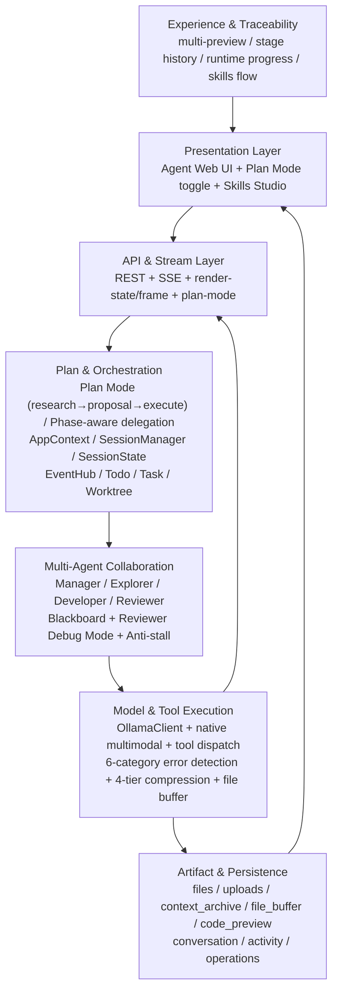

### 3.1 Interaction Architecture Diagram

```text
User (Browser/Web UI)
        │
        │ REST (message/config/uploads/preview) + SSE (runtime events)
        ▼
ThreadingHTTPServer
  ├─ Handler (Agent APIs)
  └─ SkillsHandler (Skills Studio APIs)
        │
        ▼
SessionManager ──► SessionState (per-session runtime state machine)
        │                    │
        │                    ├─ Model call orchestration (Ollama/OpenAI-compatible)
        │                    ├─ Tool execution (bash/read/write/edit/skills/task)
        │                    └─ Recovery controls (truncation/timeout/no-tool idle)
        │
        ├─ EventHub (transient runtime events)
        └─ Artifact store (files/uploads/code_preview/context_archive)
                │
                ▼
       Preview APIs + Render bridge + History/provenance timeline
                │
                ▼
        Web UI live updates (chat/runtime/preview/skills)
```

Mermaid:

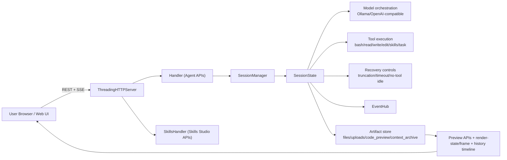

### 3.2 Task Logic Diagram

```text
User Goal
   │
   ▼
Intent + Context Intake
   │ (uploads/history/context budget/multimodal detection)
   ▼
Plan Mode Gate (Auto/On/Off)
   ├─ Plan ON ──► Explorer research → Manager synthesis → User choice
   │                                                         │
   │              ◄──────── approved plan steps ◄────────────┘
   │
   ▼
Agent Loop (Single or Sync mode)
  ├─ Phase-aware delegation (research→explorer, implement→developer, ...)
  ├─ Model Call
  │    ├─ normal output ───────────────┐
  │    ├─ tool call request ──► run tool├─► append result -> next round
  │    └─ truncation signal ─► continuation/rescue
  │
  ├─ Error detected → Reviewer Debug Mode (write access)
  ├─ 4-tier context compression (normal/light/medium/heavy)
  ├─ Live user input → merge with plan direction
  ├─ Plan step auto-advance (Single) / advance_plan_step (Sync)
  ├─ no-tool idle detected -> diagnosis + recovery hints
  ├─ timeout governance (model-active span excluded)
  └─ context pressure -> compact + file buffer + state handoff
   │
   ▼
Converged Output + Artifacts
   │
   ▼
Preview/History/Export (MD/Code/HTML + stage backups)
```

Mermaid:

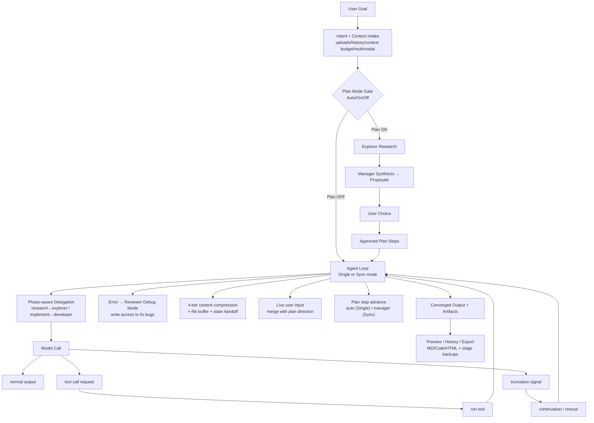

### 3.3 Monolithic Multi-Agent Collaboration (Blackboard Mode)

Clouds Coder now supports role-specialized collaboration inside one monolithic runtime process:

- `manager`: routing/arbitration only (does not implement code directly); phase-aware delegation
- `explorer`: research, dependency/path analysis, environment probing
- `developer`: implementation, file edits, tool execution
- `reviewer`: validation, test judgment, approval/block decisions; **Debug Mode** grants write access to fix bugs independently

This is not a microservice cluster. All agents run in one process and synchronize through one shared blackboard (single source of truth), which gives:

- lower coordination overhead (no cross-service RPC/event drift)
- deterministic state snapshots for Manager decisions
- faster corrective routing when errors appear mid-execution

Blackboard-centered data slices:

- `original_goal`, `status`, `manager_cycles`, `plan` (phase/steps/cursor)
- `research_notes`, `code_artifacts`, `execution_logs`, `review_feedback`
- `errors` (unified 6-category failure ledger) + `compilation_errors` (compat view)
- `todos` with owner attribution (`manager`/`explorer`/`developer`/`reviewer`)
- manager judgement state (`task level`, `budget`, `remaining rounds`, `approval gate`, `phase`)

Execution topologies:

- `sequential`: Explorer -> Developer -> Reviewer pipeline
- `sync`: Manager-led same-frequency collaboration, with dynamic cross-role re-routing

Task-level policy (Manager semantic classification, reset per user turn):

| Level | Typical task profile | Mode decision | Budget strategy |
| --- | --- | --- | --- |
| L1 | one-shot simple answer | switch to single-agent | minimal |
| L2 | short conversational follow-up | switch to single-agent | increased but bounded |
| L3 | light multi-role engineering | keep sync | constrained |
| L4 | complex engineering/research | keep sync | expanded |
| L5 | system-scale, long-horizon orchestration | keep sync | effectively unbounded, with confirmation gates |

Mermaid (same-frequency collaboration under monolithic kernel):

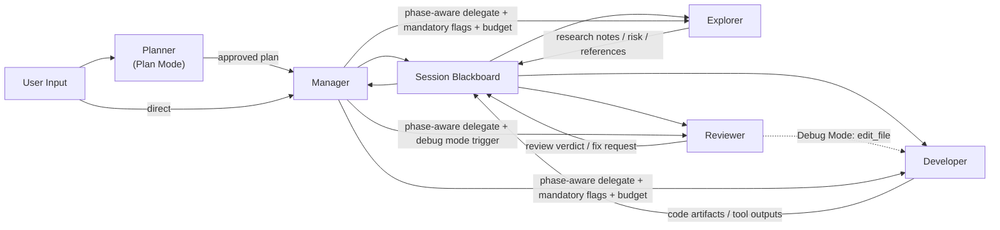

Mermaid (routing loop and dynamic interception):

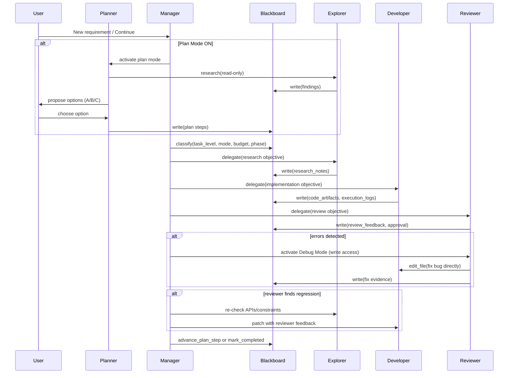

Mermaid (blackboard state machine):

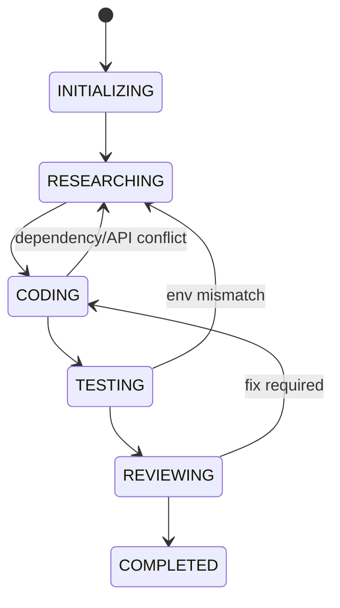

### 3.4 2026-03-07 Update Set and Innovation Mapping

Priority-ordered updates merged into this architecture:

| Priority | Update | Implementation highlights | Architecture impact |
| --- | --- | --- | --- |
| 1 | Multi-agent + blackboard fusion | role set (`explorer/developer/reviewer/manager`), blackboard statuses, sync/sequential mode, task-level policy L1-L5 | upgrades single-agent loop to managed collaborative graph |
| 2 | Circuit breaker & fused fault control | `CircuitBreakerTriggered`, `HARD_BREAK_TOOL_ERROR_THRESHOLD`, `FUSED_FAULT_BREAK_THRESHOLD` | hard stop on repeated failures to protect convergence and token budget |
| 3 | Thinking-output recovery | tolerant `<think>` parsing, `EmptyActionError`, `<thinking-empty-recovery>` hints | reduces "thinking-only" drift in long-chain reasoning models |
| 4 | Memory-bounded hotspot code preview | `_compress_rows_keep_hotspot`, dynamic `buffer_cap`, hotspot-preserving row compression | avoids OOM / UI stall on huge diff or full-file replacement |
| 5 | Todo ownership + arbiter refinement | todo `owner`/`key`, `complete_active`, `complete_all_open`, arbiter planning streak constraints | tighter planning-to-execution governance and clearer responsibility routing |

2026.03.07 architecture innovations:

- Monolithic same-frequency multi-agent collaboration: one process, one blackboard, low coordination friction.
- Industrial-grade execution circuit breaker: retries are bounded by hard fusion guards, not unlimited loops.
- OOM-safe hotspot rendering: preserve modified regions while compressing non-critical context.
- Adaptive thinking wakeup: catches empty-action drift and forces execution re-entry.

### 3.5 Detailed 2026-03-07 Change Inventory

1. Core architecture and multi-agent system (highest priority)
- Added execution mode constants: `EXECUTION_MODE_SINGLE`, `EXECUTION_MODE_SEQUENTIAL`, `EXECUTION_MODE_SYNC`.
- Added role sets: `AGENT_ROLES = ("explorer", "developer", "reviewer")` and `AGENT_BUBBLE_ROLES` (including `manager`).
- Added task-level policy matrix: `TASK_LEVEL_POLICIES` (`L1` to `L5`) for semantic mode/budget decisions.
- Added blackboard state machine constants: `BLACKBOARD_STATUSES` covering `INITIALIZING`, `RESEARCHING`, `CODING`, `TESTING`, `REVIEWING`, `COMPLETED`, `PAUSED`.

2. Circuit breaker and anti-drift hardening
- Added `CircuitBreakerTriggered` for hard execution cut-off on irreversible failure patterns.
- Added strict thresholds: `HARD_BREAK_TOOL_ERROR_THRESHOLD = 3`, `HARD_BREAK_RECOVERY_ROUND_THRESHOLD = 3`, `FUSED_FAULT_BREAK_THRESHOLD = 3`.
- Architecture effect: turns retry from optimistic repetition into bounded, safety-first convergence.

3. Thinking-output recovery for deep reasoning models
- Added `EmptyActionError` to catch "thinking-only, no executable action" turns.
- Added wake-up controls: `EMPTY_ACTION_WAKEUP_RETRY_LIMIT = 2` with runtime hint `<thinking-empty-recovery>`.
- Enhanced `split_thinking_content` with lenient `<think>` scanning, including unclosed-tag fallback handling.

4. Memory-bounded code preview and hotspot rendering
- Added `_compress_rows_keep_hotspot` to preserve changed regions and compress non-critical context.
- Added dynamic `buffer_cap` limits in `make_numbered_diff` and `build_code_preview_rows` to constrain memory growth.
- Architecture effect: keeps giant file replacements and high-line diff previews OOM-safe.

5. Todo ownership, arbiter, and workflow governance
- Added todo ownership and identity fields: `owner`, `key`.
- Added batch state APIs: `complete_active()`, `complete_all_open()`, `clear_all()`.
- Added arbiter planning control: `ARBITER_VALID_PLANNING_STREAK_LIMIT = 4`.

6. Runtime dependency and miscellaneous control-plane additions
- Added system-level imports for orchestration and non-blocking control paths: `deque`, `selectors`, `signal`, `shlex`.
- Expanded `RUNTIME_CONTROL_HINT_PREFIXES` with `<arbiter-continue>` and `<fault-prefill>` for richer recovery loops.

The full trilingual release narrative is in [`CHANGELOG-2026-03-07.md`](./log/CHANGELOG-2026-03-07.md).

### 3.6 2026-03-16 Critical Fix: Single-Mode Agent Leak & Termination Signal

Two interrelated critical bugs were fixed in the multi-agent orchestration layer:

1. Single-mode agent leak (`_manager_apply_task_policy`)
- When `executor_mode_flag=True`, the target-not-in-participants branch could append extra agents, overriding the Single-mode `participants = [assigned_expert]` constraint.
- Fix: added a hard post-guard that forces `participants = [assigned_expert]` and redirects non-expert targets back, regardless of executor_mode_flag.

2. Conclusive-reply termination signal ignored by Manager
- When an agent (e.g. developer) replied "task complete", the Manager continued dispatching explorer → developer → reviewer in a loop, because: (a) conclusive-reply detection only ran on the fallback path, not the tool-parsed routing path; (b) `_manager_apply_task_policy()` had no conclusive-reply check; (c) text-based completion never set `approval.approved` on the blackboard.
- Fix: four-layer defense added:
  - Layer 1 — Fallback general endpoint detection: `_detect_endpoint_intent` extended from `simple_qa`-only to all task types.
  - Layer 2 — Policy-layer interception: conclusive-reply detection added before `can_finish_from_approval` gate.
  - Layer 3 — Sync-loop interception: post-turn conclusive-reply detection in `_multi_agent_sync_blackboard_worker()` with auto-approval and immediate break.
- Safety guards: conclusive-reply finish is suppressed when error logs exist or open todo items remain.

Full trilingual details: [`CHANGELOG-2026-03-16.md`](./log/CHANGELOG-2026-03-16.md)

### 3.7 2026-03-20 Major Update: Plan Mode Architecture & Core Overhaul

The largest architecture update since project inception — 7 modules, 60+ modification points.

**Plan Mode — Unified Architecture**
- New UI toggle button: `Plan: Auto/On/Off` — users control whether planning runs regardless of task level.
- Works identically in both Single and Sync execution modes. Single mode auto-advances plan steps via `_single_agent_plan_step_check()`.
- 6-layer plan step protection prevents premature finish: arbiter can't batch-complete plan steps, manager can't route to finish with pending steps.
- Planner chat bubble with orange-red theme and full agent badge structure.

**Tiered Context Compression + File Buffer**
- 4-tier progressive compression (Tier 0–3) based on ctx_left percentage and absolute thresholds.
- Agent contexts (`agent_messages`, `manager_context`, per-role `contexts`) now compressed during compact — previously untouched, causing immediate re-wall.
- File buffer offloads large content (>2KB) to disk with compact references. ctx_left range extended to [4K, 1M].
- `_build_state_handoff()` ensures lossless goal/progress/state preservation across compaction.

**Universal Error Architecture**
- Unified `errors` list with `category` field replaces compilation-only detection. 6 categories: test, lint, compilation, build_package, deploy_infra, runtime.
- `_process_tool_result_errors()` replaces inline detection in both multi-agent and single-agent paths.
- Reviewer DEBUG METHODOLOGY generalized to cover all error types.

**Reviewer Debug Mode**
- When errors are detected, reviewer automatically gains `write_file`/`edit_file` access to independently fix bugs.
- Auto-deactivates when errors resolve or after 6 rounds (falls back to developer).
- Explorer stall detection: 3 consecutive identical delegations → forced switch to developer.

**Complexity Inheritance & Real-time Input**
- Plan choice responses skip reclassification — complexity level preserved.
- Live user inputs trigger `_merge_user_feedback_with_plan()` for mid-flight plan adjustment.
- Restart intent fusion with priority: user intent > plan intent > context intent.

**Task Phase Independence**
- Phase-aware delegation: research→explorer, implement→developer, test→developer, review→reviewer.
- Manager receives `PHASE INDEPENDENCE` instruction to prevent carrying over patterns from previous phases.

**Multimodal Native Support & TodoWrite Isolation**
- `_run_read()` detects image/audio/video files and injects as native multimodal input when model supports it.
- TodoWrite in plan mode creates sub-items tagged with owner, preventing plan_step overwrite.

Full trilingual details: [`CHANGELOG-2026-03-20.md`](./log/CHANGELOG-2026-03-20.md)

### 3.8 2026-03-25 Update: Universal Skills Ecosystem + Dual RAG Architecture + Core Fixes

**Universal Skills Ecosystem Compatibility**
- Now compatible with 5 major skill ecosystems — no per-provider adapters needed:
  - [awesome-claude-skills](https://github.com/travisvn/awesome-claude-skills) — curated community Claude skills collection
  - [MiniMax-AI/skills](https://github.com/MiniMax-AI/skills) — MiniMax official skills (frontend/fullstack/iOS/Android/PDF/PPTX)
  - [anthropics/skills](https://github.com/anthropics/skills) — Anthropic official skills repository (`skills-main`)
  - [kimi-agent-internals](https://github.com/dnnyngyen/kimi-agent-internals) — Kimi agent skill system analysis and extracted skill artifacts
  - [academic-pptx-skill](https://github.com/Gabberflast/academic-pptx-skill) — academic presentation skill with action titles, citation standards, and argument structure
- Root cause of prior failures fixed: Execution Guide injection (removed) was forcing `read_file` on virtual skill paths that don't exist, causing infinite loops instead of skill execution.
- Chain Tracking system removed (7 methods); `_broadcast_loaded_skill` simplified from 16→6 fields; `_loaded_skills_prompt_hint` reduced from ~350→~120 tokens.
- LLM-driven autonomous discovery: the model decides which skill fits the task based on task type, not keyword triggers. Multi-skill loading enabled with conflict pair detection.
- Sync-mode Manager gains `TodoWrite` capability for plan-skill coordination.
- New `_preload_skills_from_plan_steps` proactively scans plan steps for skill name mentions and preloads before execution.
- Plan steps limit raised 10→20; per-step limit 400→600 chars; anti-hallucination constraint added to plan synthesis.

**Dual RAG Knowledge Architecture**
- `RAGIngestionService` (Data RAG): handles documents, PDFs, structured data — general knowledge base.
- `CodeIngestionService` (Code RAG): handles source code files with code-aware tokenization — code knowledge base.
- Both built on TF_G_IDF_RAG; `query_knowledge_library(query, top_k)` provides a unified retrieval interface that searches both libraries in parallel.
- Full RAG retrieval guide injected into `research-orchestrator-pro` and `scientific-reasoning-lab` built-in skills.

Dual RAG architecture:

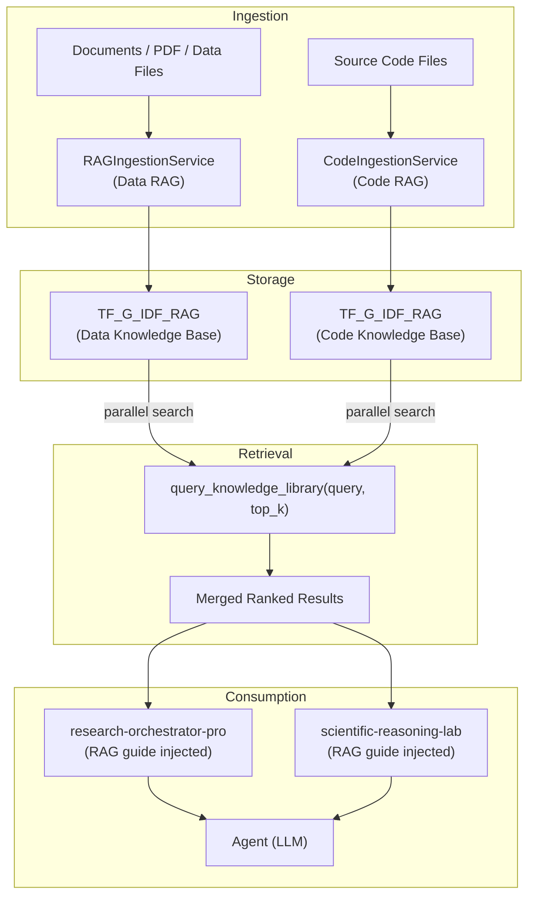

RAG retrieval flow:

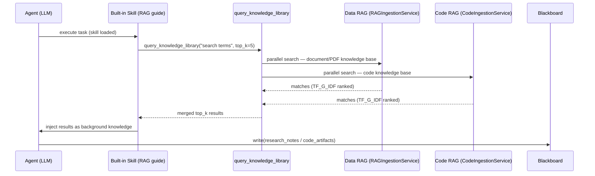

**Built-in Skills Overhaul**
- `research-orchestrator-pro` rewritten as a cooperative analysis decision hub: focuses on evidence synthesis, delegates output formatting to output-type skills (ppt, report), and includes anti-hallucination posture.
- `scientific-reasoning-lab` rebuilt as a 5-phase self-iterating reasoning engine (decompose → derive → verify → evaluate → integrate), embedded as Phase 2 sub-engine of research-orchestrator-pro.

**Multi-Factor Priority Context Compression**
- New `_classify_message_priority`: 10-factor scoring (recency 0–3, role weight, task progress markers +2, errors +2, goal relevance +1, skills +1, compact-resume =10).
- New `_priority_compress_messages`: high-score (≥7) kept intact, mid-score (4–6) truncated to 500-char summary, low-score (0–3) collapsed to one-liner.
- `_build_state_handoff` enhanced with PLAN_PROGRESS, CURRENT_STEP, ACTIVE_SKILLS, RECENT_TOOLS fields.
- `_auto_compact` integrates priority compression first, with chronological `pop(0)` as safety fallback.

**Anti-stall Mechanism Optimization**
- Threshold raised from 2→3 consecutive same-target delegations before triggering.
- Instruction softened from "CHANGE YOUR APPROACH" to collaborative guidance (ask_colleague / try different tool / call finish_current_task).

**Critical Bug Fixes**
- `CodeIngestionService._flush_lock`: added missing `threading.Lock()` — previously caused `AttributeError` when uploading to Code Library.
- Frontend `setTaskLevel()`: added `scheduleSnapshot()` after level update — previously caused the task-level selector to revert to "Auto" on next SSE refresh.
- `_sync_todos_from_blackboard`: worker items (`owner ∈ {developer, explorer, reviewer}`) now preserved separately across blackboard syncs — previously lost every cycle.

Full trilingual details: [`CHANGELOG-2026-03-25.md`](./log/CHANGELOG-2026-03-25.md)

## 4. Key Runtime Components

- `AppContext`: global runtime container (config, model catalog, server runtime state)
- `SessionManager`: session lifecycle and lookup
- `SessionState`: per-session agent loop state, tool execution state, context/truncation/runtime markers
- `EventHub`: in-memory publish/subscribe event bus used by SSE and internal runtime events
- `OllamaClient`: model request adapter with chat API handling/fallback logic
- `SkillStore`: local and provider-based skill registry/scan/load
- `TodoManager` / `TaskManager` / `BackgroundManager`: planning and async execution
- `WorktreeManager`: isolated work directory coordination for task execution
- `Handler` / `SkillsHandler`: HTTP API endpoints for Agent UI and Skills Studio
- `RAGIngestionService` (Data RAG) + `CodeIngestionService` (Code RAG): dual knowledge base ingestion and retrieval engines built on `TFGraphIDFIndex` / `CodeGraphIndex`

## 4.1 RAG Knowledge Architecture: TF-Graph_IDF Engine

Clouds Coder ships with a retrieval engine called **TF-Graph_IDF** that combines lexical scoring, knowledge graph topology, automatic community detection, and multi-route query orchestration — offering meaningfully better recall quality than standard TF-IDF or BM25.

### Dual-Library Design

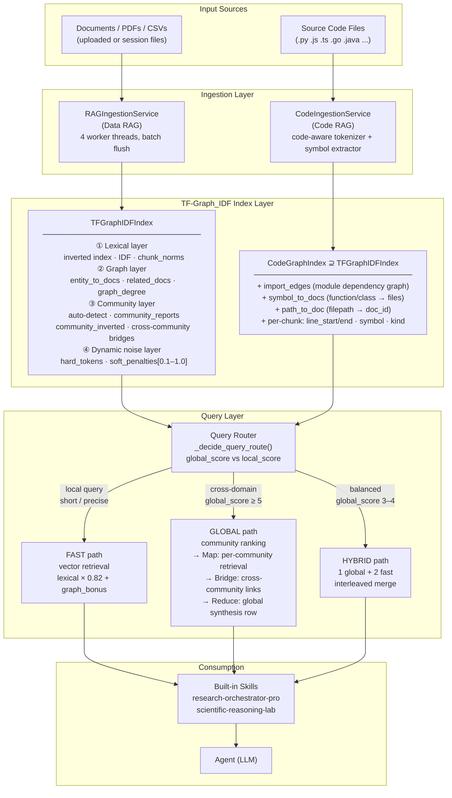

### TF-Graph_IDF Scoring Formula

Every retrieved chunk receives a score composed of a **lexical component** and a **graph bonus**:

```
final_score = lexical × 0.82 + graph_bonus         (Data RAG)
final_score = lexical × 0.78 + graph_bonus         (Code RAG — more graph weight)

lexical     = Σ(q_weight_i × c_weight_i) / (query_norm × chunk_norm)

graph_bonus = 0.18 × entity_overlap                 (shared named entities)
            + 0.10 × doc_entity_overlap              (doc-level entity match)
            + min(0.16, log(doc_graph_degree+1)/12) (hub document boost)
            + 0.08  (if query category == doc category)
            + min(0.08, log(community_doc_count+1)/16)

Code RAG additional bonuses:
            + 0.16 × symbol_overlap                  (function/class name match)
            + 0.28  (if file path appears in query)
            + 0.20  (if filename appears in query)
            + 0.14  (if module name appears in query)
            + min(0.12, log(import_degree+1)/9)      (import graph centrality)
```

Token weight with dynamic noise:

```
idf[token]    = log((1 + N_chunks) / (1 + df[token])) + 1.0
tf_weight     = (1 + log(freq)) × idf[token] × dynamic_noise_penalty[token]
chunk_norm    = √Σ(tf_weight²)

dynamic_noise_penalty ∈ [0.10, 1.0]  — computed per corpus, not a static stopword list
```

### Dynamic Noise Suppression — Corpus-Adaptive Token Weighting

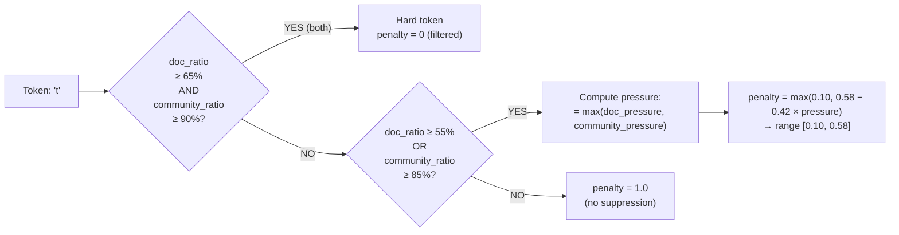

This replaces the hard-coded stopword lists used in standard TF-IDF: tokens like "the" or "and" are penalized when corpus evidence confirms they are uninformative **in this specific knowledge base**, not because they appear in a pre-built list. Domain-specific common terms get the right penalty level derived from actual document distribution.

### Three-Route Query Orchestration

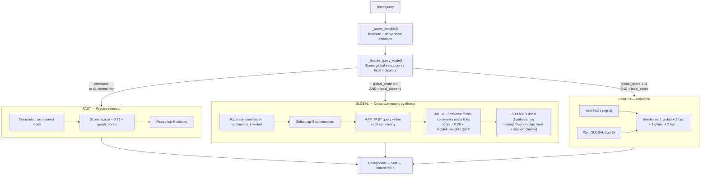

**Route decision signals:**
- Global indicators (+score): query length ≥ 18 tokens, ≥ 2 named entities, keywords like "compare"/"overall"/"trend"/"survey"
- Local indicators (+score): keywords like "what is"/"which file"/file extension in query, short queries ≤ 10 tokens

### Automatic Community Detection

Documents are automatically grouped into communities based on `(category, language, top_entities)` — no manual taxonomy required.

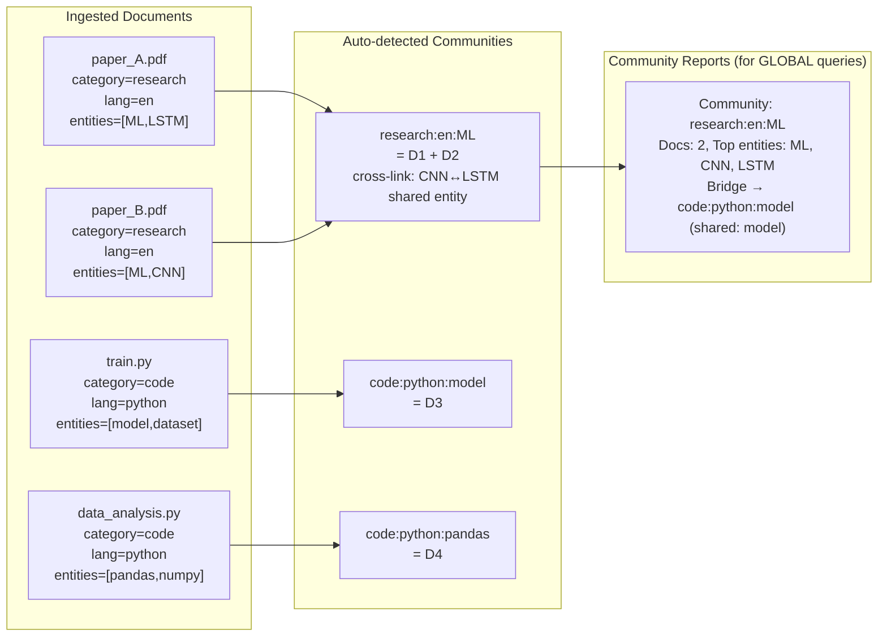

Each community generates a **Community Report** — a structured text summary of member documents, top entities, and cross-community links. GLOBAL queries retrieve at the community level first, then drill into chunks.

### Code RAG: Module Dependency Graph

`CodeGraphIndex` extends `TFGraphIDFIndex` with a code-native knowledge graph:

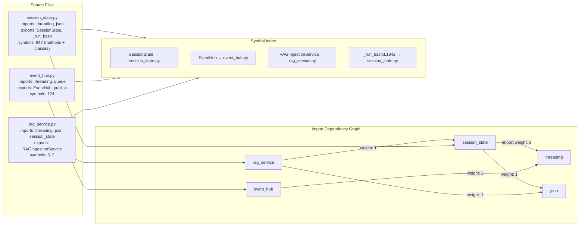

When a query mentions `"RAGIngestionService"`, the symbol index directly surfaces `rag_service.py`, with bonus scores for import-graph centrality (highly imported files rank higher).

### Advantages Over Standard RAG Approaches

| Capability | Standard TF-IDF | BM25 | Embedding / Vector RAG | **TF-Graph_IDF (Clouds Coder)** |
|---|---|---|---|---|
| Stopword handling | Static list | Static list | Implicit (embedding space) | **Corpus-adaptive dynamic penalties** |
| IDF smoothing | `log(N/df)` | Saturated BM25 | N/A | `log((1+N)/(1+df)) + 1.0` |
| TF saturation | None | BM25 k₁ parameter | N/A | `log(freq)` + noise penalty |
| Knowledge graph | ✗ | ✗ | ✗ | **Entity overlap + doc graph degree + community topology** |
| Multi-tier retrieval | Flat | Flat | Flat | **chunk → document → community** |
| Community synthesis | ✗ | ✗ | ✗ | **Auto community detection + Map-Reduce across communities** |
| Cross-domain bridges | ✗ | ✗ | ✗ | **Entity-linked community bridges** |
| Code-native graph | ✗ | ✗ | ✗ | **Import edges + symbol table + line ranges** |
| Query routing | Fixed | Fixed | Fixed | **Auto: fast / global / hybrid** |
| Out-of-vocabulary | Fails | Fails | Handles via embedding | Handled via entity extraction |
| Explainability | Score decomposition | Score decomposition | Black box | **Full score breakdown: lexical + entity + graph + community** |
| Requires GPU/embedding model | ✗ | ✗ | ✓ (required) | **✗ — pure in-process, no external model** |

**Key design choices and their rationale:**

1. **No embedding model required** — TF-Graph_IDF is fully in-process (Python + JSON snapshots). No GPU, no API call, no vector DB. Retrieval latency is sub-millisecond for typical knowledge bases.

2. **Dynamic noise > static stopwords** — A token like "model" is essential in a code RAG context but irrelevant noise in a domain where every document discusses "models". The corpus-derived penalty adapts to the actual knowledge base, not a universal list.

3. **Graph bonus makes hub documents discoverable** — A central file that many other files import (`graph_degree` high) is naturally surfaced even for loosely matching queries. This solves the "important file buried in results" problem common in pure lexical retrieval.

4. **Community Map-Reduce for synthesis queries** — When a user asks "compare ML frameworks across projects", FAST retrieval returns scattered chunks. GLOBAL retrieval groups by community, generates per-community summaries, and synthesizes a unified view — closer to what a human analyst would do.

5. **Code RAG path match bonus (+0.28)** — When a query explicitly names a file path, the retrieval weights that file almost certainly to top-1, eliminating irrelevant results caused by overlapping token content between files.

## 5. Complex-Task Reliability Design

### 5.1 Truncation Recovery Closed Loop

Clouds Coder detects truncated model output and continues generation in controlled passes.

- Tracks live truncation state (`text/kind/tool/attempts/tokens`)
- Publishes incremental truncation events to UI
- Builds continuation prompts from tail buffer and structural state
- Repairs broken tail segments before merging continuation output
- Supports multiple continuation passes (`TRUNCATION_CONTINUATION_MAX_PASSES`)
- Keeps truncation continuation under a single tool-call execution context from UI perspective

### 5.2 Timeout Scheduling

- Global timeout scheduler for each run (`--timeout` / `--run_timeout`)
- Minimum enforced timeout is 600 seconds
- Runtime explicitly marks model-active spans and excludes them from timeout budgeting
- Timeout scheduling state is visible in runtime boards

### 5.3 Anti-Drift / Anti-Loop Behavior

- Detects no-tool idle streaks
- Injects diagnosis hints when repeated blank/thinking-only turns are observed
- Enters recovery mode and encourages decomposed execution steps
- Couples with Todo/Task mechanisms for stepwise convergence

### 5.4 Context Budget Control

- Configurable context limit (`--ctx_limit`)
- Manual lock behavior when user explicitly sets `--ctx_limit`
- Context token estimation and remaining budget shown in UI
- Auto compaction + archive recall when budget pressure rises

### 5.5 `LLM -> Coding -> LLM` Reliability Path for General and Research Tasks

- Stage A (`LLM planning`): converts ambiguous goals into constrained, executable subtasks with measurable outputs.
- Stage B (`Coding execution`): enforces tool-based parsing/computation/write steps so progress is grounded in files, commands, and artifacts.
- Stage C (`LLM synthesis`): merges intermediate artifacts into explainable conclusions, with explicit assumptions and unresolved gaps.
- Drift suppression by construction: if output is repeatedly truncated/blank, controller shifts to finer-grained decomposition instead of repeating long free-form calls.
- Scientific numeric rigor checks: encourage unit normalization, value-range sanity checks, multi-source cross-validation, and re-computation on suspicious deltas before final reporting.

## 6. Web UI and Performance Strategy

Clouds Coder Web UI is designed for long sessions and frequent state updates.

- SSE + snapshot polling hybrid refresh path
- Live running indicator and elapsed timer for model call spans
- Truncation-recovery live panel with pass/token progress
- Conversation virtualization path for large feeds
- Static freeze mode (`live/static`) to reduce continuous render pressure
- Render bridge channel for structured visualization/report updates
- Code preview supports stage timeline and full-text rendering

### 6.1 UX Innovations (Preview, Provenance, Humanized Operations)

- Unified multi-view preview workspace: the same task can be inspected through Markdown narrative, HTML rendering, and code-level stage views without leaving the current session context.
- Real-time code provenance: every write/edit operation feeds preview stage snapshots and operation streams, so users can trace what changed, when, and through which agent/tool step.
- History-backup oriented code review UX: stage-based code backups, diff-aware rows, hot-anchor focus, and copy-safe plain code export support both debugging and audit scenarios.
- Humanized runtime feedback: long-running model calls show elapsed state, truncation continuation progress, and recovery hints in the same conversation/runtime board rather than hidden logs.
- Skill authoring as a first-class UX flow: Skills Studio provides scan -> flow design -> generation -> injection -> save workflow, including a visual flow builder for SKILL.md creation.
- Operational continuity for mixed content tasks: drag-and-drop uploads (code/docs/tables/media) are mirrored into workspace context and immediately connected to preview and execution paths.

## 7. Skills System

Two capability layers:

- **Runtime skill loading** (agent execution): local skill files + HTTP JSON provider manifest protocol
- **Skills Studio** (authoring): scan, inspect, generate, save, upload skills

**Universal ecosystem compatibility** — skills from any of these ecosystems load and execute without adapters:
- [awesome-claude-skills](https://github.com/travisvn/awesome-claude-skills) — curated community Claude skills collection
- [MiniMax-AI/skills](https://github.com/MiniMax-AI/skills) — MiniMax official skills (frontend/fullstack/iOS/Android/PDF/PPTX)
- [anthropics/skills](https://github.com/anthropics/skills) — Anthropic official skills repository
- [kimi-agent-internals](https://github.com/dnnyngyen/kimi-agent-internals) — Kimi agent skill system analysis and extracted skill artifacts
- [academic-pptx-skill](https://github.com/Gabberflast/academic-pptx-skill) — academic presentation skill with action titles, citation standards, and argument structure

**Loading mechanics**:
- LLM-driven autonomous discovery: the model judges task type and selects the appropriate skill — no keyword-based forced triggers
- Multi-skill loading: multiple skills can be active simultaneously; directly conflicting skill pairs are blocked
- Plan-step preloading: `_preload_skills_from_plan_steps` scans plan step text and proactively preloads referenced skills before execution begins

**Built-in skills** (bundled and updated in this release):
- `research-orchestrator-pro`: cooperative analysis decision hub with injected RAG retrieval guide
- `scientific-reasoning-lab`: 5-phase self-iterating reasoning engine (decompose → derive → verify → evaluate → integrate) with injected RAG retrieval guide

Current skill composition in this repository:

- Reusable baseline skills: `skills/code-review`, `skills/agent-builder`, `skills/mcp-builder`, `skills/pdf`
- Generated/extended skills: `skills/generated/*`
- Protocol and indexing assets: `skills/clawhub/`, `skills/skills_Gen/`

## 8. API Surface (Summary)

Major endpoint groups:

- Global config/model/tools/skills: `/api/config`, `/api/models`, `/api/tools`, `/api/skills*`
- Session lifecycle: `/api/sessions` (CRUD)
- Session runtime: `/api/sessions/{id}`, `/api/sessions/{id}/events` (SSE)
- Message/control: `/message`, `/interrupt`, `/compact`, `/uploads`
- Model config: `/api/sessions/{id}/config/model`, `/config/language`
- Preview/render: `/preview-file/*`, `/preview-code/*`, `/preview-code-stages/*`, `/render-state`, `/render-frame`
- Skills Studio: `/api/skillslab/*`

## 9. Quick Start

### 9.0 Install from PyPI (Recommended)

```bash
pip install clouds-coder
```

Then start directly:

```bash
clouds-coder --host 0.0.0.0 --port 8080
```

- Agent UI: `http://127.0.0.1:8080`
- Skills Studio: `http://127.0.0.1:8081` (unless disabled)

> PyPI page: https://pypi.org/project/clouds-coder/

### 9.1 Requirements (Source Install)

- Python 3.10+
- Ollama (for local model serving, optional but recommended)
- Install dependencies for full source-mode preview / parsing support:

```bash
pip install -r requirements.txt
```

This source install enables the richer local preview stack used by the runtime:

- PDF: `pdfminer.six`, `PyMuPDF`
- CSV / analysis tables: `pandas`
- Excel: `openpyxl`, `xlrd`
- Word: `python-docx`
- PowerPoint: `python-pptx`
- Image asset handling: `Pillow`

Optional OS-level helpers such as `pdftotext`, `xls2csv`, `antiword`, `catdoc`, `catppt`, and `textutil` can still improve legacy-format fallback parsing, but they are not required for the base source install.

### 9.2 Run (Source Install)

```bash
python Clouds_Coder.py --host 0.0.0.0 --port 8080
```

Default behavior:

- Agent UI: `http://127.0.0.1:8080`
- Skills Studio: `http://127.0.0.1:8081` (unless disabled)

### 9.3 Useful CLI Options

- `--model <name>`: startup model
- `--ollama-base-url <url>`: Ollama endpoint
- `--timeout <seconds>`: global run timeout scheduler
- `--ctx_limit <tokens>`: session context limit (manual lock if explicitly set)
- `--max_rounds <n>`: max agent rounds per run
- `--no_Skills_UI`: disable Skills Studio server
- `--config <path-or-url>`: load external LLM profile config
- `--use_external_web_ui` / `--no_external_web_ui`: external UI mode switch
- `--export_web_ui`: export built-in UI assets to configured web UI dir

## 10. Repository Structure

Release package (static files):

```text
.
├── Clouds_Coder.py   # Core runtime (backend + embedded frontend assets)
├── requirements.txt                  # Python dependencies
├── .env.example                      # Environment variable template
├── .gitignore                        # Release-time hidden-file filter rules
├── LLM.config.json                   # Main LLM profile template
├── README.md
├── README-zh.md
├── README-ja.md
├── LICENSE
└── packaging/                        # Cross-platform packaging scripts
    ├── README.md
    ├── windows/
    ├── linux/
    └── macos/
```

Runtime-generated directories (created automatically after first start):

```text
.
├── skills/                           # Auto-extracted from embedded bundle at startup
│   ├── code-review/
│   ├── agent-builder/
│   ├── mcp-builder/
│   ├── pdf/
│   └── generated/...
├── js_lib/                           # Auto-downloaded/validated frontend libraries at runtime
├── Codes/                            # Session workspaces and runtime artifacts
│   └── user_*/sessions/*/...
└── web_UI/                           # Optional, when exporting external Web UI assets
```

Notes:

- `skills/` is released by the program itself (`ensure_embedded_skills` + `ensure_runtime_skills`), so it does not need to be manually bundled in this release directory.
- `js_lib/` is managed at runtime (download/validation/cache), so it can be absent in a clean release package.
- macOS hidden files (`.DS_Store`, `__MACOSX`, `._*`) are filtered by `.gitignore` and should not be committed into release artifacts.
- The static release package intentionally keeps only runtime-critical files and packaging scripts.

## 11. Engineering Characteristics

- Single-file core runtime for easy deployment and versioning
- API + UI tightly integrated for operational visibility
- Strong bias toward deterministic recovery over optimistic retries
- Maintains session-level artifacts for reproducibility and debugging
- Practical support for long-run tasks rather than short toy prompts
- Prioritizes general-task adaptability over coding-only interaction loops

## 11.1 Architecture Advantages

- All-in-one runtime kernel (`Clouds_Coder.py`): agent loop, tool router, session state manager, HTTP APIs, SSE stream, Web UI bridge, and Skills Studio are integrated in one process. This reduces cross-service coordination cost and cuts distributed failure points for local-first usage.
- Flexible deployment profile: PyPI install keeps the base runtime lightweight, while source install via `requirements.txt` enables the richer PDF / Office / table / image preview stack; packaging scripts still support PyInstaller/Nuitka in both onedir and onefile modes.
- Native multimodal model support: provider capability inference and per-provider media endpoint mapping are built into profile parsing, so image/audio/video workflows can be routed without adding a separate multimodal proxy layer.
- Broad local + web model support with small-model optimization: supports Ollama and OpenAI-compatible backends, while adding constrained-model safeguards such as context limit control, truncation continuation passes, no-tool idle recovery, and unified timeout scheduling.

## 11.2 Native Multilingual Programming Environment Switching

- UI language switching is first-class: `zh-CN`, `zh-TW`, `ja`, `en` are supported through runtime normalization and API-level config switching (global and per-session).
- Model environment switching is native: model/provider profile can be switched at runtime from Web UI without restarting the process, with catalog-based validation and fallback behavior.
- Programming language context switching is built-in for code workspaces: code preview auto-detects many source file extensions and maps them to language renderers, enabling mixed-language repositories to be inspected in one continuous workflow.

## 11.3 Cloud CLI Coder: Architecture Value and Practical Advantages

- Cloud-side CLI execution model: the server executes `bash`/`read_file`/`write_file`/`edit_file` against isolated session workspaces, so users get CLI-grade programming capability with Web-side observability.
- Easy deployment and distribution: one-command startup plus packaging paths (PyInstaller/Nuitka, onedir/onefile) make rollout simpler than distributing and maintaining full local CLI stacks on every endpoint.
- Server-side isolation path: session-level filespace separation (`files/uploads/context_archive/code_preview`) and task/worktree isolation provide a strong base for one-tenant-per-VM or host-level physical isolation strategies.
- Hybrid UX (Web + CLI): combines Web strengths (live status, timeline, preview, visual operations trace) with CLI strengths (shell execution, deterministic file mutation, reproducible artifacts).
- Multi-end parallel centralized management: one service can manage multiple sessions with centralized model catalog, skills registry, operations feed, and runtime controls.
- Security for local-cloud deployment: code execution and artifacts can stay in self-managed environments (local host, private LAN, private cloud), reducing exposure to third-party runtime paths.

### 11.3.1 Compared With Common Alternatives

- Versus pure Web copilots: Clouds Coder provides direct server-side tool execution and artifact persistence, not only suggestion-level interaction.
- Versus pure local CLI agents: Clouds Coder lowers onboarding cost by avoiding per-device environment bootstrapping and adds a shared visual control plane.
- Versus heavy multi-service agent platforms: Clouds Coder keeps a compact runtime topology while still offering session isolation, streaming observability, and long-task recovery controls.

## 11.4 Why It Is More General Than a Traditional Coding CLI

- Traditional coding CLIs optimize for source-code mutation only; Clouds Coder optimizes for full-task closure: evidence collection, parsing, execution, synthesis, and report delivery.
- Traditional coding CLIs often hide runtime state in terminal logs; Clouds Coder makes execution state, truncation recovery, timeout governance, and artifact lineage visible in Web UI.
- Traditional coding CLIs usually stop at "code produced"; Clouds Coder supports downstream analysis/report outputs (for example markdown + HTML + structured previews) in the same run.
- Traditional coding CLIs are user-terminal centric; Clouds Coder provides centralized, session-isolated, cloud-side CLI execution with multi-session operational control.

## 11.5 Efficiency Chain and Scientific Numerical Rigor

Clouds Coder treats complex scientific tasks as an executable state machine, not as a one-shot long answer. The target chain is `input -> understanding -> thinking -> coding (human-like written computation) -> compute -> verify -> re-think -> synthesize -> output` with observable checkpoints.

Implementation consistency note: the following chain is constrained to modules/events/artifacts that already exist in source (`SessionState`, `TodoManager`, tool dispatch, `code_preview`, `context_archive`, `live_truncation`, `runtime_progress`, `render-state/frame`). No non-existent hardcoded scientific validator is assumed.

### 11.5.1 Scientific Task Processing Pipeline (Kernel-Aligned)

```text
┌──────────────────────────────────────────────────────────────────────┐
│ 0) Input                                                            │
│ user prompt + uploaded data/files (PDF/CSV/code/media)             │
└─────────────────────────────┬────────────────────────────────────────┘
                              ▼
┌──────────────────────────────────────────────────────────────────────┐
│ 1) Understanding                                                    │
│ Model role: LLM intent parsing / constraint extraction              │
│ Kernel modules: Handler + SessionState                              │
│ Output: conversation messages + system prompt context               │
└─────────────────────────────┬────────────────────────────────────────┘
                              ▼
┌──────────────────────────────────────────────────────────────────────┐
│ 2) Thinking & Decomposition                                         │
│ Model role: LLM todo split / execution ordering                     │
│ Kernel modules: TodoManager + SkillStore                           │
│ Output: todos[] (TodoWrite/TodoWriteRescue)                         │
└─────────────────────────────┬────────────────────────────────────────┘
                              ▼
┌──────────────────────────────────────────────────────────────────────┐
│ 3) Coding (human-like written computation)                          │
│ Model role: generate scripts/parsers/queries                        │
│ Kernel modules: tool dispatch + WorktreeManager + skill runtime     │
│ Output: tool_calls / file_patch / code_preview stages               │
└─────────────────────────────┬────────────────────────────────────────┘
                              ▼
┌──────────────────────────────────────────────────────────────────────┐
│ 4) Compute                                                          │
│ Model role: minimized; deterministic execution first                │
│ Kernel modules: bash/read/write/edit/background_run + persistence   │
│ Output: command outputs / changed files / intermediate files         │
└─────────────────────────────┬────────────────────────────────────────┘
                              ▼
┌──────────────────────────────────────────────────────────────────────┐
│ 5) Verify                                                           │
│ Model role: LLM review + tool-script checks (no hardcoded validator)│
│ Kernel modules: SessionState + EventHub + context_archive           │
│ Checks: formula/unit, range/outlier, source and narrative alignment │
│ Output: review messages + read/log evidence + confidence wording    │
└───────────────┬───────────────────────────────────────┬──────────────┘
                │pass                                    │fail/conflict
                ▼                                        ▼
┌──────────────────────────────────────┐     ┌─────────────────────────┐
│ 6) Synthesis                         │     │ Back to 2)/3) loop      │
│ Model role: LLM explanation/caveats  │     │ triggers: anti-drift,   │
│ Kernel modules: SessionState/EventHub│     │ truncation resume,      │
│ Output: assistant message/caveats    │     │ context compact/recall  │
└───────────────────┬──────────────────┘     └───────────┬─────────────┘
                    ▼                                    ▲
┌──────────────────────────────────────────────────────────────────────┐
│ 7) Output                                                           │
│ Kernel modules: preview-file/code/render-state/frame APIs          │
│ Deliverables: Markdown / HTML / code artifacts / visual report      │
└──────────────────────────────────────────────────────────────────────┘
```

Mermaid:

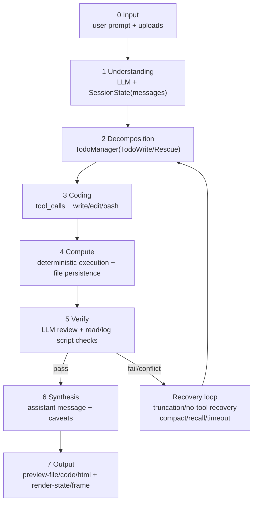

### 11.5.2 Node-Level Model Participation and Quality Gates

| Node | Model participation | Core action | Quality gate | Traceable artifact |
|---|---|---|---|---|
| Input | light LLM assist | ingest and normalize files/tasks | file integrity and encoding checks | raw input snapshot |
| Understanding | LLM primary | extract goals, variables, constraints | requirement coverage check | `messages[]` |
| Decomposition | LLM primary | split todo and milestones | executable-step check | `todos[]` |
| Coding | LLM + tools | produce parser/compute code and commands | syntax/dependency checks | `tool_calls`, `file_patch` |
| Compute | tools primary | deterministic execution and file writes | exit-code and log checks | `operations[]`, intermediate files |
| Verify | LLM + tool scripts | unit/range/consistency/conflict validation | failure triggers loop-back | `read_file` outputs + review messages |
| Synthesis/Output | LLM primary | explain results and uncertainty | evidence-to-claim consistency | markdown/html/code previews |

### 11.5.3 Scientific Numerical Rigor Policies

- Compute-before-narrate: produce reproducible scripts and intermediate outputs before final prose.
- Unit and dimension first: normalize units and check dimensional consistency before publishing values.
- Cross-source validation: compare the same metric across sources and record deviation windows.
- Outlier re-check: out-of-range results trigger automatic decomposition/recompute loops.
- Narrative consistency gate: textual conclusions must match tables/metrics; otherwise block output.
- Explicit uncertainty: publish confidence + missing evidence instead of silent interpolation.

### 11.5.4 Mapping to Existing Architecture Diagram

- Input/output ends map to Presentation Layer + API & Stream Layer.
- Understanding/thinking/synthesis map to Orchestration & Control Layer (`SessionState`, `TodoManager`, `EventHub`).
- Coding/compute map to Model & Tool Execution Layer (tool router, worktree, runtime tools).
- Verification and replay map to Artifact & Persistence Layer (intermediate artifacts, archive, stage preview).
- Truncation recovery, timeout governance, context budgeting, and anti-drift controls form the stability loop over this pipeline.

## 12. References

### 12.1 Primary inspirations

- anomalyco/opencode: https://github.com/anomalyco/opencode/
- openai/codex: https://github.com/openai/codex
- shareAI-lab/learn-claude-code: https://github.com/shareAI-lab/learn-claude-code/tree/main

### 12.1.1 Explicit architecture borrowing from learn-claude-code

- Agent loop and tool dispatch pedagogy (`agents/s01`~`s12`) is retained as lineage reference in this repo's `agents/` directory
- Todo/task/worktree/team mechanisms are inherited at concept and interface level, then integrated into the single-runtime web agent
- Skills loading protocol (`SKILL.md`) and "load on demand" methodology are reused and expanded by Skills Studio

### 12.2 Additional references

- Ollama: https://github.com/ollama/ollama
- OpenAI API docs (OpenAI-compatible patterns): https://platform.openai.com/docs
- MDN EventSource (SSE): https://developer.mozilla.org/docs/Web/API/EventSource
- PyInstaller: https://pyinstaller.org/
- Nuitka: https://nuitka.net/

### 12.3 Implementation-time references used in this repository

- `Clouds_Coder.py` (runtime architecture, APIs, frontend bridge)
- `packaging/README.md` (distribution and packaging commands)
- `requirements.txt` (runtime dependencies)
- `skills/` (skill protocol and runtime loading structure)

## 13. License

This project is released under the MIT License. See [LICENSE](./LICENSE).
