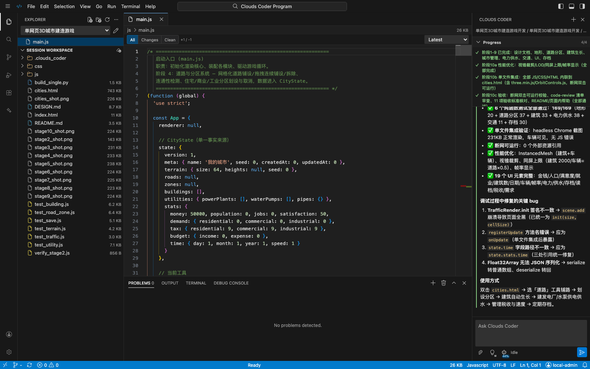

# CHANGELOG 2026-08-16

## Browser IDE, model-driven execution, Prompt Enhancer depth, and workspace MCP trust

  

This release concentrates the programming workflow inside the browser IDE while strengthening the runtime paths behind long Agent tasks. The screenshot above is a real local IDE session, not a mockup.

## English

### 1. The IDE is now a complete session workspace

- The IDE brings session selection, workspace files, Monaco editing, staged file history, Problems, Output, Terminal, Debug Console, and Agent execution into one browser workbench.
- Files and folders can be dragged into the workspace. Dropping onto a directory targets that directory, and standard copy, cut, paste, rename, and delete operations are available from the file tree and keyboard.
- File history is loaded on first open and exposes `All`, `Changes`, and `Clean` views. Repeated edits no longer hide earlier recorded stages merely because a file has just been opened in the IDE.
- Markdown and structured Agent content use dedicated renderers instead of being treated as generic code. The Agent panel also renders structured `ask user` options as selectable controls.
- HTML, Markdown, images, media, PDF, Office, tables, and code remain connected to the preview pipeline. HTML artifacts can be opened in a full browser window when an embedded preview is too constrained.
- Python debugging uses `debugpy` when available. Without it, the IDE keeps a functional standard-library `pdb` path instead of disabling debugging entirely.

### 2. Agent progress follows canonical Todos

- Single and Plan + Single execution preserve model-driven progression and do not consume the dynamic multi-agent continuation hint.
- Sync and sequential collaboration retain shared state recording and next-turn handoff, while routing decisions remain model-driven rather than keyword-stage classifiers.
- Todo updates may complete every genuinely finished item in one operation. The UI follows canonical Todo state instead of forcing a one-item visual hop after the underlying work has already advanced.
- The single-mode completion gate now recognizes both flat and owner-scoped Todo rows. A summary cannot report completion while developer-owned work is still open.
- Progress-only runtime notices are no longer presented as model work or allowed to steer Todo generation.

### 3. Prompt Enhancer now scales reasoning, not just length

- The lightbulb is one-shot by default: enable it, submit one task, and it turns off. A `Keep enabled` switch in the budget menu restores persistent behavior across tasks and reloads.
- `Low`, `Medium`, `High`, and `XHigh` have distinct output budgets and distinct planning depth, affected-surface breadth, alternative exploration, Skill limits, risk analysis, and verification layers.
- Stage count is inferred from actual complexity. Larger budgets may expose more dependencies for a complex task, but they do not inflate a simple request into ceremonial steps.
- Workspace directory awareness is always enabled and is metadata-only. The original request, attachments, and directory snapshot are not budget-clipped to manufacture differences between levels.
- Optional Skills awareness lets the model select and sequence the most relevant validated Skills. Full Skill instructions are used in a refinement pass; invalid catalog IDs are rejected.
- Intent analysis and the final Agent prompt are both retained. Only the final prompt is editable and submitted after review, while unresolved questions include Agent-prepared defaults.
- Structured parsing accepts complete JSON, fenced JSON, common wrapper/alias shapes, headed Markdown, and plain text. Incomplete JSON is never repaired or concatenated into a prompt.
- Prompt enhancement is quality-first and cancellable from the browser, with no fixed server-side generation timeout. If the model is unavailable or returns unusable output, the validated local template remains available and the UI states that fallback explicitly.

### 4. Long-task context and transport reliability

- Plan + Single, Sync/Multi, and Plan + Sync now pass the complete authoritative task into model calls instead of displaying a full prompt while sending a truncated variant downstream.
- Automatic compaction produces structured state handoffs for the goal, current plan/Todos, completed evidence, open work, and next action. Compaction checks continue across rounds rather than behaving as a first-round-only feature.
- Empty-action recovery is kept separate from context-budget checks, so a thinking-only warning cannot block a required compact.
- Successful read-loop detection now allows up to 10 identical reads before intervention and asks the Agent to switch to a focused read or concrete action.
- `IncompleteRead` is treated as a retryable connection failure. Non-streaming requests restart and request a complete response; partial JSON is never joined. Streaming requests retry only before any content has been committed to the Agent.
- Session catalog and workbench refresh paths use lightweight state first and defer heavy conversation/file hydration until the user selects it, reducing initial load and submit-path work for installations with large histories.

### 5. Workspace MCP execution now requires explicit trust

- This release resolves [GitHub issue #36](https://github.com/FonaTech/Clouds-Coder/issues/36): a workspace-controlled `LLM.config.json` can no longer start a stdio MCP command during startup or hot reload without administrator approval.
- Trust receipts live in private application state outside the workspace and bind the workspace identity, complete config digest, command, arguments, working directory, environment-key set, executable identity, and hashes of referenced scripts.
- Startup, hot reload, manual restart, and crash restart all pass through the same final pre-spawn gate. Any relevant config, executable, command, or script change invalidates approval.
- The MCP service page provides an approval review workflow. Authenticated management APIs are available at `GET /mcp/approvals` and `POST /mcp/trust`; public status does not disclose full command arguments.

### Verification

- Regression suite: `221 passed`, plus `54` subtests.
- Focused coverage includes Agent Todo progression/completion and workspace MCP trust invalidation.
- The IDE screenshot was captured from the running local `P+5` service at a 1600 × 1000 browser viewport and checked for clipped panels, overlays, credentials, and private paths.

## 中文

### 1. IDE 成为完整的会话工作区

- 浏览器工作台统一了会话选择、文件树、Monaco 编辑、分阶段文件历史、Problems、Output、Terminal、Debug Console 和 Agent 执行面板。
- 支持拖放文件与文件夹；拖到具体目录时直接上传到该目录；文件树和键盘同时支持复制、剪切、粘贴、重命名和删除。
- 文件首次打开时会加载完整记录，`All`、`Changes`、`Clean` 三种视图可查看多轮修改，不再因为“第一次在 IDE 打开”而遗漏历史阶段。
- Markdown 与结构化 Agent 文本使用专用渲染器，不再误判为普通代码；`ask user` 的结构化选项会渲染为可点击控件。
- HTML、Markdown、图片、媒体、PDF、Office、表格和代码继续共用工件预览链路；HTML 可从对话页在完整浏览器窗口中打开。
- 安装 `debugpy` 时使用完整 Python 调试适配器；未安装时保留标准库 `pdb` 兼容路径，不会让调试功能整体失效。

### 2. Agent 进度与规范 Todo 对齐

- Single 与 Plan + Single 保留模型自主推进，不消费多智能体的动态续轮提示。
- Sync 与 sequential 继续记录共享状态并在下一轮统一交接，但路由判断仍由模型完成，不恢复关键词阶段分类器。
- 一次 Todo 更新可以提交所有真实完成项；底层已经推进时，界面不再强制逐项跳动。
- Single 完成门同时识别扁平 Todo 与带 owner 的 Todo；developer 仍有未完成工作时不会输出虚假完成总结。
- 仅用于运行时提示的进度文字不再伪装成模型工作，也不会干扰 Todo 生成。

### 3. Prompt Enhancer 按推理深度分级，而不只是增加长度

- 电灯泡默认只对下一次提交生效，任务提交后自动关闭；预算菜单中的 `Keep enabled` 可选择跨任务与刷新常驻。
- `Low`、`Medium`、`High`、`XHigh` 分别拥有不同输出预算、规划深度、影响面广度、备选方案探索、Skill 数量、风险分析和验证层级。
- 阶段数量由任务真实复杂度决定。复杂任务在高预算下会展开依赖和风险，简单任务不会被人为拆成冗余步骤。
- 工作区目录感知始终开启且只提供元数据；原始请求、附件和目录快照不会为了制造档位差异而被硬截断。
- 可选 Skills 感知由模型从有效目录中选择并编排最相关的 Skill，再读取完整 Skill 指令进行强化；无效 ID 会被拒绝。
- 意图分析与最终 Agent Prompt 同时保留；审核界面只编辑和提交最终 Prompt，待确认问题带有 Agent 预先准备的默认答案。
- 结构化解析兼容完整 JSON、JSON 代码块、常见 wrapper/别名、带标题 Markdown 与纯文本；残缺 JSON 不会被修补或拼接。
- Prompt 强化以质量优先，可在浏览器取消，后端不设置固定生成时限。模型不可用或输出不可用时继续保留经过校验的本地模板，并在界面明确提示降级原因。

### 4. 长任务上下文与连接可靠性

- Plan + Single、Sync/Multi 与 Plan + Sync 会把完整权威任务传给模型，修复了前端显示全文但下游模型只收到截断版本的问题。
- 自动 compact 使用结构化状态交接，保存目标、Plan/Todo、已完成证据、未完成工作与下一动作；检查会跨轮持续执行，而不是只在第一轮触发。
- 空动作恢复与上下文预算检查相互独立，thinking-only 警告不会阻塞需要发生的 compact。
- 成功读取循环阈值放宽为连续 10 次，触发后要求 Agent 改用聚焦读取或基于现有证据采取具体行动。
- `IncompleteRead` 被归类为可重试连接错误：非流式请求重新获取完整响应，不拼接残缺 JSON；流式请求仅在尚未向 Agent 提交任何内容时重试。
- 会话目录和工作台刷新优先获取轻量状态，历史对话与文件内容在用户选中后再加载，降低大量历史会话环境中的首屏与提交路径负担。

### 5. 工作区 MCP 启动需要显式信任

- 本次更新解决 [GitHub issue #36](https://github.com/FonaTech/Clouds-Coder/issues/36)：工作区控制的 `LLM.config.json` 不能再在启动或热重载时未经管理员批准启动 stdio MCP 命令。
- 信任收据保存在工作区之外的应用私有状态中，并绑定工作区身份、完整配置摘要、命令、参数、工作目录、环境变量键、可执行文件身份和引用脚本哈希。
- 启动、热重载、手动重启和崩溃重启都经过同一个最终进程启动门；相关配置、命令、可执行文件或脚本变化会使批准失效。
- MCP 服务页提供审批界面；认证管理 API 为 `GET /mcp/approvals` 和 `POST /mcp/trust`，公开状态不会暴露完整命令参数。

### 验证

- 回归测试：`221 passed`，另有 `54` 个 subtests 通过。
- 聚焦覆盖 Agent Todo 推进/完成门和工作区 MCP 信任失效。
- IDE 截图来自正在运行的本地 `P+5` 服务，浏览器视口为 1600 × 1000，并已检查面板裁切、浮层、凭据和私人路径。

## 日本語

### 1. IDE を完全なセッションワークスペースへ

- セッション選択、ファイルツリー、Monaco、段階別履歴、Problems、Output、Terminal、Debug Console、Agent 実行を 1 つのブラウザーワークベンチに統合した。
- ファイル/フォルダーのドラッグ＆ドロップ、指定ディレクトリへの直接アップロード、コピー、切り取り、貼り付け、名前変更、削除に対応した。
- 初回オープン時に完全な履歴を読み込み、`All`、`Changes`、`Clean` で複数回の変更を確認できる。
- Markdown と構造化 Agent テキストを専用レンダラーで処理し、`ask user` の選択肢をクリック可能な UI として表示する。
- HTML、Markdown、画像、メディア、PDF、Office、表、コードのプレビューを維持し、HTML は完全なブラウザーウィンドウでも開ける。
- `debugpy` があれば完全な Python デバッグを使い、なければ標準ライブラリ `pdb` の互換経路を使う。

### 2. Agent 進捗を正規 Todo に統一

- Single と Plan + Single はモデル主導の自律進行を維持し、マルチ Agent 用の動的継続ヒントを消費しない。
- Sync と sequential は共有状態と次ターンの引き継ぎを維持するが、ルーティングはキーワード分類器ではなくモデルが判断する。
- 1 回の Todo 更新で実際に完了した複数項目を反映でき、UI は正規状態に追従する。
- Single の完了ゲートはフラット Todo と owner 付き Todo の両方を認識し、未完了作業がある状態で完了要約を出さない。
- 内部進捗通知はモデルの作業として表示されず、Todo 生成にも介入しない。

### 3. Prompt Enhancer を長さではなく推論深度で分化

- 電球は既定で次の 1 タスクだけに適用され、送信後にオフになる。`Keep enabled` でタスク間・再読み込み後も常駐できる。
- `Low` / `Medium` / `High` / `XHigh` は、出力予算だけでなく計画深度、影響範囲、代替案、Skill 上限、リスク分析、検証層が異なる。
- ステージ数は実際の複雑さから決める。高予算でも単純な依頼を不必要に分割しない。
- ワークスペースツリー認識は常時オンでメタデータのみを使う。元の依頼、添付、ディレクトリ情報を予算別に切り詰めない。
- 任意の Skills 認識ではモデルが検証済み Skill を選択・順序付けし、完全な指示で再強化する。無効な ID は拒否する。
- 意図分析と最終 Agent Prompt を両方保持し、レビュー後に編集可能な最終 Prompt だけを送信する。確認事項には Agent が用意した既定回答が付く。
- 完全な JSON、JSON fence、一般的な wrapper/alias、見出し付き Markdown、プレーンテキストを許容する一方、不完全 JSON は修復も連結もしない。
- 品質優先でブラウザーからキャンセル可能。サーバー側の固定生成タイムアウトは設けず、モデルが利用不能な場合は検証済みローカルテンプレートと明示的な通知を使う。

### 4. 長時間タスクの文脈と通信信頼性

- Plan + Single、Sync/Multi、Plan + Sync で完全な権威タスクをモデルへ渡し、UI だけが全文で下流入力が切れていた経路を修正した。
- 自動 compact は目標、Plan/Todo、完了証拠、未完了作業、次の操作を構造化して引き継ぎ、全ターンで継続的に判定する。
- 空アクション回復を文脈予算判定から分離し、thinking-only 警告が compact を妨げないようにした。
- 成功 read-loop の検出しきい値を 10 回へ緩和し、以後は焦点を絞った読み取りか具体的な実行へ切り替える。
- `IncompleteRead` は再試行可能な接続エラーとして扱う。非ストリーミングは完全応答を再取得し、部分 JSON を結合しない。ストリーミングは Agent に何も渡していない場合だけ再試行する。
- セッション一覧とワークベンチ更新は軽量状態を先に読み、重い履歴とファイルは選択後に遅延ロードする。

### 5. ワークスペース MCP に明示的な信頼を要求

- [GitHub issue #36](https://github.com/FonaTech/Clouds-Coder/issues/36) を修正し、ワークスペースの `LLM.config.json` が管理者承認なしに stdio MCP を起動できないようにした。
- 信頼レシートはワークスペース外の非公開アプリ状態に保存し、ワークスペース ID、設定全体の digest、コマンド、引数、cwd、環境変数キー、実行ファイル、参照スクリプト hash に結び付ける。
- 起動、hot reload、手動再起動、crash restart は同じ最終 spawn gate を通り、関連内容の変更で承認が失効する。
- MCP サービス画面に承認 UI を追加し、管理 API として `GET /mcp/approvals` / `POST /mcp/trust` を提供する。公開 status は完全なコマンド引数を開示しない。

### 検証

- 回帰テストは `221 passed`、追加で `54` subtests が成功。
- Agent Todo の進行/完了ゲートとワークスペース MCP 信頼失効を重点的に検証した。
- IDE スクリーンショットは実行中のローカル `P+5` サービスを 1600 × 1000 viewport で取得し、パネル切れ、overlay、資格情報、私的パスがないことを確認した。
