# CHANGELOG 2026-08-20

## Collaboration Mode and Skills Studio 2.0

This release turns Clouds Coder from a single-browser Agent runtime into a local-first workspace where trusted people and their Agents can work on the same project without surrendering file authority, conflict decisions, or publication control to the model.

The central idea is **shared work, explicit authority**:

- people join through approved device identities rather than a trusted IP alone;
- every member keeps private Agent conversations while publishing bounded task summaries and evidence to a shared blackboard;
- text edits, whole-file writes, and shell/Agent mutations all pass through revision-aware coordination;
- ambiguous writes freeze the document and become reviewable candidate branches instead of silently overwriting another participant;
- shared Skills, MCP tools, applications, and libraries are consumed as administrator-governed resources;
- Skill drafts remain private until a frozen revision passes validation and administrator review.

For the complete user-facing explanation and setup guide, see [Collaboration Mode in the README](../README.md#collaboration-mode-human--agent-shared-workspace).

## 1. Why Collaboration Mode exists

Putting multiple browsers and multiple Agents in one directory is easy. Making their combined work understandable and recoverable is the hard part. A plain shared folder has no answer to these questions:

- Who intended to edit a file, and from which revision?
- Which Agent owns the plan, and which Agent is contributing a slice?
- Was a disk write made through the editor, through an Agent tool, or outside Clouds Coder?
- If two valid results disagree, who is allowed to discard one?
- Can a new LAN device immediately inherit model credentials or write global Skills?

Collaboration Mode treats these as product-level coordination problems. The filesystem remains the execution surface, while SQLite-backed revisions, events, identities, task evidence, and audit records form the control surface.

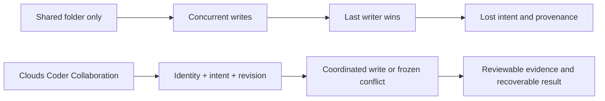
```mermaid
flowchart LR
  A["Shared folder only"] --> B["Concurrent writes"]
  B --> C["Last writer wins"]
  C --> D["Lost intent and provenance"]

  E["Clouds Coder Collaboration"] --> F["Identity + intent + revision"]
  F --> G["Coordinated write or frozen conflict"]
  G --> H["Reviewable evidence and recoverable result"]
```

The intended outcome is not maximum autonomous parallelism. It is **useful parallelism with visible ownership, bounded authority, and a human decision path whenever automation cannot prove that a merge is safe**.

## 2. Collaboration framework

Collaboration Mode is an independent service, normally bound to `P+7` when the main Agent UI uses port `P`. It serves the full browser IDE with a collaboration-specific identity and workspace. It still runs from the single `Clouds_Coder.py` entrypoint.

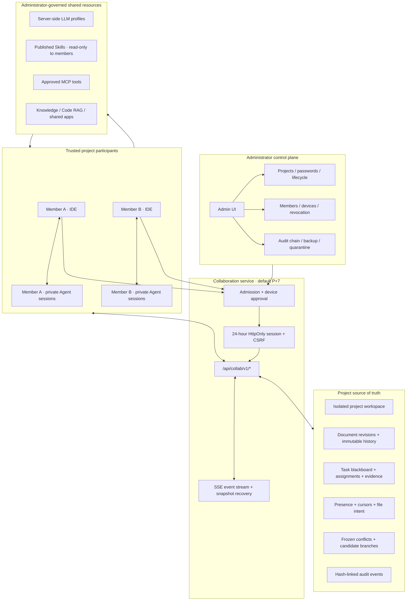
```mermaid
flowchart TB
  subgraph Control["Administrator control plane"]
    Admin["Admin UI"]
    Projects["Projects / passwords / lifecycle"]
    Access["Members / devices / revocation"]
    Audit["Audit chain / backup / quarantine"]
    Admin --> Projects
    Admin --> Access
    Admin --> Audit
  end

  subgraph Entry["Collaboration service · default P+7"]
    Gate["Admission + device approval"]
    Session["24-hour HttpOnly session + CSRF"]
    API["/api/collab/v1/*"]
    Events["SSE event stream + snapshot recovery"]
    Gate --> Session --> API
    API <--> Events
  end

  subgraph Participants["Trusted project participants"]
    H1["Member A · IDE"]
    H2["Member B · IDE"]
    A1["Member A · private Agent sessions"]
    A2["Member B · private Agent sessions"]
    H1 <--> A1
    H2 <--> A2
  end

  subgraph SharedState["Project source of truth"]
    Workspace["Isolated project workspace"]
    Docs["Document revisions + immutable history"]
    Board["Task blackboard + assignments + evidence"]
    Presence["Presence + cursors + file intent"]
    Conflicts["Frozen conflicts + candidate branches"]
    Ledger["Hash-linked audit events"]
  end

  subgraph Resources["Administrator-governed shared resources"]
    Models["Server-side LLM profiles"]
    Skills["Published Skills · read-only to members"]
    MCP["Approved MCP tools"]
    Libraries["Knowledge / Code RAG / shared apps"]
  end

  Control --> Gate
  H1 --> Gate
  H2 --> Gate
  API <--> Participants
  API <--> SharedState
  Participants --> Resources
  Resources --> Participants
```

The framework deliberately separates five kinds of state:

| State | Visibility | Purpose |
| --- | --- | --- |
| Private Agent session | Owning member | Full conversation, model interaction, and local Agent execution state |
| Public task evidence | Project members | Sanitized plan slices, clues, touched paths, validation, blockers, and result summaries |
| Project documents | Project members | The shared working tree, revision history, and current baselines |
| Governance state | Administrator; bounded project status to members | Admission, approvals, revocation, backup, quarantine, and audit |
| Shared capability catalog | Project members, mostly read-only | Published Skills, approved MCP tools, shared apps, and RAG resources without exposing server-side credentials |

## 3. Identity, admission, and trust boundary

An IP address is transport metadata, not a durable collaborator identity. A participant is the combination of a project, member, and approved device. The project password proves knowledge of the invitation; the administrator-approved device credential decides whether a session may be issued.

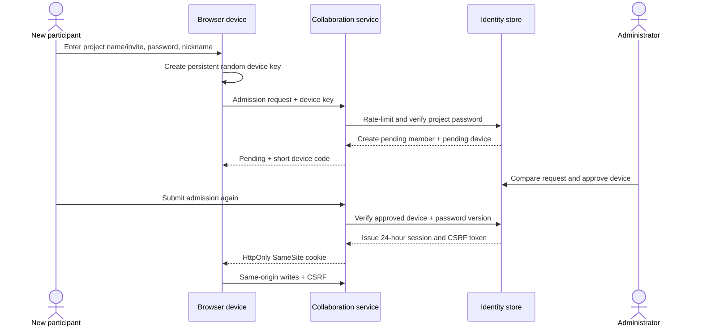
```mermaid
sequenceDiagram
  actor User as New participant
  participant Browser as Browser device
  participant Service as Collaboration service
  participant DB as Identity store
  actor Admin as Administrator

  User->>Browser: Enter project name/invite, password, nickname
  Browser->>Browser: Create persistent random device key
  Browser->>Service: Admission request + device key
  Service->>DB: Rate-limit and verify project password
  DB-->>Service: Create pending member + pending device
  Service-->>Browser: Pending + short device code
  Admin->>DB: Compare request and approve device
  User->>Service: Submit admission again
  Service->>DB: Verify approved device + password version
  DB-->>Service: Issue 24-hour session and CSRF token
  Service-->>Browser: HttpOnly SameSite cookie
  Browser->>Service: Same-origin writes + CSRF
```

Security and lifecycle properties include:

- PBKDF2-HMAC-SHA256 project passwords with 600,000 iterations;
- admission throttling per IP/project and a deliberately generic invalid-credential response;
- device approval, member block/revoke, password rotation, and immediate session invalidation;
- same-origin checks and CSRF for every mutation;
- `HttpOnly` / `SameSite=Strict` collaboration session cookies, with `Secure` when HTTPS is trusted;
- project path normalization, traversal rejection, and symbolic-link escape prevention;
- TLS or an explicitly trusted HTTPS proxy for untrusted networks; plain HTTP is only a trusted-LAN development mode.

## 4. One workspace, three write protocols

Different write shapes need different consistency mechanisms. Collaboration Mode does not force a large binary upload, a Monaco keystroke, and a shell command through the same protocol.

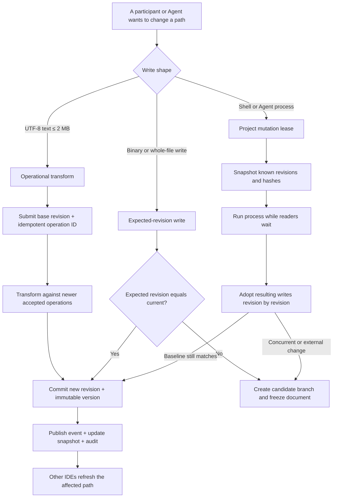
```mermaid
flowchart TD
  W["A participant or Agent wants to change a path"] --> K{"Write shape"}

  K -->|"UTF-8 text ≤ 2 MB"| OT["Operational transform"]
  OT --> O1["Submit base revision + idempotent operation ID"]
  O1 --> O2["Transform against newer accepted operations"]
  O2 --> Commit["Commit new revision + immutable version"]

  K -->|"Binary or whole-file write"| CAS["Expected-revision write"]
  CAS --> C1{"Expected revision equals current?"}
  C1 -->|Yes| Commit
  C1 -->|No| Conflict["Create candidate branch and freeze document"]

  K -->|"Shell or Agent process"| Lease["Project mutation lease"]
  Lease --> L1["Snapshot known revisions and hashes"]
  L1 --> L2["Run process while readers wait"]
  L2 --> L3["Adopt resulting writes revision by revision"]
  L3 -->|"Baseline still matches"| Commit
  L3 -->|"Concurrent or external change"| Conflict

  Commit --> Event["Publish event + update snapshot + audit"]
  Event --> UI["Other IDEs refresh the affected path"]
```

For small UTF-8 documents, incoming operations are transformed against operations accepted since their base revision. Existing server inserts win insertion ties, and a client operation ID makes retry idempotent.

Whole-file and binary writes use optimistic concurrency with `expected_revision`. Shell and Agent tools are wrapped by `CollaborationWriteCoordinator`: it holds the project mutation lease, records before/after hashes, and adopts writes back into the document catalog. A watcher also detects stable out-of-band disk changes; it never treats an unexplained filesystem value as silently authoritative.

## 5. Human–Agent cooperation through the task blackboard

Each member has private Agent sessions, but Agents working on the same normalized objective converge on one public task item. The first Agent becomes the active `coordinator`; later Agents become `contributors`. The coordinator is still a worker—it owns delegation and integration rather than becoming a chat-only manager.

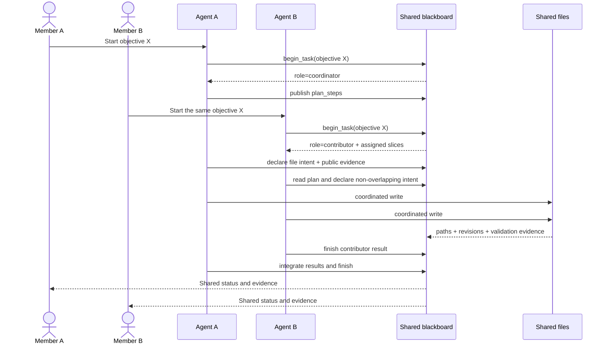
```mermaid
sequenceDiagram
  actor UA as Member A
  actor UB as Member B
  participant AA as Agent A
  participant AB as Agent B
  participant B as Shared blackboard
  participant F as Shared files

  UA->>AA: Start objective X
  AA->>B: begin_task(objective X)
  B-->>AA: role=coordinator
  AA->>B: publish plan_steps

  UB->>AB: Start the same objective X
  AB->>B: begin_task(objective X)
  B-->>AB: role=contributor + assigned slices

  AA->>B: declare file intent + public evidence
  AB->>B: read plan and declare non-overlapping intent
  AA->>F: coordinated write
  AB->>F: coordinated write
  F-->>B: paths + revisions + validation evidence

  AB->>B: finish contributor result
  AA->>B: integrate results and finish
  B-->>UA: Shared status and evidence
  B-->>UB: Shared status and evidence
```

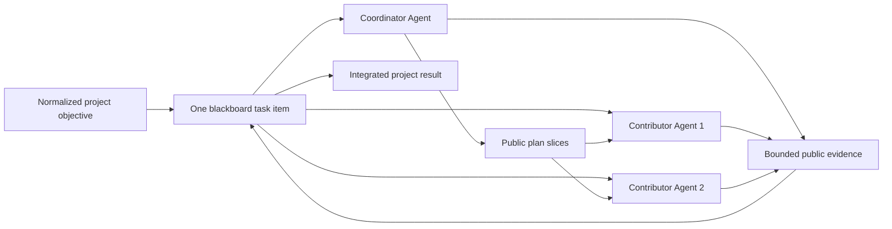
```mermaid
flowchart LR
  Goal["Normalized project objective"] --> Item["One blackboard task item"]
  Item --> Coord["Coordinator Agent"]
  Item --> C1["Contributor Agent 1"]
  Item --> C2["Contributor Agent 2"]
  Coord --> Plan["Public plan slices"]
  Plan --> C1
  Plan --> C2
  Coord --> Evidence["Bounded public evidence"]
  C1 --> Evidence
  C2 --> Evidence
  Evidence --> Item
  Item --> Result["Integrated project result"]
```

Only explicit public sections are accepted: research notes, execution logs, review feedback, plan findings/steps/proposals/risks, and status. Public text is length-bounded and sanitized for credentials, private keys, bearer tokens, private home paths, fenced code, and hidden/system prompt material. Full prompts and hidden reasoning are not copied to the project blackboard.

This project-level coordinator/contributor protocol is separate from the in-session `manager / explorer / developer / reviewer` topology. The two can coexist:

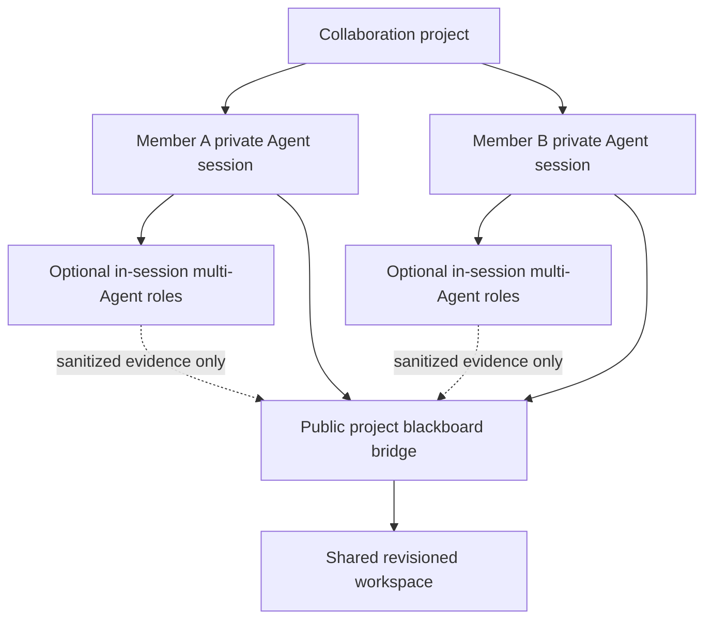
```mermaid
flowchart TB
  Project["Collaboration project"] --> MA["Member A private Agent session"]
  Project --> MB["Member B private Agent session"]
  MA --> IA["Optional in-session multi-Agent roles"]
  MB --> IB["Optional in-session multi-Agent roles"]
  MA --> PB["Public project blackboard bridge"]
  MB --> PB
  IA -. "sanitized evidence only" .-> PB
  IB -. "sanitized evidence only" .-> PB
  PB --> Workspace["Shared revisioned workspace"]
```

## 6. Conflict handling is a decision protocol

When the baseline cannot be proven, the affected document is frozen. Clouds Coder preserves the current baseline and every submitted candidate rather than choosing a winner by arrival time.

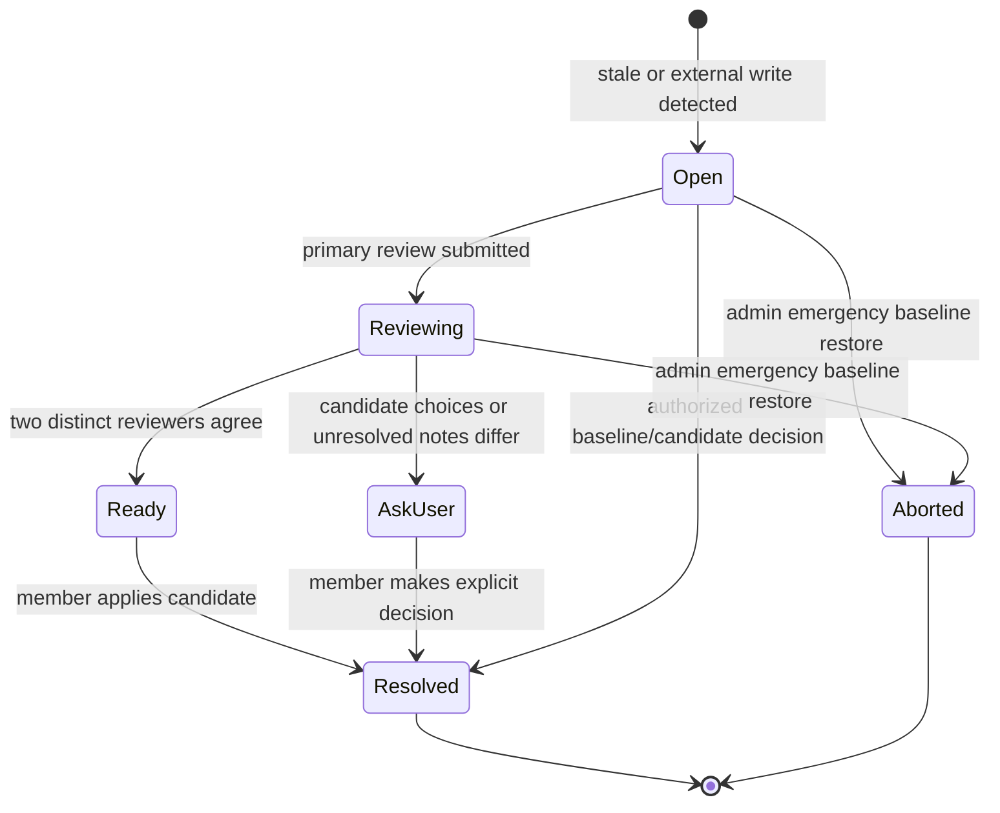
```mermaid
stateDiagram-v2
  [*] --> Open: stale or external write detected
  Open --> Reviewing: primary review submitted
  Reviewing --> Ready: two distinct reviewers agree
  Reviewing --> AskUser: candidate choices or unresolved notes differ
  Ready --> Resolved: member applies candidate
  AskUser --> Resolved: member makes explicit decision
  Open --> Resolved: authorized baseline/candidate decision
  Open --> Aborted: admin emergency baseline restore
  Reviewing --> Aborted: admin emergency baseline restore
  Resolved --> [*]
  Aborted --> [*]
```

Important safeguards:

- primary and secondary reviews must come from different members;
- reviewers record a candidate, risk summary, reason, and unresolved disagreement;
- discarding another member's candidate requires its owner's confirmation;
- discarding all candidates requires confirmation from all candidate owners;
- merge/discard decisions invalidate related authorization leases;
- administrator emergency abort restores the recorded baseline and unfreezes the file, but does not pretend to merge a candidate.

## 7. Event consistency and recovery

The UI combines an ordered project event log with complete snapshots. Events provide low-latency presence, operation, blackboard, Agent, permission, and conflict updates. Snapshots make reconnect and event-retention gaps deterministic.

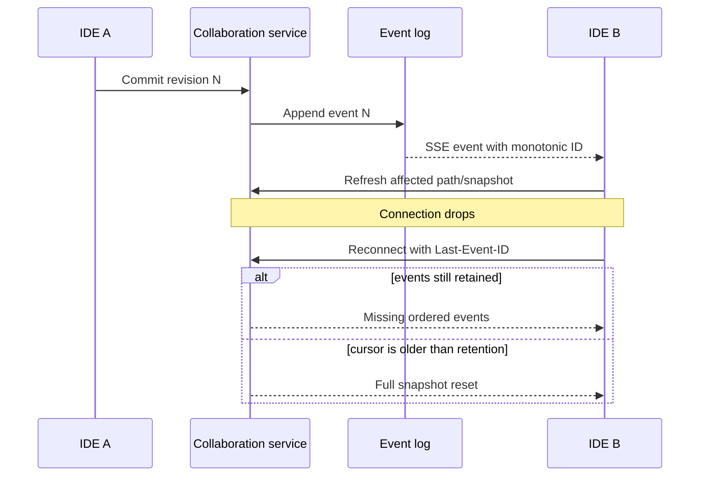
```mermaid
sequenceDiagram
  participant A as IDE A
  participant S as Collaboration service
  participant E as Event log
  participant B as IDE B

  A->>S: Commit revision N
  S->>E: Append event N
  E-->>B: SSE event with monotonic ID
  B->>S: Refresh affected path/snapshot
  Note over B,S: Connection drops
  B->>S: Reconnect with Last-Event-ID
  alt events still retained
    S-->>B: Missing ordered events
  else cursor is older than retention
    S-->>B: Full snapshot reset
  end
```

On server restart, abandoned running Agents become inactive, unfinished assignments become blocked, and stale file intents are closed. A watchdog performs the same cleanup when an Agent heartbeat expires.

## 8. Project governance

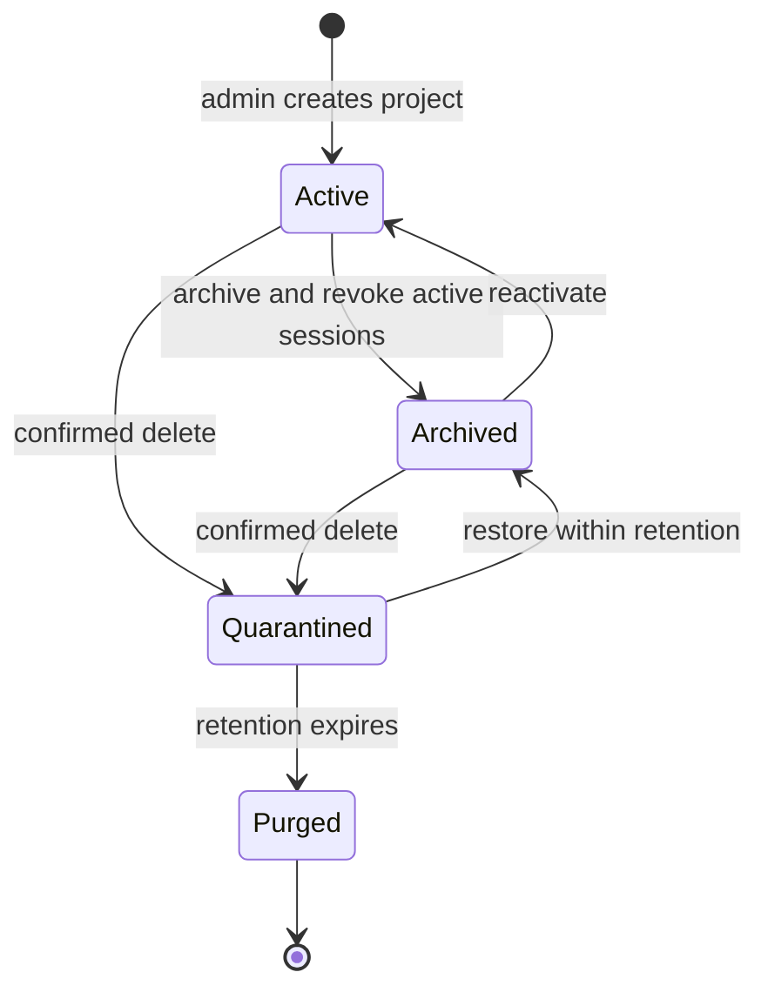
```mermaid
stateDiagram-v2
  [*] --> Active: admin creates project
  Active --> Archived: archive and revoke active sessions
  Archived --> Active: reactivate
  Active --> Quarantined: confirmed delete
  Archived --> Quarantined: confirmed delete
  Quarantined --> Archived: restore within retention
  Quarantined --> Purged: retention expires
  Purged --> [*]
```

The Admin UI can create and rename projects, rotate passwords, approve devices, block or revoke members, archive/reactivate, create ZIP backups, quarantine projects for 30 days, restore them, inspect active conflicts, and verify the hash-linked audit chain.

## 9. Skills Studio 2.0

Skills Studio now follows the same philosophy: creation is private; distribution is governed.

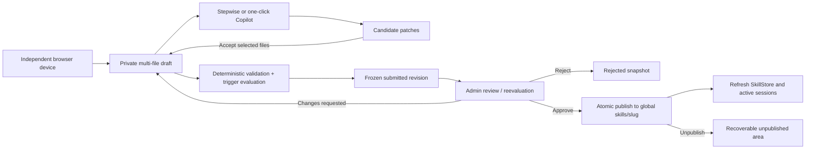
```mermaid
flowchart LR
  Device["Independent browser device"] --> Draft["Private multi-file draft"]
  Draft --> Copilot["Stepwise or one-click Copilot"]
  Copilot --> Patch["Candidate patches"]
  Patch -->|Accept selected files| Draft
  Draft --> Validate["Deterministic validation + trigger evaluation"]
  Validate --> Freeze["Frozen submitted revision"]
  Freeze --> Review["Admin review / reevaluation"]
  Review -->|Changes requested| Draft
  Review -->|Reject| Rejected["Rejected snapshot"]
  Review -->|Approve| Publish["Atomic publish to global skills/slug"]
  Publish --> Refresh["Refresh SkillStore and active sessions"]
  Publish -->|Unpublish| Quarantine["Recoverable unpublished area"]
```

Highlights:

- 180-day device identity, 24-hour session, CSRF, same-origin writes, and Studio-local encrypted model profiles;
- device-owned drafts in `.clouds_coder_admin/skills_studio/`, indexed by `skills_studio.sqlite`;
- full packages with `SKILL.md`, `agents/openai.yaml`, `agents/clouds-coder.yaml`, `scripts/`, `references/`, and `assets/`;
- revision checks on mutations, immutable submitted snapshots, unified diffs, and cancellable Copilot jobs;
- validation of standard frontmatter, naming, descriptions, `openai.yaml`, default `$skill-name` prompts, syntax, paths, size, and likely secrets;
- positive/negative trigger simulation plus workflow, output-contract, safety-boundary, and resource-discoverability signals;
- per-run confirmation and hard isolation for executable-script evaluation, with network disabled and no unsafe host fallback;
- executable Skills cannot be approved without passing isolation evidence;
- global name collisions block publication; approval never silently replaces an existing Skill;
- atomic publication and live SkillStore refresh, so ordinary WebUI, IDE, and Collaboration sessions discover approved Skills without a restart.

Legacy `/api/skillslab/*` administration endpoints remain available for compatibility. The new workbench uses `/api/skillslab/v2/*`, and review is exposed through `/api/admin/skills/submissions/*`.

## 10. Operator quick start

Start all services from the single entrypoint:

```bash
python Clouds_Coder.py \
  --host 0.0.0.0 \
  --port 8080 \
  --enable_collaboration \
  --collab_host 0.0.0.0 \
  --collab_port 8087
```

Default relevant URLs for `P=8080`:

| Surface | URL |
| --- | --- |
| Agent Web UI | `http://127.0.0.1:8080` |
| Skills Studio 2.0 | `http://127.0.0.1:8081` |
| Main Admin | `http://127.0.0.1:8080/admin` |
| Browser IDE | `http://127.0.0.1:8085` |
| Collaboration Mode | `http://127.0.0.1:8087` or the printed LAN URL |

Then:

1. Sign in to Admin and open **Collaboration**.
2. Create a project with a strong project password and note its name or invite code.
3. Send the Collaboration URL, project reference, and password through an appropriate trusted channel.
4. Ask each participant to join; compare the displayed short device code and approve the device in Admin.
5. Re-submit the admission form, then work in the collaboration IDE.

Plain HTTP exposes project traffic to the LAN. Use a certificate with `--collab_tls_cert` and `--collab_tls_key`, or an explicitly configured trusted HTTPS reverse proxy, outside a network you fully trust.

## 中文

## 协作模式与 Skills Studio 2.0

本次发布将 Clouds Coder 从单浏览器 Agent 运行时升级为本地优先的工作区：受信任的人与其 Agent 可以共同处理同一项目，同时不会把文件权、冲突决策或发布控制交给模型。

核心理念是 **共享工作，明确权责**：

- 成员通过管理员批准的设备身份加入，而不是仅凭可信 IP；
- 每位成员保留私有 Agent 对话，同时向共享黑板发布有边界的任务摘要和证据；
- 文本编辑、整文件写入以及 Shell/Agent 变更都经过带 revision 的协调；
- 无法判断安全性的写入会冻结文档并生成可审核的候选分支，不会静默覆盖其他参与者的结果；
- 共享 Skills、MCP 工具、应用和库作为管理员治理的资源使用；
- Skill 草稿在冻结 revision 通过校验和管理员审核前始终保持私有。

完整的面向用户说明和启动指南见 [README 中的 Collaboration Mode](../README.md#collaboration-mode-human--agent-shared-workspace)。

## 1. 为什么需要协作模式

让多个浏览器和多个 Agent 进入同一个目录很容易，难的是让合并后的工作可理解、可恢复。普通共享文件夹无法回答以下问题：

- 谁打算编辑某个文件？依据的是哪个 revision？
- 哪个 Agent 负责计划？哪个 Agent 只贡献一个切片？
- 磁盘写入来自编辑器、Agent 工具，还是 Clouds Coder 之外的进程？
- 两个有效结果发生分歧时，谁有权丢弃其中一个？
- 新的局域网设备是否可以立即继承模型凭据或写入全局 Skills？

协作模式把这些问题当作产品级协调问题。文件系统仍是执行面，而由 SQLite 支撑的 revision、事件、身份、任务证据和审计记录构成控制面。

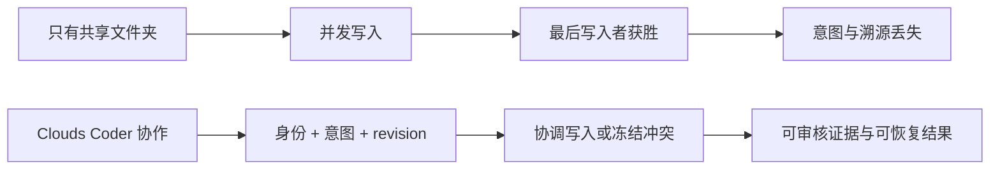
```mermaid
flowchart LR
  A["只有共享文件夹"] --> B["并发写入"]
  B --> C["最后写入者获胜"]
  C --> D["意图与溯源丢失"]

  E["Clouds Coder 协作"] --> F["身份 + 意图 + revision"]
  F --> G["协调写入或冻结冲突"]
  G --> H["可审核证据与可恢复结果"]
```

目标不是最大化自主并行度，而是实现 **有用的并行：所有权可见、权限有边界，并且当自动化无法证明合并安全时，始终回到人的决策路径**。

## 2. 协作框架

协作模式是独立服务：主 Agent UI 使用端口 `P` 时，通常绑定到 `P+7`。它提供带有协作身份和项目工作区的完整浏览器 IDE，仍然从单一的 `Clouds_Coder.py` 入口启动。

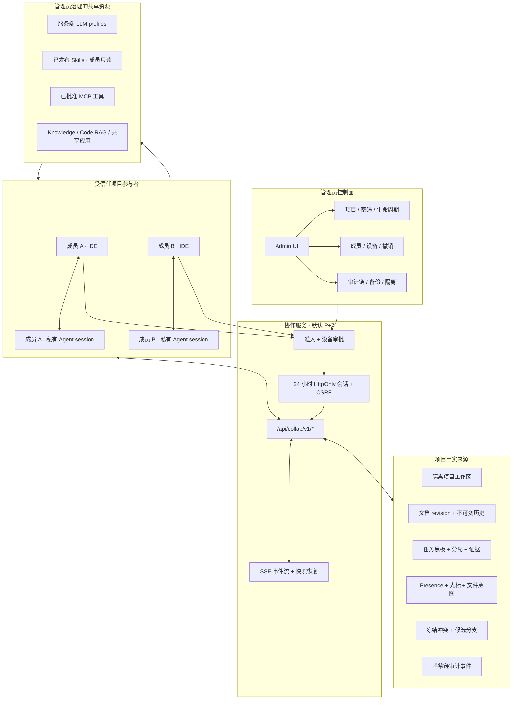
```mermaid
flowchart TB
  subgraph Control["管理员控制面"]
    Admin["Admin UI"]
    Projects["项目 / 密码 / 生命周期"]
    Access["成员 / 设备 / 撤销"]
    Audit["审计链 / 备份 / 隔离"]
    Admin --> Projects
    Admin --> Access
    Admin --> Audit
  end

  subgraph Entry["协作服务 · 默认 P+7"]
    Gate["准入 + 设备审批"]
    Session["24 小时 HttpOnly 会话 + CSRF"]
    API["/api/collab/v1/*"]
    Events["SSE 事件流 + 快照恢复"]
    Gate --> Session --> API
    API <--> Events
  end

  subgraph Participants["受信任项目参与者"]
    H1["成员 A · IDE"]
    H2["成员 B · IDE"]
    A1["成员 A · 私有 Agent session"]
    A2["成员 B · 私有 Agent session"]
    H1 <--> A1
    H2 <--> A2
  end

  subgraph SharedState["项目事实来源"]
    Workspace["隔离项目工作区"]
    Docs["文档 revision + 不可变历史"]
    Board["任务黑板 + 分配 + 证据"]
    Presence["Presence + 光标 + 文件意图"]
    Conflicts["冻结冲突 + 候选分支"]
    Ledger["哈希链审计事件"]
  end

  subgraph Resources["管理员治理的共享资源"]
    Models["服务端 LLM profiles"]
    Skills["已发布 Skills · 成员只读"]
    MCP["已批准 MCP 工具"]
    Libraries["Knowledge / Code RAG / 共享应用"]
  end

  Control --> Gate
  H1 --> Gate
  H2 --> Gate
  API <--> Participants
  API <--> SharedState
  Participants --> Resources
  Resources --> Participants
```

该框架有意把状态分成五类：

| 状态 | 可见范围 | 用途 |
| --- | --- | --- |
| 私有 Agent session | 所属成员 | 完整对话、模型交互和本地 Agent 执行状态 |
| 公开任务证据 | 项目成员 | 脱敏的计划切片、线索、触碰路径、校验、阻塞原因和结果摘要 |
| 项目文档 | 项目成员 | 共享工作树、revision 历史和当前基线 |
| 治理状态 | 管理员；成员只能看到受限项目状态 | 准入、审批、撤销、备份、隔离和审计 |
| 共享能力目录 | 项目成员，主要为只读 | 已发布 Skills、批准的 MCP 工具、共享应用和 RAG 资源，不暴露服务端凭据 |

## 3. 身份、准入与信任边界

IP 地址只是传输元数据，不是持久的协作者身份。参与者由项目、成员和管理员批准的设备共同构成。项目密码证明其知晓邀请信息；管理员批准的设备凭据决定是否可以签发会话。

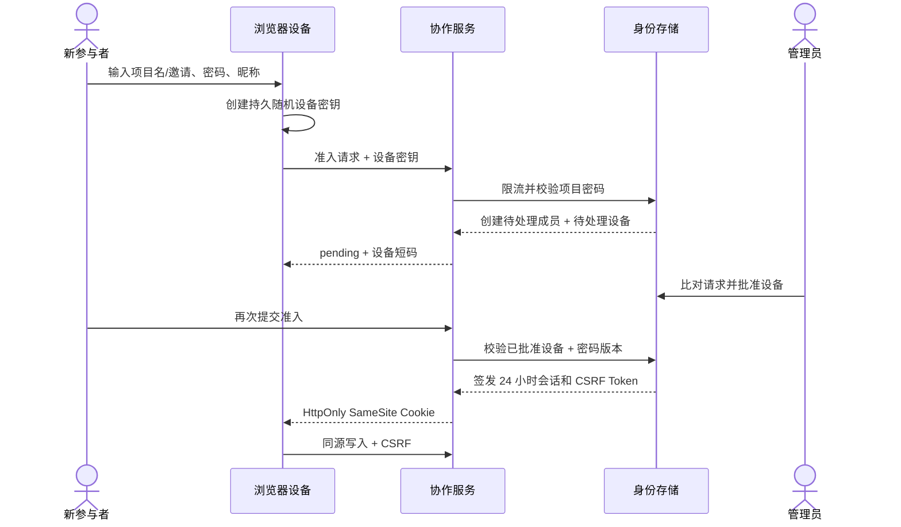
```mermaid
sequenceDiagram
  actor User as 新参与者
  participant Browser as 浏览器设备
  participant Service as 协作服务
  participant DB as 身份存储
  actor Admin as 管理员

  User->>Browser: 输入项目名/邀请、密码、昵称
  Browser->>Browser: 创建持久随机设备密钥
  Browser->>Service: 准入请求 + 设备密钥
  Service->>DB: 限流并校验项目密码
  DB-->>Service: 创建待处理成员 + 待处理设备
  Service-->>Browser: pending + 设备短码
  Admin->>DB: 比对请求并批准设备
  User->>Service: 再次提交准入
  Service->>DB: 校验已批准设备 + 密码版本
  DB-->>Service: 签发 24 小时会话和 CSRF Token
  Service-->>Browser: HttpOnly SameSite Cookie
  Browser->>Service: 同源写入 + CSRF
```

安全与生命周期属性包括：

- 项目密码使用 600,000 次迭代的 PBKDF2-HMAC-SHA256；
- 按 IP/项目限流准入，并对无效凭据返回有意保持通用的错误信息；
- 支持设备审批、成员封禁/撤销、密码轮换和立即使会话失效；
- 每个变更都执行同源检查和 CSRF 校验；
- 协作会话 Cookie 使用 `HttpOnly` / `SameSite=Strict`，在信任 HTTPS 时加上 `Secure`；
- 项目路径规范化、拒绝穿越，并阻止通过符号链接逃逸；
- 不可信网络必须使用 TLS 或明确受信的 HTTPS 代理；明文 HTTP 只用于可信局域网开发模式。

## 4. 一个工作区、三种写入协议

不同形态的写入需要不同的一致性机制。协作模式不会强迫大型二进制上传、Monaco 击键和 Shell 命令共用同一个协议。

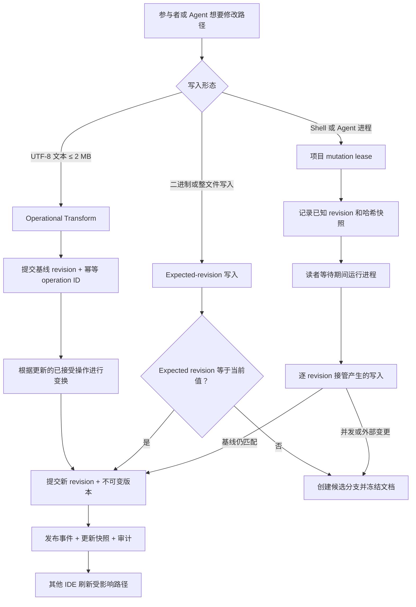
```mermaid
flowchart TD
  W["参与者或 Agent 想要修改路径"] --> K{"写入形态"}

  K -->|"UTF-8 文本 ≤ 2 MB"| OT["Operational Transform"]
  OT --> O1["提交基线 revision + 幂等 operation ID"]
  O1 --> O2["根据更新的已接受操作进行变换"]
  O2 --> Commit["提交新 revision + 不可变版本"]

  K -->|"二进制或整文件写入"| CAS["Expected-revision 写入"]
  CAS --> C1{"Expected revision 等于当前值？"}
  C1 -->|是| Commit
  C1 -->|否| Conflict["创建候选分支并冻结文档"]

  K -->|"Shell 或 Agent 进程"| Lease["项目 mutation lease"]
  Lease --> L1["记录已知 revision 和哈希快照"]
  L1 --> L2["读者等待期间运行进程"]
  L2 --> L3["逐 revision 接管产生的写入"]
  L3 -->|"基线仍匹配"| Commit
  L3 -->|"并发或外部变更"| Conflict

  Commit --> Event["发布事件 + 更新快照 + 审计"]
  Event --> UI["其他 IDE 刷新受影响路径"]
```

对于小型 UTF-8 文档，传入操作会根据其基线 revision 之后已接受的操作进行变换。服务器已有的插入在并列插入时优先，客户端 operation ID 保证重试幂等。

整文件和二进制写入使用带 `expected_revision` 的乐观并发。Shell 和 Agent 工具由 `CollaborationWriteCoordinator` 包装：它持有项目 mutation lease，记录前后哈希，并把写入结果重新纳入文档目录。监视器也会检测稳定的越界磁盘变更，但不会把无法解释的文件值静默视为权威结果。

## 5. 通过任务黑板实现人机协作

每个成员拥有私有 Agent session，但处理同一规范化目标的 Agent 会汇聚到一个公开任务项。第一个 Agent 成为活跃的 `coordinator`，后续 Agent 成为 `contributor`。coordinator 仍然是工作者：它负责委派和集成，而不是变成只聊天的管理器。

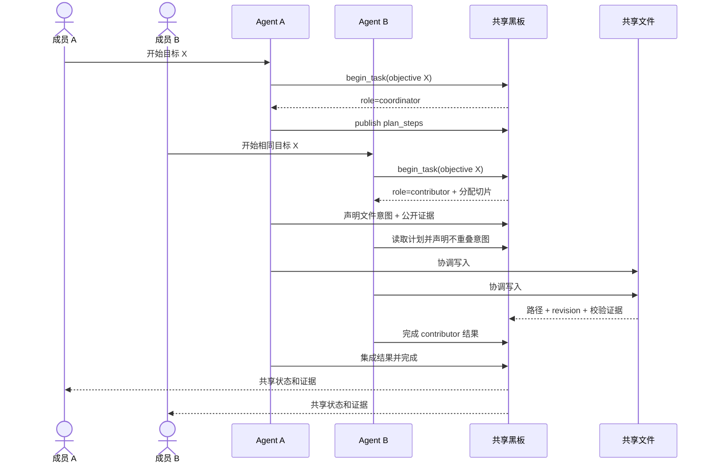
```mermaid
sequenceDiagram
  actor UA as 成员 A
  actor UB as 成员 B
  participant AA as Agent A
  participant AB as Agent B
  participant B as 共享黑板
  participant F as 共享文件

  UA->>AA: 开始目标 X
  AA->>B: begin_task(objective X)
  B-->>AA: role=coordinator
  AA->>B: publish plan_steps

  UB->>AB: 开始相同目标 X
  AB->>B: begin_task(objective X)
  B-->>AB: role=contributor + 分配切片

  AA->>B: 声明文件意图 + 公开证据
  AB->>B: 读取计划并声明不重叠意图
  AA->>F: 协调写入
  AB->>F: 协调写入
  F-->>B: 路径 + revision + 校验证据

  AB->>B: 完成 contributor 结果
  AA->>B: 集成结果并完成
  B-->>UA: 共享状态和证据
  B-->>UB: 共享状态和证据
```

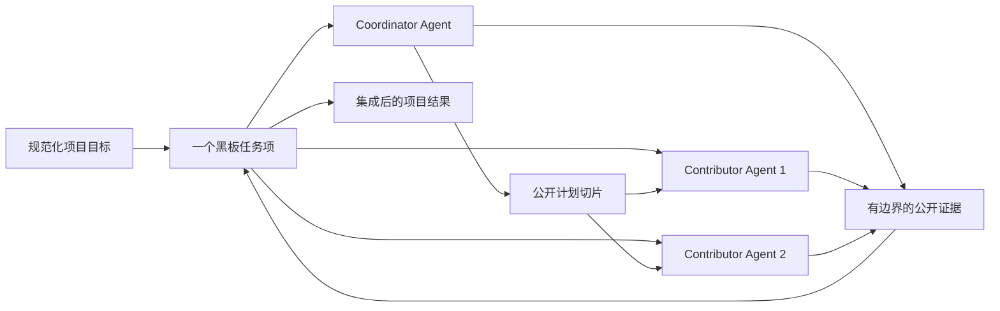
```mermaid
flowchart LR
  Goal["规范化项目目标"] --> Item["一个黑板任务项"]
  Item --> Coord["Coordinator Agent"]
  Item --> C1["Contributor Agent 1"]
  Item --> C2["Contributor Agent 2"]
  Coord --> Plan["公开计划切片"]
  Plan --> C1
  Plan --> C2
  Coord --> Evidence["有边界的公开证据"]
  C1 --> Evidence
  C2 --> Evidence
  Evidence --> Item
  Item --> Result["集成后的项目结果"]
```

系统只接受明确的公开区段：研究笔记、执行日志、审查反馈、计划 findings/steps/proposals/risks 和状态。公开文本有长度上限，并会清理凭据、私钥、Bearer Token、私有 home 路径、围栏代码以及隐藏/系统 Prompt。完整 Prompt 和隐藏推理不会复制到项目黑板。

项目级的 coordinator/contributor 协议与会话内的 `manager / explorer / developer / reviewer` 拓扑相互独立，二者可以同时存在：

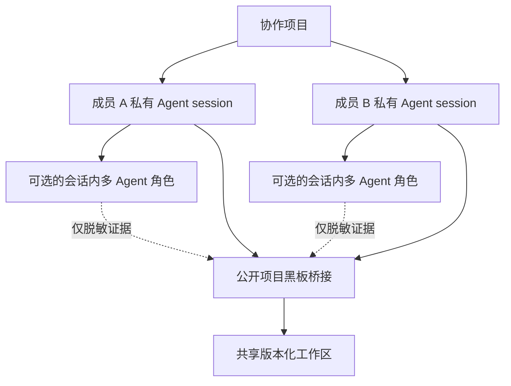
```mermaid
flowchart TB
  Project["协作项目"] --> MA["成员 A 私有 Agent session"]
  Project --> MB["成员 B 私有 Agent session"]
  MA --> IA["可选的会话内多 Agent 角色"]
  MB --> IB["可选的会话内多 Agent 角色"]
  MA --> PB["公开项目黑板桥接"]
  MB --> PB
  IA -. "仅脱敏证据" .-> PB
  IB -. "仅脱敏证据" .-> PB
  PB --> Workspace["共享版本化工作区"]
```

## 6. 冲突处理是一套决策协议

当无法证明基线仍然有效时，受影响的文档会被冻结。Clouds Coder 保存当前基线和每个提交的候选，而不是按到达顺序选择赢家。

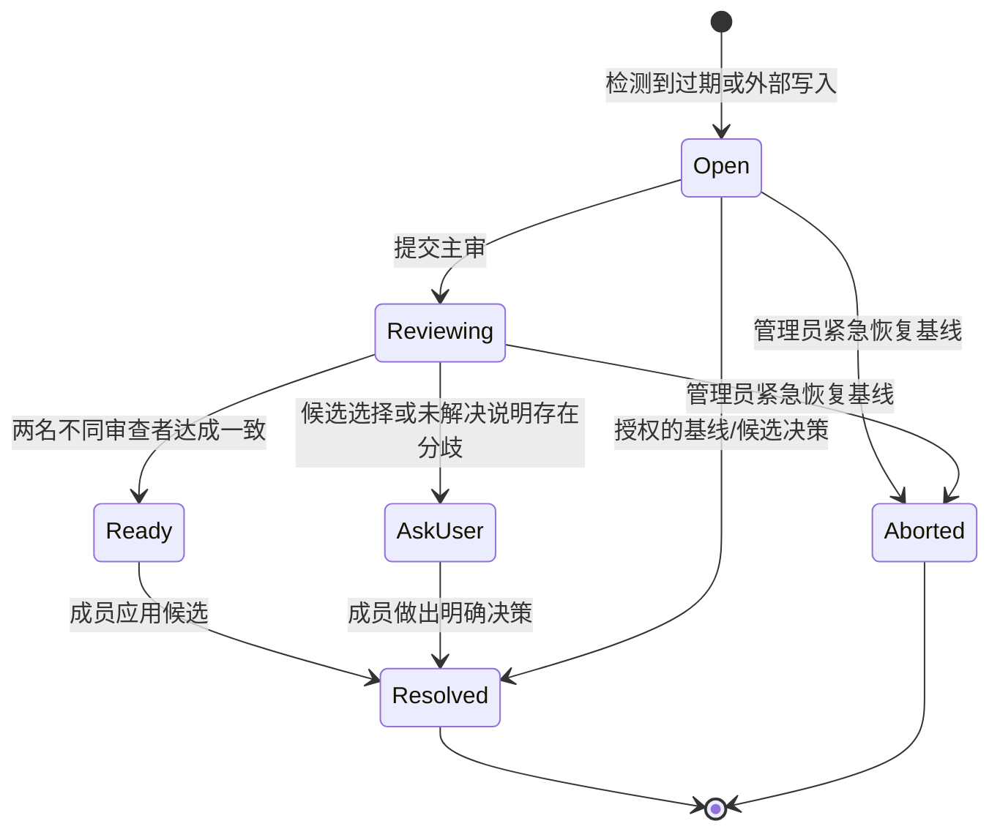
```mermaid
stateDiagram-v2
  [*] --> Open: 检测到过期或外部写入
  Open --> Reviewing: 提交主审
  Reviewing --> Ready: 两名不同审查者达成一致
  Reviewing --> AskUser: 候选选择或未解决说明存在分歧
  Ready --> Resolved: 成员应用候选
  AskUser --> Resolved: 成员做出明确决策
  Open --> Resolved: 授权的基线/候选决策
  Open --> Aborted: 管理员紧急恢复基线
  Reviewing --> Aborted: 管理员紧急恢复基线
  Resolved --> [*]
  Aborted --> [*]
```

重要保护措施：

- 主审和次审必须来自不同成员；
- 审查者记录候选、风险摘要、理由和未解决分歧；
- 丢弃其他成员的候选需要其所有者确认；
- 丢弃全部候选需要所有候选所有者确认；
- 合并/丢弃决策会使相关授权 lease 失效；
- 管理员紧急中止会恢复已记录的基线并解冻文件，但不会假装已经合并候选。

## 7. 事件一致性与恢复

UI 将有序的项目事件日志与完整快照结合。事件为 Presence、操作、黑板、Agent、权限和冲突提供低延迟更新；快照让重连和事件保留缺口保持确定性。

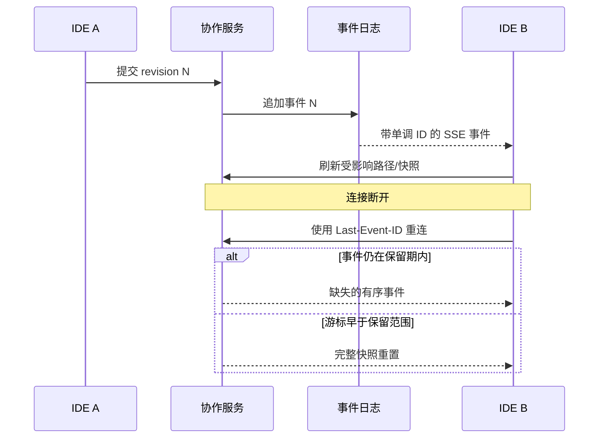
```mermaid
sequenceDiagram
  participant A as IDE A
  participant S as 协作服务
  participant E as 事件日志
  participant B as IDE B

  A->>S: 提交 revision N
  S->>E: 追加事件 N
  E-->>B: 带单调 ID 的 SSE 事件
  B->>S: 刷新受影响路径/快照
  Note over B,S: 连接断开
  B->>S: 使用 Last-Event-ID 重连
  alt 事件仍在保留期内
    S-->>B: 缺失的有序事件
  else 游标早于保留范围
    S-->>B: 完整快照重置
  end
```

服务器重启时，遗留的运行中 Agent 会变为 inactive，未完成分配会变为 blocked，过期文件意图会被关闭。Agent 心跳超时后，watchdog 会执行相同的清理。

## 8. 项目治理

```mermaid
stateDiagram-v2
  [*] --> Active: 管理员创建项目
  Active --> Archived: 归档并撤销活跃会话
  Archived --> Active: 重新激活
  Active --> Quarantined: 确认删除
  Archived --> Quarantined: 确认删除
  Quarantined --> Archived: 保留期内恢复
  Quarantined --> Purged: 保留期到期
  Purged --> [*]
```

Admin UI 可以创建和重命名项目、轮换密码、批准设备、封禁或撤销成员、归档/重新激活、创建 ZIP 备份、将项目隔离 30 天、恢复项目、查看活跃冲突并校验哈希链审计。

## 9. Skills Studio 2.0

Skills Studio 遵循相同理念：创作是私有的，分发受治理。

```mermaid
flowchart LR
  Device["独立浏览器设备"] --> Draft["私有多文件草稿"]
  Draft --> Copilot["分步或一键 Copilot"]
  Copilot --> Patch["候选 patch"]
  Patch -->|接受选定文件| Draft
  Draft --> Validate["确定性校验 + 触发评测"]
  Validate --> Freeze["冻结提交 revision"]
  Freeze --> Review["管理员审核 / 重新评测"]
  Review -->|要求修改| Draft
  Review -->|拒绝| Rejected["拒绝的快照"]
  Review -->|批准| Publish["原子发布到全局 skills/slug"]
  Publish --> Refresh["刷新 SkillStore 和活跃 session"]
  Publish -->|下架| Quarantine["可恢复的下架区"]
```

主要改进：

- 180 天设备身份、24 小时会话、CSRF、同源写入，以及 Studio 独立加密的模型 profiles；
- 设备所有的草稿存放在 `.clouds_coder_admin/skills_studio/`，由 `skills_studio.sqlite` 建索引；
- 完整包支持 `SKILL.md`、`agents/openai.yaml`、`agents/clouds-coder.yaml`、`scripts/`、`references/` 和 `assets/`；
- 变更使用 revision 检查，提交快照不可变，支持统一 Diff 和可取消的 Copilot 任务；
- 校验标准 frontmatter、命名、描述、`openai.yaml`、默认 `$skill-name` Prompt、语法、路径、大小和潜在密钥；
- 通过正例/反例触发模拟，以及工作流、输出契约、安全边界和资源可发现性信号进行评测；
- 可执行脚本评测逐次确认并使用硬隔离，网络默认关闭，不提供不安全的主机兜底；
- 含可执行脚本的 Skill 没有隔离证据不得批准；
- 全局名称冲突会阻止发布；批准不会静默替换已有 Skill；
- 采用原子发布并实时刷新 SkillStore，因此普通 WebUI、IDE 和协作 session 无需重启即可发现批准后的 Skill。

旧版 `/api/skillslab/*` 管理接口继续保留兼容性。新版工作台使用 `/api/skillslab/v2/*`，审核接口为 `/api/admin/skills/submissions/*`。

## 10. 运维快速开始

从单一入口启动所有服务：

```bash
python Clouds_Coder.py \
  --host 0.0.0.0 \
  --port 8080 \
  --enable_collaboration \
  --collab_host 0.0.0.0 \
  --collab_port 8087
```

当 `P=8080` 时的默认相关 URL：

| 界面 | URL |
| --- | --- |
| Agent Web UI | `http://127.0.0.1:8080` |
| Skills Studio 2.0 | `http://127.0.0.1:8081` |
| 主 Admin | `http://127.0.0.1:8080/admin` |
| 浏览器 IDE | `http://127.0.0.1:8085` |
| 协作模式 | `http://127.0.0.1:8087` 或启动时打印的局域网 URL |

然后：

1. 登录 Admin 并打开 **Collaboration**。
2. 使用强项目密码创建项目，并记录项目名或邀请码。
3. 通过合适的可信渠道发送 Collaboration URL、项目引用和密码。
4. 让每位参与者加入；比对页面显示的设备短码，并在 Admin 中批准设备。
5. 重新提交准入表单，然后在协作 IDE 中工作。

明文 HTTP 会把项目流量暴露给局域网。在完全信任的网络之外，请使用 `--collab_tls_cert` 和 `--collab_tls_key` 配置证书，或配置明确受信的 HTTPS 反向代理。

## 日本語

## Collaboration Mode と Skills Studio 2.0

今回のリリースでは、Clouds Coder を単一ブラウザーの Agent ランタイムから、ローカルファーストのワークスペースへ発展させました。信頼された人とその Agent が同じプロジェクトで作業しながら、ファイルの権限、競合の判断、公開の管理権をモデルに明け渡すことはありません。

中心となる考え方は **共有する仕事、明示する権限** です。

- メンバーは、信頼済み IP だけではなく、承認済みデバイスの ID で参加します。
- 各メンバーはプライベートな Agent 会話を保持し、範囲を制限したタスク概要と証拠だけを共有 blackboard に公開します。
- テキスト編集、全ファイル書き込み、Shell/Agent の変更はすべて revision-aware coordination を通ります。
- 安全性を証明できない書き込みはドキュメントを凍結し、他の参加者を静かに上書きする代わりに、レビュー可能な候補ブランチにします。
- 共有 Skills、MCP ツール、アプリケーション、ライブラリは管理者が統制するリソースとして利用します。
- Skill の下書きは、凍結された revision が検証と管理者レビューを通過するまで非公開です。

利用者向けの詳しい説明と起動ガイドは [README の Collaboration Mode](../README.md#collaboration-mode-human--agent-shared-workspace) を参照してください。

## 1. Collaboration Mode が必要な理由

複数のブラウザーと複数の Agent を同じディレクトリに置くことは簡単です。難しいのは、組み合わされた作業を理解可能かつ復元可能にすることです。単純な共有フォルダーでは、次の問いに答えられません。

- 誰がどの revision を基準にファイルを編集しようとしたのか。
- どの Agent が計画を所有し、どの Agent が一部の作業を担当しているのか。
- ディスクへの書き込みはエディター、Agent ツール、それとも Clouds Coder 外部から行われたのか。
- 2 つの有効な結果が食い違った場合、どちらを破棄できるのか。
- 新しい LAN デバイスが、すぐにモデル資格情報を継承したり、グローバル Skills に書き込んだりできるのか。

Collaboration Mode はこれらを製品レベルの調整問題として扱います。ファイルシステムは実行面のまま、SQLite が保持する revision、イベント、ID、タスク証拠、監査記録が制御面を構成します。

```mermaid
flowchart LR
  A["共有フォルダーだけ"] --> B["同時書き込み"]
  B --> C["最後の書き込みを採用"]
  C --> D["意図とプロヴェナンスの喪失"]

  E["Clouds Coder Collaboration"] --> F["ID + 意図 + revision"]
  F --> G["調整済み書き込みまたは凍結された競合"]
  G --> H["レビュー可能な証拠と復元可能な結果"]
```

目標は自律的な並列性を最大化することではありません。**所有者を可視化し、権限を限定し、自動化が安全なマージを証明できない場合は人の判断へ戻れる、役に立つ並列性**を実現することです。

## 2. Collaboration のフレームワーク

Collaboration Mode は独立したサービスです。メイン Agent UI がポート `P` を使う場合、通常は `P+7` にバインドされます。協調用の ID とワークスペースを持つ完全なブラウザー IDE を提供し、単一の `Clouds_Coder.py` エントリーポイントから起動します。

```mermaid
flowchart TB
  subgraph Control["管理者コントロールプレーン"]
    Admin["Admin UI"]
    Projects["プロジェクト / パスワード / ライフサイクル"]
    Access["メンバー / デバイス / 失効"]
    Audit["監査チェーン / バックアップ / 隔離"]
    Admin --> Projects
    Admin --> Access
    Admin --> Audit
  end

  subgraph Entry["Collaboration サービス · デフォルト P+7"]
    Gate["参加受付 + デバイス承認"]
    Session["24 時間 HttpOnly セッション + CSRF"]
    API["/api/collab/v1/*"]
    Events["SSE イベントストリーム + スナップショット復旧"]
    Gate --> Session --> API
    API <--> Events
  end

  subgraph Participants["信頼済みプロジェクト参加者"]
    H1["メンバー A · IDE"]
    H2["メンバー B · IDE"]
    A1["メンバー A · プライベート Agent session"]
    A2["メンバー B · プライベート Agent session"]
    H1 <--> A1
    H2 <--> A2
  end

  subgraph SharedState["プロジェクトの唯一の正当な状態"]
    Workspace["隔離されたプロジェクトワークスペース"]
    Docs["ドキュメント revision + 不変履歴"]
    Board["タスク blackboard + 割り当て + 証拠"]
    Presence["Presence + カーソル + ファイル意図"]
    Conflicts["凍結された競合 + 候補ブランチ"]
    Ledger["ハッシュ連結監査イベント"]
  end

  subgraph Resources["管理者が統制する共有リソース"]
    Models["サーバー側 LLM profiles"]
    Skills["公開済み Skills · メンバーは読み取り専用"]
    MCP["承認済み MCP ツール"]
    Libraries["Knowledge / Code RAG / 共有アプリ"]
  end

  Control --> Gate
  H1 --> Gate
  H2 --> Gate
  API <--> Participants
  API <--> SharedState
  Participants --> Resources
  Resources --> Participants
```

このフレームワークは、状態を意図的に 5 種類へ分離します。

| 状態 | 可視範囲 | 目的 |
| --- | --- | --- |
| プライベート Agent session | 所有メンバー | 完全な会話、モデルとの相互作用、ローカル Agent 実行状態 |
| 公開タスク証拠 | プロジェクトメンバー | サニタイズ済みの計画分割、手掛かり、変更パス、検証、ブロッカー、結果概要 |
| プロジェクト文書 | プロジェクトメンバー | 共有ワークツリー、revision 履歴、現在のベースライン |
| ガバナンス状態 | 管理者。メンバーには制限されたプロジェクト状態のみ | 参加受付、承認、失効、バックアップ、隔離、監査 |
| 共有機能カタログ | プロジェクトメンバー。主に読み取り専用 | サーバー側資格情報を公開せずに、公開済み Skills、承認済み MCP ツール、共有アプリ、RAG リソースを提供 |

## 3. ID、参加受付、信頼境界

IP アドレスは通信メタデータであり、永続的な協力者 ID ではありません。参加者はプロジェクト、メンバー、管理者が承認したデバイスの組み合わせです。プロジェクトパスワードは招待を知っていることを証明し、管理者が承認したデバイス資格情報がセッション発行の可否を決めます。

```mermaid
sequenceDiagram
  actor User as 新しい参加者
  participant Browser as ブラウザデバイス
  participant Service as Collaboration サービス
  participant DB as ID ストア
  actor Admin as 管理者

  User->>Browser: プロジェクト名/招待、パスワード、ニックネームを入力
  Browser->>Browser: 永続ランダムデバイスキーを生成
  Browser->>Service: 参加受付リクエスト + デバイスキー
  Service->>DB: レート制限とプロジェクトパスワードの検証
  DB-->>Service: 保留中メンバー + 保留中デバイスを作成
  Service-->>Browser: pending + 短いデバイスコード
  Admin->>DB: リクエストを照合してデバイスを承認
  User->>Service: 参加受付を再送信
  Service->>DB: 承認済みデバイス + パスワードバージョンを検証
  DB-->>Service: 24 時間セッションと CSRF トークンを発行
  Service-->>Browser: HttpOnly SameSite Cookie
  Browser->>Service: 同一オリジン書き込み + CSRF
```

セキュリティとライフサイクルの特性は次のとおりです。

- プロジェクトパスワードは 600,000 回反復の PBKDF2-HMAC-SHA256 で処理します。
- IP/プロジェクト単位で参加受付をスロットルし、無効な資格情報には意図的に一般化したエラーを返します。
- デバイス承認、メンバーのブロック/失効、パスワードローテーション、即時セッション無効化に対応します。
- すべての変更で同一オリジン検査と CSRF 検証を行います。
- Collaboration セッション Cookie は `HttpOnly` / `SameSite=Strict` とし、信頼できる HTTPS では `Secure` を付けます。
- プロジェクトパスを正規化し、パストラバーサルとシンボリックリンクによる脱出を拒否します。
- 信頼できないネットワークでは TLS または明示的に信頼した HTTPS プロキシを使います。平文 HTTP は信頼済み LAN の開発モードだけで使用します。

## 4. 1 つのワークスペース、3 つの書き込みプロトコル

書き込みの形が異なれば、一貫性の仕組みも異なります。Collaboration Mode は大きなバイナリアップロード、Monaco のキーストローク、Shell コマンドを同じプロトコルに押し込みません。

```mermaid
flowchart TD
  W["参加者または Agent がパスを変更したい"] --> K{"書き込みの形"}

  K -->|"UTF-8 テキスト ≤ 2 MB"| OT["Operational Transform"]
  OT --> O1["ベース revision + 冪等な operation ID を送信"]
  O1 --> O2["新しい受理済み操作に対して変換"]
  O2 --> Commit["新しい revision + 不変バージョンをコミット"]

  K -->|"バイナリまたは全ファイル書き込み"| CAS["Expected-revision 書き込み"]
  CAS --> C1{"Expected revision は現在値と一致？"}
  C1 -->|はい| Commit
  C1 -->|いいえ| Conflict["候補ブランチを作成してドキュメントを凍結"]

  K -->|"Shell または Agent プロセス"| Lease["プロジェクト mutation lease"]
  Lease --> L1["既知の revision とハッシュをスナップショット"]
  L1 --> L2["読み取り側を待たせてプロセスを実行"]
  L2 --> L3["生成された書き込みを revision ごとに取り込む"]
  L3 -->|"ベースラインが一致"| Commit
  L3 -->|"並行または外部変更"| Conflict

  Commit --> Event["イベント公開 + スナップショット更新 + 監査"]
  Event --> UI["他の IDE が影響パスを更新"]
```

小さな UTF-8 ドキュメントでは、受信操作をベース revision 以降に受理された操作へ変換します。サーバー側の既存挿入は同位置の挿入で優先され、クライアント operation ID によりリトライが冪等になります。

全ファイルとバイナリの書き込みには `expected_revision` による楽観的並行性制御を使います。Shell と Agent のツールは `CollaborationWriteCoordinator` でラップされ、プロジェクト mutation lease を保持し、前後のハッシュを記録し、生成された書き込みをドキュメントカタログへ戻します。ウォッチャーは安定した範囲外のディスク変更も検出しますが、説明できないファイル値を黙って正当な状態とは扱いません。

## 5. タスク blackboard による人間と Agent の協力

各メンバーはプライベートな Agent session を持ちますが、同じ正規化済みの目的で動く Agent は 1 つの公開タスク項目へ収束します。最初の Agent がアクティブな `coordinator` になり、後続の Agent は `contributor` になります。coordinator はチャットだけの管理者になるのではなく、委任と統合を担当する作業者です。

```mermaid
sequenceDiagram
  actor UA as メンバー A
  actor UB as メンバー B
  participant AA as Agent A
  participant AB as Agent B
  participant B as 共有 blackboard
  participant F as 共有ファイル

  UA->>AA: 目的 X を開始
  AA->>B: begin_task(objective X)
  B-->>AA: role=coordinator
  AA->>B: publish plan_steps

  UB->>AB: 同じ目的 X を開始
  AB->>B: begin_task(objective X)
  B-->>AB: role=contributor + 担当スライス

  AA->>B: ファイル意図 + 公開証拠を宣言
  AB->>B: 計画を読み、重複しない意図を宣言
  AA->>F: 調整済み書き込み
  AB->>F: 調整済み書き込み
  F-->>B: パス + revision + 検証証拠

  AB->>B: contributor の結果を完了
  AA->>B: 結果を統合して完了
  B-->>UA: 共有ステータスと証拠
  B-->>UB: 共有ステータスと証拠
```

```mermaid
flowchart LR
  Goal["正規化されたプロジェクト目的"] --> Item["1 つの blackboard タスク項目"]
  Item --> Coord["Coordinator Agent"]
  Item --> C1["Contributor Agent 1"]
  Item --> C2["Contributor Agent 2"]
  Coord --> Plan["公開された計画スライス"]
  Plan --> C1
  Plan --> C2
  Coord --> Evidence["範囲を限定した公開証拠"]
  C1 --> Evidence
  C2 --> Evidence
  Evidence --> Item
  Item --> Result["統合されたプロジェクト結果"]
```

受け付ける公開区分は、research notes、execution logs、review feedback、plan findings/steps/proposals/risks、status に限られます。公開テキストには長さ制限があり、資格情報、秘密鍵、Bearer トークン、プライベートなホームパス、フェンス付きコード、隠し/システム Prompt をサニタイズします。完全な Prompt と隠れた推論はプロジェクト blackboard にコピーしません。

このプロジェクトレベルの coordinator/contributor プロトコルは、セッション内の `manager / explorer / developer / reviewer` トポロジーとは別物です。両者は共存できます。

```mermaid
flowchart TB
  Project["Collaboration プロジェクト"] --> MA["メンバー A のプライベート Agent session"]
  Project --> MB["メンバー B のプライベート Agent session"]
  MA --> IA["任意のセッション内マルチ Agent ロール"]
  MB --> IB["任意のセッション内マルチ Agent ロール"]
  MA --> PB["公開プロジェクト blackboard ブリッジ"]
  MB --> PB
  IA -. "サニタイズ済み証拠のみ" .-> PB
  IB -. "サニタイズ済み証拠のみ" .-> PB
  PB --> Workspace["共有 revision ワークスペース"]
```

## 6. 競合処理は意思決定プロトコル

ベースラインを証明できない場合、対象ドキュメントを凍結します。Clouds Coder は到着順で勝者を決めず、現在のベースラインと送信されたすべての候補を保存します。

```mermaid
stateDiagram-v2
  [*] --> Open: stale または外部書き込みを検出
  Open --> Reviewing: 主レビューを送信
  Reviewing --> Ready: 異なる 2 名のレビュー担当者が合意
  Reviewing --> AskUser: 候補の選択または未解決メモが不一致
  Ready --> Resolved: メンバーが候補を適用
  AskUser --> Resolved: メンバーが明示的に決定
  Open --> Resolved: 承認済みベースライン/候補の決定
  Open --> Aborted: 管理者が緊急にベースラインを復元
  Reviewing --> Aborted: 管理者が緊急にベースラインを復元
  Resolved --> [*]
  Aborted --> [*]
```

重要な保護策：

- 主レビューと副レビューは異なるメンバーから行います。
- レビュー担当者は候補、リスク概要、理由、未解決の不一致を記録します。
- 他のメンバーの候補を破棄するには、その所有者の確認が必要です。
- すべての候補を破棄するには、全候補所有者の確認が必要です。
- マージ/破棄の決定は関連する認可 lease を無効にします。
- 管理者による緊急中止は記録済みベースラインを復元してファイルの凍結を解除しますが、候補をマージしたことにはしません。

## 7. イベントの一貫性と復旧

UI は順序付きのプロジェクトイベントログと完全なスナップショットを組み合わせます。イベントは Presence、操作、blackboard、Agent、権限、競合を低遅延で更新し、スナップショットは再接続とイベント保持範囲の欠落を決定的に処理します。

```mermaid
sequenceDiagram
  participant A as IDE A
  participant S as Collaboration サービス
  participant E as イベントログ
  participant B as IDE B

  A->>S: revision N をコミット
  S->>E: イベント N を追加
  E-->>B: 単調増加 ID 付き SSE イベント
  B->>S: 影響パス/スナップショットを更新
  Note over B,S: 接続が切断
  B->>S: Last-Event-ID で再接続
  alt イベントがまだ保持されている
    S-->>B: 欠落した順序付きイベント
  else カーソルが保持範囲より古い
    S-->>B: 完全なスナップショットリセット
  end
```

サーバー再起動時、放棄された実行中 Agent は inactive になり、未完了の割り当ては blocked になり、古いファイル意図は閉じられます。Agent の heartbeat が期限切れになった場合も、watchdog が同じクリーンアップを実行します。

## 8. プロジェクトガバナンス

```mermaid
stateDiagram-v2
  [*] --> Active: 管理者がプロジェクトを作成
  Active --> Archived: アーカイブして有効なセッションを失効
  Archived --> Active: 再有効化
  Active --> Quarantined: 削除を確認
  Archived --> Quarantined: 削除を確認
  Quarantined --> Archived: 保持期間内に復元
  Quarantined --> Purged: 保持期間が終了
  Purged --> [*]
```

Admin UI では、プロジェクトの作成・名前変更、パスワードローテーション、デバイス承認、メンバーのブロック/失効、アーカイブ/再有効化、ZIP バックアップ作成、30 日間の隔離、復元、アクティブな競合の確認、ハッシュ連結監査チェーンの検証を行えます。

## 9. Skills Studio 2.0

Skills Studio も同じ理念に従います。作成は非公開、配布はガバナンス対象です。

```mermaid
flowchart LR
  Device["独立したブラウザデバイス"] --> Draft["プライベートなマルチファイル下書き"]
  Draft --> Copilot["ステップ式またはワンクリック Copilot"]
  Copilot --> Patch["候補パッチ"]
  Patch -->|選択したファイルを承認| Draft
  Draft --> Validate["決定的検証 + トリガー評価"]
  Validate --> Freeze["提出 revision を凍結"]
  Freeze --> Review["管理者レビュー / 再評価"]
  Review -->|変更要求| Draft
  Review -->|拒否| Rejected["拒否されたスナップショット"]
  Review -->|承認| Publish["グローバル skills/slug へアトミック公開"]
  Publish --> Refresh["SkillStore とアクティブ session を更新"]
  Publish -->|非公開化| Quarantine["復元可能な非公開領域"]
```

主なポイント：

- 180 日のデバイス ID、24 時間セッション、CSRF、同一オリジン書き込み、Studio 内で暗号化されたモデル profiles；
- デバイス所有の下書きを `.clouds_coder_admin/skills_studio/` に保存し、`skills_studio.sqlite` で索引化；
- `SKILL.md`、`agents/openai.yaml`、`agents/clouds-coder.yaml`、`scripts/`、`references/`、`assets/` を含む完全なパッケージ；
- mutation ごとの revision 検査、不変の提出スナップショット、統合 Diff、キャンセル可能な Copilot ジョブ；
- 標準 frontmatter、命名、説明、`openai.yaml`、既定の `$skill-name` Prompt、構文、パス、サイズ、潜在的な秘密を検証；
- 正例/反例のトリガーシミュレーションに加え、ワークフロー、出力契約、安全境界、リソース発見性のシグナルを評価；
- 実行可能スクリプトの評価は毎回確認を求め、ハード隔離で実行し、ネットワークを無効化し、安全でないホストフォールバックは提供しない；
- 実行可能な Skill は隔離テストの証拠なしには承認できない；
- グローバル名の衝突は公開をブロックし、承認時に既存 Skill を黙って置き換えない；
- アトミック公開とライブ SkillStore 更新により、通常の WebUI、IDE、Collaboration session は再起動なしで承認済み Skill を発見できる。

旧 `/api/skillslab/*` 管理エンドポイントは互換性のため残ります。新しいワークベンチは `/api/skillslab/v2/*` を使用し、レビューは `/api/admin/skills/submissions/*` で提供します。

## 10. オペレーター向けクイックスタート

すべてのサービスを単一エントリーポイントから起動します。

```bash
python Clouds_Coder.py \
  --host 0.0.0.0 \
  --port 8080 \
  --enable_collaboration \
  --collab_host 0.0.0.0 \
  --collab_port 8087
```

`P=8080` の場合の主なデフォルト URL：

| 面 | URL |
| --- | --- |
| Agent Web UI | `http://127.0.0.1:8080` |
| Skills Studio 2.0 | `http://127.0.0.1:8081` |
| Main Admin | `http://127.0.0.1:8080/admin` |
| ブラウザー IDE | `http://127.0.0.1:8085` |
| Collaboration Mode | `http://127.0.0.1:8087` または表示された LAN URL |

次に：

1. Admin にサインインし、**Collaboration** を開きます。
2. 強力なプロジェクトパスワードでプロジェクトを作成し、名前または招待コードを控えます。
3. Collaboration URL、プロジェクト参照、パスワードを適切な信頼済みチャネルで送ります。
4. 各参加者に参加してもらい、表示された短いデバイスコードを照合して Admin でデバイスを承認します。
5. 参加受付フォームを再送信し、Collaboration IDE で作業します。

平文 HTTP ではプロジェクトの通信が LAN に露出します。完全に信頼できるネットワーク以外では、`--collab_tls_cert` と `--collab_tls_key` を設定するか、明示的に信頼した HTTPS リバースプロキシを使用してください。
