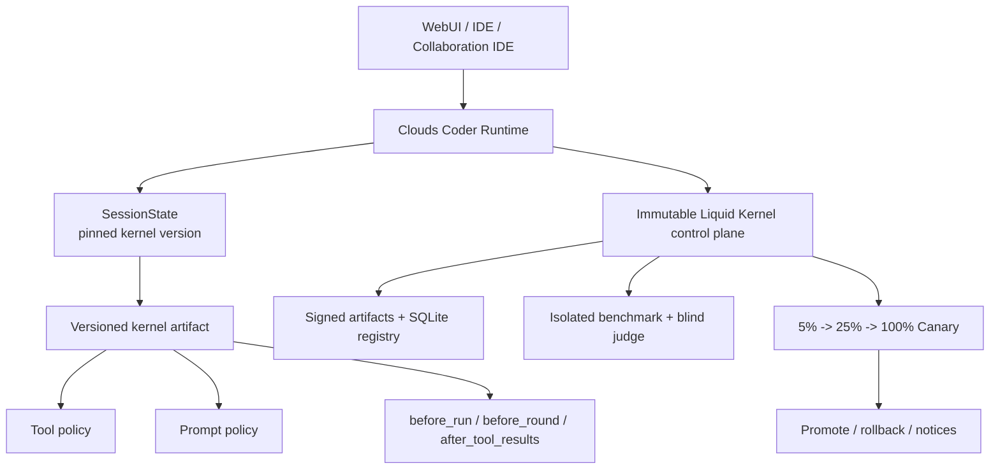
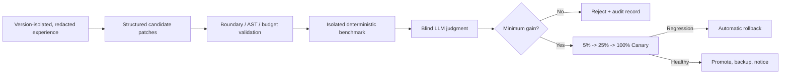
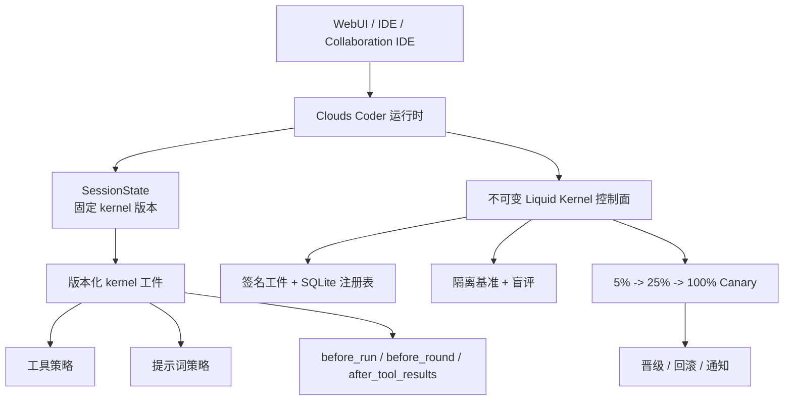
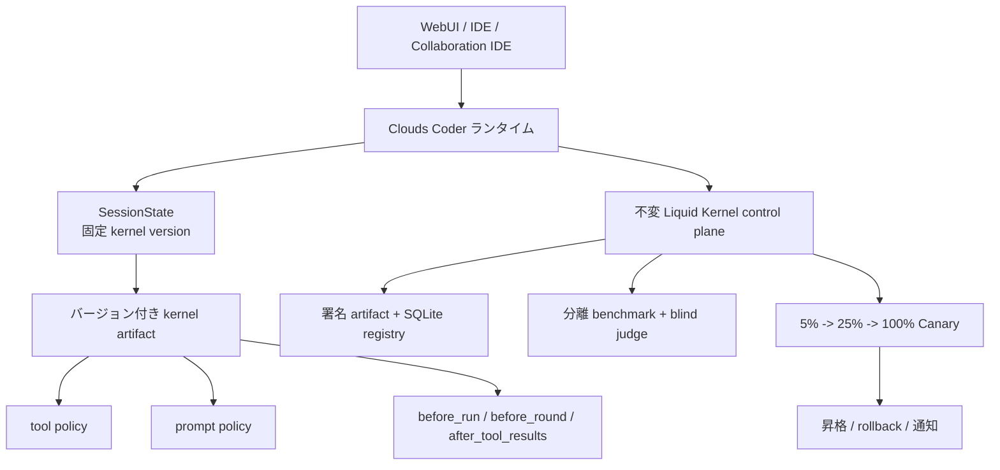

# CHANGELOG 2026-09-12

## Liquid Kernel and Scalable Session Runtime

This update records the runtime and architecture work associated with `01a08b75-c03f-7691-81ac-67ba24756ee7`. It makes long-lived WebUI, IDE, and Collaboration IDE sessions observable in real time while bounding history reads, browser work, and DOM growth. It also documents Liquid Kernel as a versioned policy layer with an immutable control plane.

## Session Runtime at Scale

The WebUI and IDE now share a lightweight session-state path while keeping surface-specific views separate. The runtime does not load every session body to build a catalog:

- WebUI session catalogs are paginated, with a first page of 120 entries. IDE catalogs are paginated and searchable, with a first page of 80 entries.
- Session summaries come from an incrementally maintained index and journal. Create, rename, and delete operations append journal records; replay and background compaction avoid synchronous rewrites of large indexes.
- Large snapshots use persisted UI counters and revisions. Lite snapshots use bounded tail windows and revision caches, reusing an unchanged projection instead of rebuilding it.
- IDE `agent-state` supports `after_feed_seq`, `after_operation_seq`, and `known_snapshot_revision`. An expired cursor produces a bounded reset/recovery response instead of an unbounded reload.
- IDE rendering applies stable-ID deltas and bounds chat/timeline DOM and cache state. WebUI remains SSE-delta first; snapshots are reserved for initialization, missed events, visibility recovery, and watchdog repair.
- Event bursts and scroll/resize refreshes are frame-batched with `requestAnimationFrame`; unrelated panels do not refresh for a chat-only event. Heavy IDE configuration and resources are deferred, and session switching does not reload the full configuration.
- Language changes update current-session preferences in O(1) work rather than looping synchronously over every session. The scheduler also avoids scanning all sessions to detect the active session.
- Submission is acknowledged quickly and starts in the background while preserving `Submitting -> Accepted/Starting/Queued -> Running -> Idle`, with explicit `Submit failed` and `Checking` states.

Measured results from the implementation benchmark are included as directional evidence, not universal guarantees:

| Scenario | Before | After | Result |
| --- | ---: | ---: | --- |
| Create a session in a 10k-session catalog | full-index path | p50 18.19 ms, p95 19.41 ms | about 18x faster |
| Read the first page of 10k sessions | full catalog work | p50 0.168 ms, p95 0.189 ms | bounded page cost |
| Lite snapshot after 20k messages + 3k operations | repeated full projection | p50 0.003 ms, p95 0.004 ms | revision cache hit |
| Largest measured 7.19 MB session, WebUI cold request | 10.591 s | 0.392 s | about 27x faster |
| Same session, WebUI hot request | full response path | 0.0044 s | cached path |
| Lite response payload | 1.32 MB | 275 KB | about 79% smaller |
| IDE agent-state refresh | 0.243 s / 201 KB initial state | 0.0106 s later refresh | cursor delta path |

This design keeps live state fresh without asking the browser to repaint the whole workspace for every event. A full snapshot remains the recovery boundary, while normal traffic is a small, ordered delta stream.

## Liquid Kernel Architecture

Liquid Kernel is the versioned policy and harness layer used by a session. The mutable artifact contains `kernel.py`, `tool_policy.py`, `prompt_policy.py`, `harness.py`, `manifest.json`, and `CHANGELOG.md`. The immutable control plane owns authentication, persistence, evaluation, promotion, audit, signing, and sandboxing. Only `Aggressive` may change the complete extracted harness core; other modes stay on the controlled policy surface.

The supported modes are:

| Mode | Default schedule | Behavior |
| --- | --- | --- |
| `Off` | disabled | No evolution run; default safe state. |
| `Tuning` | weekly | Limited policy/entrypoint changes; Canary starts after evaluation. |
| `Thinking` | every 3 days | Broader controlled changes; Admin approval before Canary. |
| `Aggressive` | daily | Full extracted tool/prompt/harness core; Admin approval before Canary. |

The evolution pipeline is version-isolated and auditable:

1. Select the active kernel and two parent versions by default.
2. Read the configured user, session, and date scope (defaults: all users, all sessions, all dates), group experience by pinned version, and redact recognized secrets.
3. Generate independent candidates that return a structured patch and optional benchmark cases.
4. Enforce file, line, token, case, timeout, AST, contract, and immutable-boundary limits.
5. Combine sanitized model cases with seeded random cases and run incumbent/candidate evaluations in isolated Python processes.
6. Score deterministic outcomes at 30% and an independent blind LLM judge at 70%; retry deterministic evaluation once after a regression above 5%.
7. Send a passing candidate through `5% -> 25% -> 100%` Canary. Stable hashing assigns new sessions; existing sessions remain pinned.
8. Promote only after a healthy 100% stage, otherwise roll back automatically. SQLite stores hash-linked state transitions and promoted artifacts are backed up.

`history_version_depth` counts parent versions in addition to the current version and defaults to `2`. History records remain grouped by the session's pinned kernel version. WebUI and IDE upgrade notices are acknowledged independently per user, device, and surface.

On startup, `Clouds_Coder.py` verifies the local Liquid Kernel package and atomically restores the embedded compressed copy when it is incomplete. `prepare_liquid_kernel_runtime()` writes `liquid_kernel_bootstrap.json`. The default startup policy is `inherit`, which retains the registry, history, active kernel, and session pins. Admin or CLI can choose `inject` to add the embedded kernel as a new promoted version without deleting existing history or rebinding old sessions.

Startup and Admin/CLI controls are exposed as `--liquid-kernel-mode Off|Tuning|Thinking|Aggressive`, `--evolution-schedule off|hourly|daily|every_3_days|weekly`, and `--liquid-kernel-startup-policy inherit|inject`. Emergency Off atomically stops evolution and active Canary work; artifact hashes and signatures are checked whenever a version is loaded.

## Compatibility and Validation

The OpenAI-compatible history path now closes skipped multiple-tool calls with matching tool results and sanitizes dangling tool calls or orphan tool responses before outbound requests. Ambiguous 400 responses can retry with optional compatibility fields removed while retaining tools, covering Kimi/Moonshot, GLM, SiliconFlow, OpenRouter, and vLLM-style endpoints.

The implementation was validated with `python -m py_compile Clouds_Coder.py` and the project regression suite (`554 passed, 75 subtests` in the recorded validation run).

## 中文

本次更新记录 `01a08b75-c03f-7691-81ac-67ba24756ee7` 相关的运行时与架构改进：WebUI、IDE 和 Collaboration IDE 在大历史量下仍保持实时可观察，同时限制历史读取、浏览器计算和 DOM 增长；Liquid Kernel 则明确为版本化策略层与不可变控制面。

### 可扩展会话运行时

WebUI 与 IDE 共用轻量会话状态路径，但保留各自的界面投影。会话目录不再通过加载全部会话正文构建：WebUI 首页分页 120 条，IDE 首页分页并支持搜索，默认 80 条；摘要来自增量维护的索引与 journal；创建、重命名、删除通过追加 journal 记录完成，回放与后台 compact 避免同步重写大索引。大快照使用持久化 UI counter/revision，lite snapshot 使用有界尾部窗口和 revision cache；IDE `agent-state` 支持 `after_feed_seq`、`after_operation_seq`、`known_snapshot_revision`，游标过期时只返回有界 reset/recovery。

IDE 前端按稳定 ID 插入 delta，并限制聊天与时间线 DOM/cache；WebUI 以 SSE delta 为主，snapshot 只用于初始化、漏事件恢复、重新可见和 watchdog 修复。事件突发以及滚动/尺寸刷新通过 `requestAnimationFrame` 合帧，不相关面板不会因聊天事件刷新。重型 IDE 配置延迟加载，切换 session 不重载完整配置；语言切换和 active-session 判断都不扫描全部会话。提交路径快速 ACK 并后台启动，状态保持 `Submitting -> Accepted/Starting/Queued -> Running -> Idle`，失败和检查状态显式展示。

实现基准中的代表性结果：10k 会话创建 p50 18.19 ms/p95 19.41 ms，首页读取 p50 0.168 ms/p95 0.189 ms；20k 消息 + 3k 操作后的 lite snapshot p50 0.003 ms/p95 0.004 ms；最大实测 7.19 MB 会话 WebUI 冷请求从 10.591 s 降至 0.392 s，lite 响应从 1.32 MB 降至 275 KB，IDE 后续 agent-state 刷新为 0.0106 s。上述为实现基准，不是所有机器的保证值。

### Liquid Kernel

Liquid Kernel 的可变版本工件包含 `kernel.py`、`tool_policy.py`、`prompt_policy.py`、`harness.py`、`manifest.json` 与 `CHANGELOG.md`；认证、持久化、评估、晋级、审计、签名和沙箱属于不可变控制面。生命周期钩子为 `before_run`、`before_round`、`after_tool_results`，每个 session 固定自己的 kernel version。模式为 `Off`（默认关闭）、`Tuning`（每周）、`Thinking`（每 3 天）和 `Aggressive`（每天）；只有 `Aggressive` 可以修改完整 harness 核心。

演进流程按 kernel 版本隔离历史，读取默认全用户、全 session、全日期范围，脱敏后生成结构化 patch 与可选 benchmark case；随后执行文件/行数/token/case/timeout/AST/contract/边界校验，在隔离 Python 进程中完成确定性评估与盲评（30% 确定性结果 + 70% 独立 LLM judge），通过后按 `5% -> 25% -> 100%` Canary 发布。新 session 使用稳定 hash 分配，已有 session 继续固定旧版本；检测到回归自动回滚，所有状态写入带 hash 链的 SQLite 审计记录。

启动时 `Clouds_Coder.py` 校验本地包，不完整时原子恢复内嵌压缩包，并写入 `liquid_kernel_bootstrap.json`。默认 `inherit` 保留注册表、历史、active kernel 和 session pin；`inject` 只新增一个 promoted version，不删除旧历史或重绑旧 session。控制参数为 `--liquid-kernel-mode`、`--evolution-schedule` 和 `--liquid-kernel-startup-policy inherit|inject`。

### 兼容性与验证

OpenAI-compatible 历史路径会为被跳过的多工具调用补齐匹配的 tool result，并在请求前清理悬空 tool call/orphan tool response；含糊 400 可在保留 tools 的前提下去除可选兼容字段重试。记录的验证包括 `python -m py_compile Clouds_Coder.py` 与回归套件 `554 passed, 75 subtests`。

## 日本語

この更新は `01a08b75-c03f-7691-81ac-67ba24756ee7` に対応するランタイムとアーキテクチャを記録する。WebUI、IDE、Collaboration IDE は大量の履歴でも状態をリアルタイムに観測でき、履歴読み込み、ブラウザー処理、DOM 増加には上限を設ける。Liquid Kernel はバージョン付きポリシー層と不変の制御プレーンとして整理した。

### スケーラブルなセッションランタイム

WebUI と IDE は軽量なセッション状態経路を共有し、画面固有の投影は分離する。セッション本文を全件読み込まず、WebUI は初回 120 件、IDE は検索可能な初回 80 件をページングする。要約は増分 index/journal から取得し、作成・名前変更・削除は追記、再生とバックグラウンド compact で大きな index の同期書き換えを避ける。大きな snapshot は UI counter/revision、lite snapshot は末尾ウィンドウと revision cache を使用する。IDE `agent-state` は `after_feed_seq`、`after_operation_seq`、`known_snapshot_revision` を使い、期限切れカーソルでも全履歴を再読込せず bounded reset/recovery を返す。

IDE は安定 ID の delta だけを DOM/cache に挿入し、チャットとタイムラインの量を制限する。WebUI は SSE delta を主経路とし、snapshot は初期化、欠落イベント、再表示、watchdog 修復に限定する。イベント集中とスクロール/リサイズ更新は `requestAnimationFrame` でフレーム単位にまとめ、無関係なパネルを更新しない。重い IDE 設定は遅延ロードし、セッション切替で全設定を再取得しない。送信は高速 ACK 後にバックグラウンド開始し、`Submitting -> Accepted/Starting/Queued -> Running -> Idle` の状態を維持する。

実装ベンチマークでは、10k セッション作成が p50 18.19 ms/p95 19.41 ms、初回ページ取得が p50 0.168 ms/p95 0.189 ms、20k メッセージ + 3k 操作後の lite snapshot が p50 0.003 ms/p95 0.004 ms。最大 7.19 MB セッションの WebUI cold request は 10.591 s から 0.392 s、lite payload は 1.32 MB から 275 KB、IDE の後続 agent-state 更新は 0.0106 s になった。これは実装時の計測値であり、環境共通の保証値ではない。

### Liquid Kernel

可変 artifact は `kernel.py`、`tool_policy.py`、`prompt_policy.py`、`harness.py`、`manifest.json`、`CHANGELOG.md` から成る。認証、永続化、評価、昇格、監査、署名、sandbox は不変 control plane に属する。ライフサイクル hook は `before_run`、`before_round`、`after_tool_results` で、各 session は kernel version を固定する。モードは `Off`（既定）、`Tuning`（週次）、`Thinking`（3 日ごと）、`Aggressive`（毎日）で、完全な harness core を変更できるのは `Aggressive` だけである。

進化では、kernel version ごとに履歴を分離し、既定で全ユーザー・全セッション・全日付を読み、秘密をマスキングして構造化 patch と benchmark case を生成する。ファイル/行/token/case/timeout/AST/contract/境界を検証し、分離 Python プロセスで決定的評価と blind judge（30% + 70%）を実行する。合格候補は `5% -> 25% -> 100%` Canary に進み、新規 session は stable hash、既存 session は pin を維持する。回帰時は自動 rollback、状態は hash-linked SQLite に記録する。

起動時 `Clouds_Coder.py` はローカル package を検査し、不完全なら内蔵圧縮 copy を原子復元して `liquid_kernel_bootstrap.json` を生成する。既定 `inherit` は registry、history、active kernel、session pin を維持し、`inject` は既存履歴を消さず新しい promoted version を追加する。CLI は `--liquid-kernel-mode`、`--evolution-schedule`、`--liquid-kernel-startup-policy inherit|inject` を提供する。

### 互換性と検証

OpenAI-compatible の履歴経路では、スキップされた複数 tool call に対応する tool result を補い、送信前に dangling tool call/orphan tool response を正規化する。曖昧な 400 では tools を維持したまま任意フィールドを除いて再試行できる。記録済み検証は `python -m py_compile Clouds_Coder.py` と回帰スイート `554 passed, 75 subtests` である。
